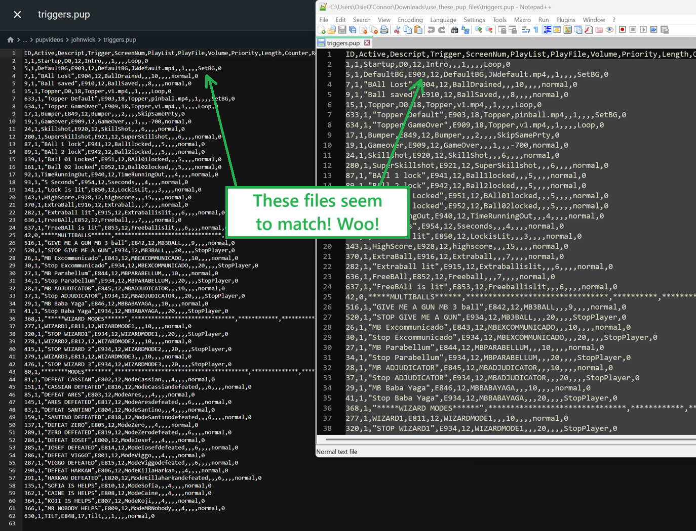

include::../attributes.adoc[]

= Pup Pack Install
:toc: left
:icons: font

[IMPORTANT]
====

PLEASE READ FIRST

Manually added puppacks are _not_ supported by the VPXS 4KP team. We
will not be able to help you diagnose issues on manually added puppacks.

This is because pup packs are very complicated and the support took up a
lot of our time… time that we can be using to get the tables on the
Wizard.

Please use the Wizard to install puppacks wherever possible.

The purpose of this wiki page is to give you all the tools you need to
resolve any issues yourself.
====

== _Basic Pup Pack Overview_

This is a high level overview of how manually installing a pup pack
works in VPXS.

The basic idea is we are going to download the pup pack media, replace
the necessary files in there, and upload it to our USB.

There are 3 major components to a PUP pack:

. The downloaded pup pack media from VPU/VPF etc.
. The `use_these_pup_files.zip` file for that table found in the repository
. The important' folder with all our pup pack files in, placed in the right place on our USB! This important
folder will always be placed within the `external/vpx-{table}/pupvideos/` folder.

=== _General Installation Steps:_

The basic premise of installing a pup pack is:

- Download the pup pack media
- Extract the pup pack media zip/rar file so that you have all the
unzipped files
- Within the pup pack media, there should be specific folder we need. +
....
Deadpool for example it's the jpsdeadpool folder (From the instructions:

Extract the folder 'jpsdeadpool' from the puppack zip
....
- Take that folder and put it somewhere you can find later
- Download the `use_these_pup_files.zip` for that table from the
repository
- Extract the `use_these_pup_files.zip` folder so you have the unzipped
files. You should see files (and potentially additional folders), not
just a single folder. If there is just a single folder then look inside
that folder.
- Copy those files into the important pup pack media folder. > Deadpool
for example you would copy the files into the _`jpsdeadpool'_ folder.
- *YOU SHOULD GET A WARNING THAT YOU ARE GOING TO OVERRIDE FILES!* This
is really important, if you don’t then you’ve not copied the files
correctly and need to try again. Click `Ok' / `Override'
- Upload that folder into your TM within the standard puppack folder
`pupvideos` (`external/vpx-{table}/pupvideos/`) > Deadpool for example
its
`external/vpx-deadpool/pupvideos/jpsdeadpool/{all the files/folders}`
- Delete any `.directb2s` files you have in the `external/vpx-{table}`
folder

== _Detailed Walkthrough (John Wick):_

[NOTE]
====
As of the time of writing this article, John Wick is not in
the Wizard. That may change in the future, but the general steps will
remain similar for other manual puppack tables.
====

=== _Step 1) Install the Basic Table as Normal_

The first step is installing the table as normal. Take all the files xref:../intermediate/tablemanagerother#_asciidoc_article_title[Add Table - Manual] page, and follow any README instructions to install the table.

=== _Step 2) Carefully read through the README instructions_

At the time of writing, John Wicks README steps look like this

The first step here is just getting an understanding of our basic pup
pack parts from above (link:#_basic_puppack_overview[Basic Puppack Overview]):

- *_Pup pack download:_* +
That is on line 5 `Download the puppack JWPUP.rar from link listed above.`

- *_USB folder location:_* This is on lines 7, and 8. +
`Extract the folder johnwick from the puppack archive, and put it in the pupvideos folder.` +
So the folder location will be `external/vpx-johnwick/pupvideos/johnwick`
- *_use_these_pup_files.zip:_* That information is on line 8 `Unzip the use_these_pup_files.zip and place them inside the pupvideos/johnwick folder, and overwrite files if prompted.`

So given the above information in the readme:

. We will be downloading a zip called `JWPUP.rar`
. We will extract it and get the important folder `johnwick`
. We will upload the `johnwick` folder into the normal `pupvideos` folder
. We will download the `use_these_pup_files.zip` from the repo and extract it
. We will copy the extracted `use_these_pup_files.zip` files into `pupvideos/johnwick` and override

=== _Step 3) Download the Pup Pack Files_

Following the instructions, we need to download the pup pack folder from
our downloads table in the README.

====
Download the puppack JWPUP.rar from link listed above.
====

Once downloaded, extract the files.

=== _Step 4) Download the `use_these_pup_files.zip'_

While on the repo README page, https://github.com/LegendsUnchained/vpx-standalone-alp4k/tree/main/external/vpx-johnwick[John
Wicks README], the files for the table are at the top of the screen
above the preview image/title.

Click on the `use_these_pup_files.zip` file name

Then on the download button:

Finally, extract those files too:

=== _Step 5) Merge the Pup Pack Files and the `use_these_pup_files' Files Together_

Before uploading the folder to the TM, lets override the files with the
ones in our `use_these_pup_files` folder!

First things first, lets just have a look inside the
`use_these_pup_files` folder and make sure there is no unnecessary root
folder.

That looks good! We always want the `playlists.pup`, `screens.pup`, and
`triggers.pup` in the root of the folder, so we are good to go here!

Next lets have a look in our pup pack folder `JWPUP`… we learned earlier
that the `important folder' in there is `johnwick`.

This also looks good! we can see our `playlists.pup`, `screens.pup`, and
`triggers.pup` files that we want to override in the root of our
important folder `johnwick`!

So what we want to do, is copy everything within the
`use_these_pup_files` folder, and paste it into the `johnwick` folder!

It will ask us if we want to override files, *_WE NEED TO CLICK `YES'!_*

There we go! the folder is now ready. Let's load the TM back up and
navigate to our `external/vpx-johnwick` folder!

=== _Step 6) Create `pupvideos' and Upload our Pup Folder_

We are getting there! One of the final steps is uploading our edited
puppack folder to the `external/vpx-johnwick` folder in the Table
Manager!

So here in the root of the folder, click on the `📁 New Folder` button.

And this *_HAS_* to be called `pupvideos` specifically. The folder
naming here is really, really important.

Once created we will automatically be placed inside the folder.

This is where we want to drag our `important', edited, `johnwick` pup
pack folder!

You can select the `johnwick` folder on your PC, and just drag it right
into the `pupvideos` page!

This will take a while!

That should be it!

You can take this moment to double-check that the files are right. Open
one of the files in the `use_these_pup_files` folder from earlier and
see if the same file in the TM matches!

=== _Step 7) Delete any b2s Files_

One last step, and this one isn’t always _needed_ but best to do, is to
delete any `.directB2S` files you might have for the table!

This table didn’t have one, but I added one for an example below.

If your table does, then just make sure to delete the file!

_I hope this helped!! Good Luck and…_

image:../images/puppack_hang_loose.gif[]

== _Common Issues:_

=== _I don’t have any Backglass_

The most likely reason for this is that you have not got the folder structure correct.

Make sure to re-read the repo README instructions again very carefully.

The basic folder structure is `/External/vpx-{table}/pupvideos/{puppack folder}/{puppack files}`

[NOTE]
====
One fringe issue that can cause this is that you do not have
the latest Table Manager version, and so the Wizard does not have pup
pack support. Make sure to always be on the latest version of the TM,
and restart the app once updating.
====

=== _My Table is Flickering_

There are 2 potential issues that cause the table to flicker.

You may need to fix both issues before the flickering stops.

. _The `.directB2S` file is still in the tables folder._  +
+
This file needs deleting as it can cause backglass conflicts. Delete it and try loading
the table again.
. _You did not override the files correctly when copying the
`use_these_pup_files.zip` files_ +
+
The files in the
`use_these_pup_files.zip` folder are essential to getting the pup packs
running nicely. +
Sometimes the pup packs will still load, but they won't
be working correctly. +
Look carefully at the files found within
`use_these_pup_files.zip`, check the names of the files, and confirm on
your files if they have been overriden. +
If not, override them again to be sure.
