= Adding a New Wizard Table
:experimental:
:source-highlighter: highlight.js
:highlightjs-languages: yaml
:toc: left
:icons: font

== _Wizard Files (.yml)_

The `table.yml` file is the file needed to get a table onto the wizard.

This is where we use VPS and our repo info to fill out a set of fields,
that the wizard can then use.

In the `vpx-table` folder on your local repo cloned files, add a
`table.yml` file.

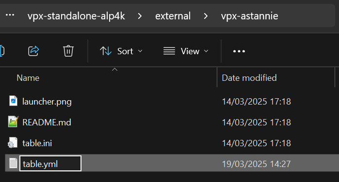

=== _All YML Fields - In Detail_

Here is an example of every field possible: (as of 27 May 2025)

....
applyFixes:                  | [Array]
backglassAuthorsOverride:    | [Array]
backglassBundled:            | [Bool]
backglassChecksum:           | [String]
backglassImageOverride       | [String]
backglassNotes:              | [String]
backglassUrlOverride:        | [String]
backglassVPSId:              | [String]
coloredROMBundled:           | [Bool]
coloredROMChecksum:          | [String]
coloredROMNotes:             | [String]
coloredROMUrlOverride:       | [String]
coloredROMVersionOverride:   | [String]
coloredROMVPSId:             | [String]
enabled:                     | [Bool]
fps:                         | [Int]
mainNotes:                   | [String]
pupArchiveFormat:            | [String]
pupArchiveRoot:              | [String]
pupChecksum:                 | [String]
pupFileUrl:                  | [String]
pupNotes:                    | [String]
pupRequired:                 | [Bool]
pupVersion:                  | [String]
romBundled:                  | [Bool]
romChecksum:                 | [String]
romNotes:                    | [String]
romUrlOverride:              | [String]
romVersionOverride:          | [String]
romVPSId:                    | [String]
tableNameOverride:           | [String]
tableNotes:                  | [String]
tableVPSId:                  | [String]
tagline:                     | [String]
testers:                     | [Array]
vpxChecksum:                 | [String]
vpxVPSId:                    | [String]
....

Below is each yml field explained, with an example, and any `gotchas'
that you need to know to use successfully!

....
########################
applyFixes
########################

Type:
------------
Array

Description:
------------
Applies fixes to the table. At the moment there is only BASS fix, but the field is open to future fixes

Example:
------------
applyFixes:
  - "bass"

Gotchas:
------------
- Like all arrays, make sure that each item in the list has 2 spaces at the start: '  - "bass"'
....

....
########################
backglassAuthorsOverride
########################

Type:
------------
Array

Description:
------------
This is an optional list so that you can manually set the Backglass Authors list.
Some backglasses don't have the authors in VPS.

Example:
------------
backglassAuthorsOverride:
  - "CoffeeAtJoes"

Gotchas:
------------
- Like all arrays, make sure that each item in the list has 2 spaces at the start: '  - "CoffeeAtJoes"'
- Currently there is a bug in the TM, if the backglass authors list is empty it'll break js/images.
  Set this field to fix that.
  You can set it to an empty field '  - ""' to get around it.
....

....
########################
backglassBundled
########################

Type:
------------
Boolean

Description:
------------
Set this field to 'true' if the backglass .directb2s file can be found in the same download as the .vpx file!
This removes the download button from the backglass, to simplify the process for the end user.

Example:
------------
backglassBundled: false

Gotchas:
------------
- The wizard will assume the file is in the vpx download.
  You cannot currently tell the wizard that it's in a different place like the rom/puppack download etc.
- If this field is set then 'backglassNotes' becomes mandatory.
  You need to explain where to find the .directb2s file.
....

....
########################
backglassChecksum
########################

Type:
------------
String

Description:
------------
This is the MD5 checksum value for the .directb2s file, taken from QuickHash.
See more info below on this page at "QuickHash (Checksums / Hash / MD5)"

Example:
------------
backglassChecksum: "8435FDA49C4DFC2D82B9B361E8AA1155"

Gotchas:
------------
- I know this sounds silly... but double check you've definitely selected the right file in QuickHash!
  Often the biggest mistake on these checksum fields were from getting a checksum of the wrong file :)
....

....
########################
backglassImageOverride
########################

Type:
------------
String

Description:
------------
This is a field used to fix broken images when using a 'backglass.png',
as we wont have a backglassVpsId to get the image from.

Example:
------------
backglassImageOverride: "https://virtualpinballspreadsheet.github.io/vps-db/img/b31KZ92B_b2s_1661263797943.webp"

Gotchas:
------------
- These image urls are the common ones to run into 'line-length' validation issues.
  If you do, check the "Line Length Issue" section below.
- Only needs to be used if your backglass image is broken or missing in the wizard.
- The image URL *has* to be from VPS, using a VPU or google image url will not work due to CORS.
....

....
########################
backglassNotes
########################

Type:
------------
String

Description:
------------
Notes for the backglass field, displayed next to the download button.
Put useful information here, or even just the file name to make things clear.
I recommend always setting it if you have a .directb2s file on the table.

Example:
------------
backglassNotes: "These are short notes..."

- or -

backglassNotes: >-
  Note: these are long notes that
  would go over the 120 character limit!
  Used the yml multi line, dont forget the 2 space indent!

Gotchas:
------------
- These notes fields are the common ones to run into 'line-length' validation issues.
  If you do, check the "Line Length Issue" section below.
- If 'backglassBundled' is true, then this field is mandatory.
....

....
########################
backglassUrlOverride
########################

Type:
------------
String

Description:
------------
This is a URL override for the backglass file.
If the b2s is in VPS there is no need for this field.
Only use it when the b2s isn't on VPS yet, and make sure to request the b2s is added on the 'Visual Pinball Chat' discord, #vps channel

Example:
------------
backglassUrlOverride: "https://vpuniverse.com/files/file/24657-pink-floyd-back-catalogue-backglass/"

Gotchas:
------------
- These URL fields are the common ones to run into 'line-length' validation issues.
  If you do, check the "Line Length Issue" section below.
....

....
########################
backglassVPSId
########################

Type:
------------
String

Description:
------------
The VPS ID for the backglass.
For more information, see the "Visual Pinball Spreadsheet (VPS)" section below

Example:
------------
backglassVPSId: "2YD0f8I0Y2"

Gotchas:
------------
- Same as the checksum, the only real problem seen here is accidently copying the ID from a different component!
  So just double check you pasted the right value :)
....

....
########################
coloredROMBundled
########################

Type:
------------
Boolean

Description:
------------
Set this field to 'true' if the serum .c7z file can be found in the same download as the .vpx file!
This removes the download button from the serum, to simplify the process for the end user.

Example:
------------
coloredROMBundled: false

Gotchas:
------------
- The wizard will assume the file is in the vpx download.
  You cannot currently tell the wizard that it's in a different place like the rom/puppack download etc.
- If this field is set then 'coloredROMNotes' becomes mandatory.
  You need to explain where to find the .c7z file.
....

....
########################
coloredROMChecksum
########################

Type:
------------
String

Description:
------------
This is the MD5 checksum value for the .c7z file, taken from QuickHash.
See more info below on this page at "QuickHash (Checksums / Hash / MD5)"

Example:
------------
coloredROMChecksum: "8435FDA49C4DFC2D82B9B361E8AA1155"

Gotchas:
------------
- I know this sounds silly... but double check you've definitely selected the right file in QuickHash!
  Often the biggest mistake on these checksum fields were from getting a checksum of the wrong file :)
....

....
########################
coloredROMNotes
########################

Type:
------------
String

Description:
------------
Notes for the serum field, displayed next to the download button.
Put useful information here, or even just the file name to make things clear.
I recommend always setting it if you have a .c7z file on the table.

Example:
------------
coloredROMNotes: "These are short notes..."

- or -

coloredROMNotes: >-
  Note: these are long notes that
  would go over the 120 character limit!
  Used the yml multi line, dont forget the 2 space indent!

Gotchas:
------------
- These notes fields are the common ones to run into 'line-length' validation issues.
  If you do, check the "Line Length Issue" section below.
- If 'coloredROMBundled' is true, then this field is mandatory.
....

....
########################
coloredROMUrlOverride
########################

Type:
------------
String

Description:
------------
This is a URL override for the serum file.
If the c7z is in VPS there is no need for this field.
Only use it when the c7z isn't on VPS yet, and make sure to request the c7z is added on the 'Visual Pinball Chat' discord, #vps channel

Example:
------------
coloredROMUrlOverride: "https://vpuniverse.com/files/file/25567-truck-stop-bally-1988-dmd-65k-serum-v2-format/"

Gotchas:
------------
- These URL fields are the common ones to run into 'line-length' validation issues.
  If you do, check the "Line Length Issue" section below.
- If you set this field, then 'coloredROMVersionOverride' becomes mandatory
....

....
########################
coloredROMVersionOverride
########################

Type:
------------
String

Description:
------------
This is mandatory when 'coloredROMUrlOverride' is used.
It is how we know what the ROM should be called, so that we can
update the name if they upload it with and altered name like 'romname (1)' etc.
So this needs to be the romname, with no file extension like '.zip'.

Example:
------------
coloredROMVersionOverride: "baywatch"

Gotchas:
------------
- This has to match the rom name / romVersionOverride
- It is very very common to see someone accidently put the file extension
  in this field (for example coloredROMVersionOverride: "baywatch.zip")
  This WILL NOT work, you need to remove all file extensions. otherwise it will be named 'baywatch.zip.zip'
....

....
########################
coloredROMVPSId
########################

Type:
------------
String

Description:
------------
The VPS ID for the serum file.
For more information, see the "Visual Pinball Spreadsheet (VPS)" section below

Example:
------------
coloredROMVPSId: "2YD0f8I0Y2"

Gotchas:
------------
- Same as the checksum, the only real problem seen here is accidently copying the ID from a different component!
  So just double check you pasted the right value :)
....

....
########################
enabled
########################

Type:
------------
Boolean

Description:
------------
We can use this field to disable/hide tables from appearing in the TM wizard.

Example:
------------
enabled: false

Note - Its good to add a note too:

enabled: false # Osie: Disabled till new bundle is released

Gotchas:
------------
- By default tables will appear in the TM wizard, so you dont need to put 'enabled: true'
....

....
########################
fps
########################

Type:
------------
Integer

Description:
------------
This is the FPS for the table. This will display in the TM wizard page.

Example:
------------
fps: 60

Gotchas:
------------
- Please make sure when this field is updated, you also update both the table README and the main README!!
....

....
########################
mainNotes
########################

Type:
------------
String

Description:
------------
Field for general table notes. Not specific to any one file (.vpx/.directb2s etc) but for the table itself.
Displayed above all the download inputs on the wizard page, under the image/name/info.

Example:
------------
mainNotes: "These are short notes..."

- or -

mainNotes: >-
  Note: these are long notes that
  would go over the 120 character limit!
  Used the yml multi line, dont forget the 2 space indent!

Gotchas:
------------
- These notes fields are the common ones to run into 'line-length' validation issues.
  If you do, check the "Line Length Issue" section below.
....

....
########################
pupArchiveFormat
########################

Type:
------------
String

Description:
------------
Default: zip
Available values: zip | rar | 7z

You can use this to specify if the puppack archive is a different format than zip

Example:
------------
pupArchiveFormat: "rar"
....

....
########################
pupArchiveRoot
########################

Type:
------------
String

Description:
------------
This is a field used by the wizard to navigate through a zip to the location of the important pup folder.
Used if the author puts the pup files deeper into the zip then just the root.

Example:
------------
pupArchiveRoot: "TableMedia/PupFiles/"

Gotchas:
------------
- THE TABLE MANAGER IS NOT SET UP TO USE THIS FIELD ATM!
....

....
########################
pupChecksum
########################

Type:
------------
String

Description:
------------
This is the MD5 checksum value for the .zip/.rar file of the puppack media, taken from QuickHash.
See more info below on this page at "QuickHash (Checksums / Hash / MD5)"

Example:
------------
pupChecksum: "8435FDA49C4DFC2D82B9B361E8AA1155"

Gotchas:
------------
- I know this sounds silly... but double check you've definitely selected the right file in QuickHash!
  Often the biggest mistake on these checksum fields were from getting a checksum of the wrong file :)
- Do the checksum on the unaltered zip/rar file you get from the puppack download
....

....
########################
pupFileUrl
########################

Type:
------------
String

Description:
------------
This is the download URL for the puppack zip/rar.
Currently this is the only way to link a puppack, as there is no pupFileVpsId field.

Example:
------------
pupFileUrl: "https://mega.nz/file/yZAEAawT#XlXXV5F_vwgCNGuQNfGKgbWjPha5C8CJP48QpfVcMiY"

Gotchas:
------------
- These URL fields are the common ones to run into 'line-length' validation issues.
  If you do, check the "Line Length Issue" section below.
- The download urls are usually in the .vpx table description, so you can use the direct link from there here.
....

....
########################
pupNotes
########################

Type:
------------
String

Description:
------------
Notes for the puppack field, displayed next to the download button.
Put useful information here, or even just the file name to make things clear.
I recommend always setting it if you have a puppack download.

Example:
------------
pupNotes: "These are short notes..."

- or -

pupNotes: >-
  Note: these are long notes that
  would go over the 120 character limit!
  Used the yml multi line, dont forget the 2 space indent!

Gotchas:
------------
- These notes fields are the common ones to run into 'line-length' validation issues.
  If you do, check the "Line Length Issue" section below.
....

....
########################
pupRequired
########################

Type:
------------
String

Description:
------------
Specifies if the puppack is mandatory, like Space Cadet or John Wick for example.

Example:
------------
pupRequired: true
....

....
########################
pupVersion
########################

Type:
------------
String

Description:
------------
This is mandatory for pup packs
It is how we know what the puppack folder should be called, so that we can
update the name if they upload it with and altered name like 'puppack (1)' etc.
So this needs to be the puppack folder name (likely same as rom), with no file extension like '.zip'.

Example:
------------
pupVersion: "spacecadet"

Gotchas:
------------
- It is very very common to see someone accidently put the file extension
  in this field (for example pupVersion: "spacecadet.zip")
  This WILL NOT work, you need to remove all file extensions. otherwise it will be named 'spacecadet.zip.zip'
....

....
########################
romBundled
########################

Type:
------------
Boolean

Description:
------------
Set this field to 'true' if the rom zip file can be found in the same download as the .vpx file!
This removes the download button from the rom, to simplify the process for the end user.

Example:
------------
romBundled: false

Gotchas:
------------
- The wizard will assume the file is in the vpx download.
  You cannot currently tell the wizard that it's in a different place like the b2s/puppack download etc.
- If this field is set then 'romNotes' becomes mandatory.
  You need to explain where to find the .zip file.
....

....
########################
romChecksum
########################

Type:
------------
String

Description:
------------
This is the MD5 checksum value for the .zip file, taken from QuickHash.
See more info below on this page at "QuickHash (Checksums / Hash / MD5)"

Example:
------------
romChecksum: "8435FDA49C4DFC2D82B9B361E8AA1155"

Gotchas:
------------
- I know this sounds silly... but double check you've definitely selected the right file in QuickHash!
  Often the biggest mistake on these checksum fields were from getting a checksum of the wrong file :)
....

....
########################
romNotes
########################

Type:
------------
String

Description:
------------
Notes for the rom field, displayed next to the download button.
Put useful information here, or even just the file name to make things clear.
I recommend always setting it if you have a .zip file on the table.

Example:
------------
romNotes: "These are short notes..."

- or -

romNotes: >-
  Note: these are long notes that
  would go over the 120 character limit!
  Used the yml multi line, dont forget the 2 space indent!

Gotchas:
------------
- These notes fields are the common ones to run into 'line-length' validation issues.
  If you do, check the "Line Length Issue" section below.
- If 'romBundled' is true, then this field is mandatory.
....

....
########################
romUrlOverride
########################

Type:
------------
String

Description:
------------
This is a URL override for the rom file.
If the rom is in VPS there is no need for this field.
Only use it when the rom isn't on VPS yet, and make sure to request the rom is added on the 'Visual Pinball Chat' discord, #vps channel

Example:
------------
romUrlOverride: "https://vpuniverse.com/files/file/25567-truck-stop-bally-1988-dmd-65k-serum-v2-format/"

Gotchas:
------------
- These URL fields are the common ones to run into 'line-length' validation issues.
  If you do, check the "Line Length Issue" section below.
- If you set this field, then 'romVersionOverride' becomes mandatory
....

....
########################
romVersionOverride
########################

Type:
------------
String

Description:
------------
This is mandatory when 'coloredROMUrlOverride' is used.
It is how we know what the ROM should be called, so that we can
update the name if they upload it with and altered name like 'romname (1)' etc.
So this needs to be the romname, with no file extension like '.zip'.

Example:
------------
romVersionOverride: "baywatch"

Gotchas:
------------
- It is very very common to see someone accidently put the file extension
  in this field (for example romVersionOverride: "baywatch.zip")
  This WILL NOT work, you need to remove all file extensions. otherwise it will be named 'baywatch.zip.zip'
....

....
########################
romVPSId
########################

Type:
------------
String

Description:
------------
The VPS ID for the rom file.
For more information, see the "Visual Pinball Spreadsheet (VPS)" section below

Example:
------------
romVPSId: "2YD0f8I0Y2"

Gotchas:
------------
- Same as the checksum, the only real problem seen here is accidently copying the ID from a different component!
  So just double check you pasted the right value :)
....

....
########################
tableNameOverride
########################

Type:
------------
String

Description:
------------
This is an override for the table name.
Try not to use this one, its only if there are big mistakes i.e. the name is wrong / misleading.

Example:
------------
tableNameOverride: "James Bond"
....

....
########################
tableNotes
########################

Type:
------------
String

Description:
------------
Notes for the .vpx field, displayed next to the download button.
Put useful information here, or even just the file name to make things clear.
I recommend always setting this.

Example:
------------
tableNotes: "These are short notes..."

- or -

tableNotes: >-
  Note: these are long notes that
  would go over the 120 character limit!
  Used the yml multi line, dont forget the 2 space indent!

Gotchas:
------------
- These notes fields are the common ones to run into 'line-length' validation issues.
  If you do, check the "Line Length Issue" section below.
....

....
########################
tableVPSId
########################

Type:
------------
String

Description:
------------
The VPS ID for the overall table itself in VPS.
So this will be right at the top of the page once you've found the table in VPS.
For more information, see the "Visual Pinball Spreadsheet (VPS)" section below

Example:
------------
tableVPSId: "2YD0f8I0Y2"

Gotchas:
------------
- Same as the checksum, the only real problem seen here is accidently copying the ID from a different component!
  So just double check you pasted the right value :)
....

....
########################
tagline
########################

Type:
------------
String

Description:
------------
This is the fun quote or message we put on every table!
For example "Baywatch will be right back..." for Baywatch.

Example:
------------
tagline: "This is a short tagline"

- or -

tagline: >-
  This tagline is much much longer and
  would go over the 120 character limit!
  Used the yml multi line, dont forget the 2 space indent!

Gotchas:
------------
- These string fields are the common ones to run into 'line-length' validation issues.
  If you do, check the "Line Length Issue" section below.
....

....
########################
testers
########################

Type:
------------
Array

Description:
------------
The list of beta users who tested the table, and also who got it onto the wizard.
This includes the original testers who submitted the table to the repo.

Example:
------------
testers:
  - "CoffeeAtJoes"
  - "OminousOsie"

Gotchas:
------------
- Like all arrays, make sure that each item in the list has 2 spaces at the start: '  - "CoffeeAtJoes"'
- Make sure to include the original tester who submitted the table! We don't leave anyone out.
  If they didn't write their name in the README then you can find it in the git history for the file.
....

....
########################
vpxChecksum
########################

Type:
------------
String

Description:
------------
This is the MD5 checksum value for the .vpx file, taken from QuickHash.
See more info below on this page at "QuickHash (Checksums / Hash / MD5)"

Example:
------------
vpxChecksum: "8435FDA49C4DFC2D82B9B361E8AA1155"

Gotchas:
------------
- I know this sounds silly... but double check you've definitely selected the right file in QuickHash!
  Often the biggest mistake on these checksum fields were from getting a checksum of the wrong file :)
....

....
########################
vpxVPSId
########################

Type:
------------
String

Description:
------------
The VPS ID for the .vpx file.
For more information, see the "Visual Pinball Spreadsheet (VPS)" section below

Example:
------------
vpxVPSId: "2YD0f8I0Y2"

Gotchas:
------------
- Same as the checksum, the only real problem seen here is accidently copying the ID from a different component!
  So just double check you pasted the right value :)
....

=== _YML PR Issues_

We have YML validation that runs whenever you make a PR that contains an
updated .yml file.

==== _Line Length Issue_

In the `.yamllint` we have `line-length: max: 120` set. So any lines
over 120 characters will flag an issue.

This can be updated in that file if 120 is too little, but there are a
couple ways around the issue anyway:

*_Using the multi line syntax to break up long lines. Great for note
fields._*

_Before:_

[source,yaml]
....
tableNotes: "this line is far too loooooooooooong!"
....

_After:_

[source,yaml]
....
tableNotes: >-
  This line is
  far too loooooooooooong!
....

[NOTE]
====
. Make sure to indent the lines by 2 spaces.
. You don’t need to use double-quotes here. If you do, they will be
displayed.
====

*_Using a comment to disable the check. Great for URLs_*

Adding this line above the line you want excluded from the check will
stop it checking the length.

[source,yaml]
....
# yamllint disable-line rule:line-length
romUrlOverride: "https://super-long-url-here"
....

== _Related Information_

There are some processes / sites / apps we need to have installed or be
familiar with!

=== _QuickHash (Checksums / Hash / MD5)_

This is the program we use to get MD5 hashs!

Install here: https://www.quickhash-gui.org/[QuickHash]

To get the hash, open up `QuickHash' on your PC.

Go to the `File` tab, and make sure `MD5` is selected:

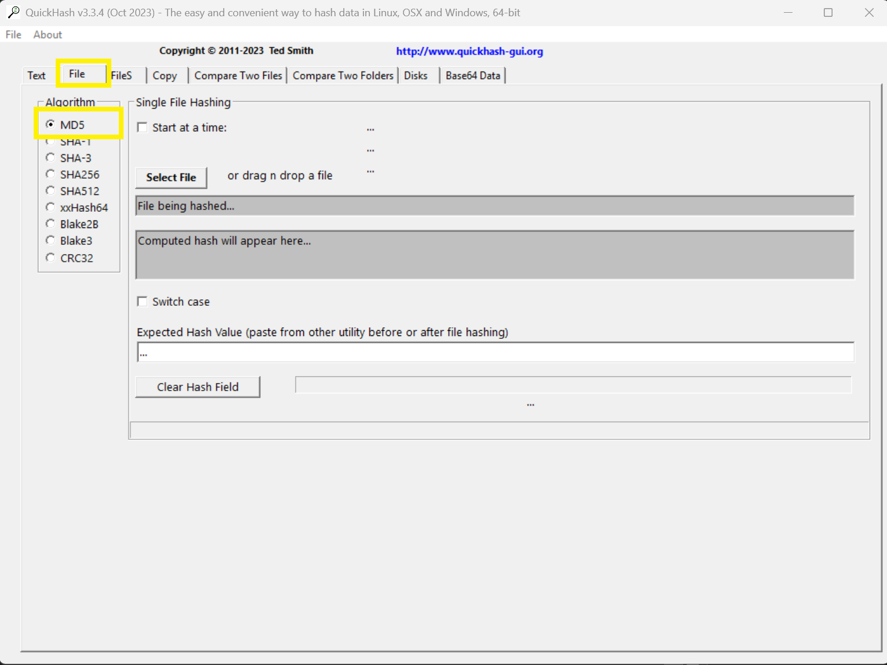

Then select file:

[NOTE]
====
This can be either a file like `.vpx` etc, or it can be a `.zip`
like the rom or pup pack
====

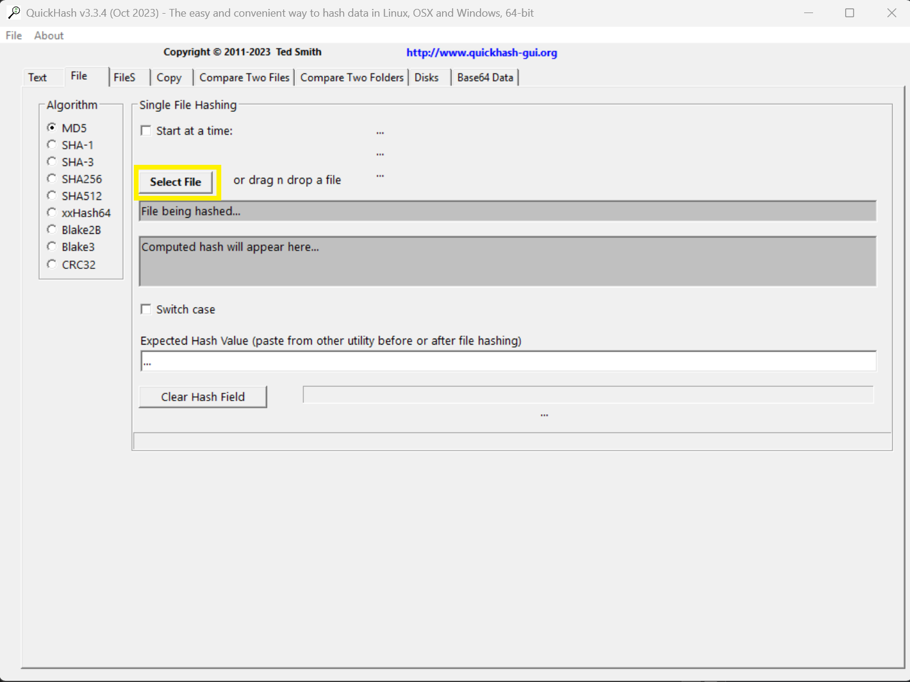

Finally grab the hash!

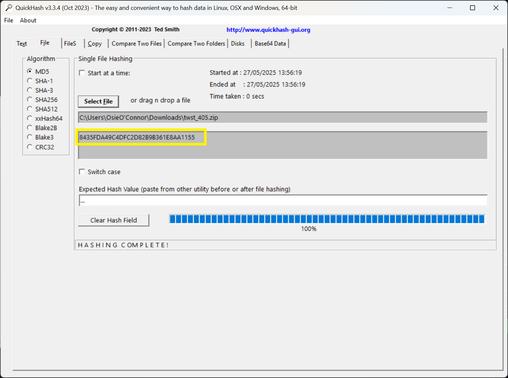

=== _Visual Pinball Spreadsheet (VPS)_

https://virtualpinballspreadsheet.github.io/[Visual Pinball Spreadsheet]
is the website we use to get table ids, which then allow us to
programmatically get download URLs, images, authors, and other
information!

Use the table name from our repo, to search VPS (you might need to
simplify the name to find it)

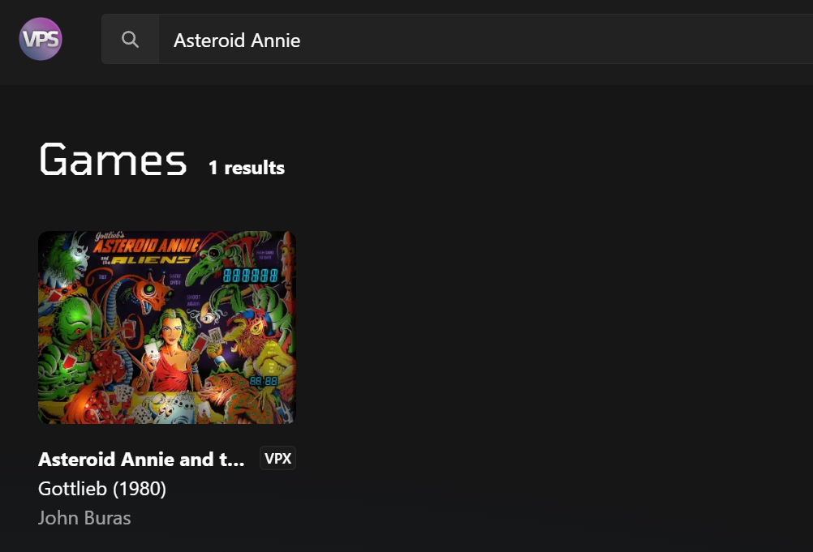

Clicking it will open up the full details. This is where we are going to
get the majority of the information we need!

image:../images/add_table_vps_table_details.png[]

The table itself will have an overall ID:

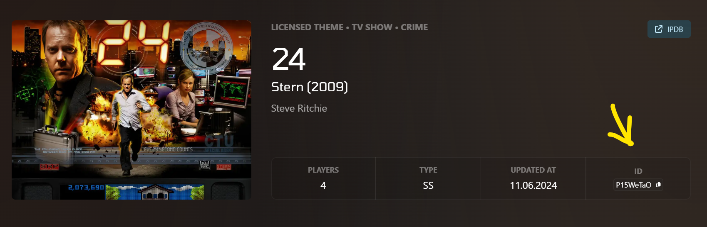

And each component will also have an ID:

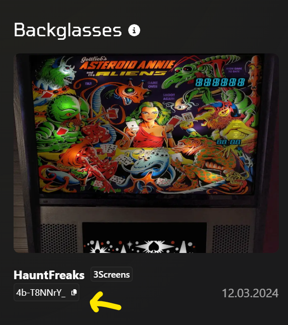

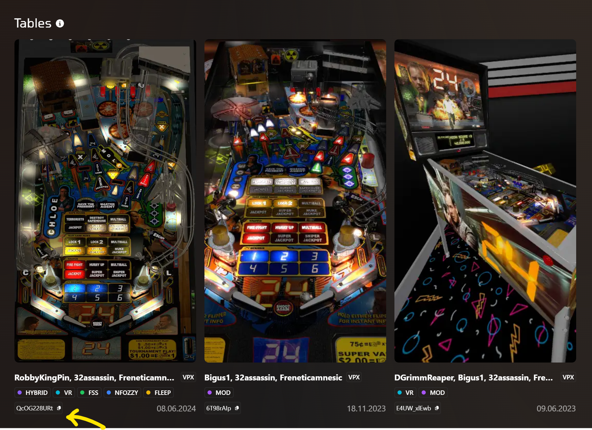

=== _GitHub Releases_

GitHub Releases are how we deploy wizard tables.

These can be done on your own repository!

First of all, we need to make sure your repo has actions enabled.

On your repository fork, click settings

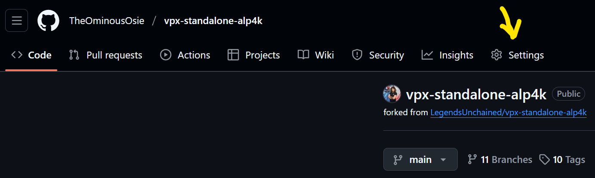

Then click on menu:Actions[General]

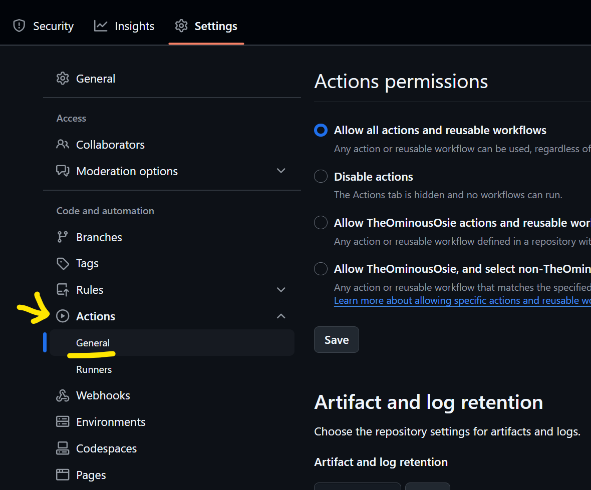

And ensure that both `Actions permissions` and `Workflow permissions`
are set to their `enabled' state, underlined below:

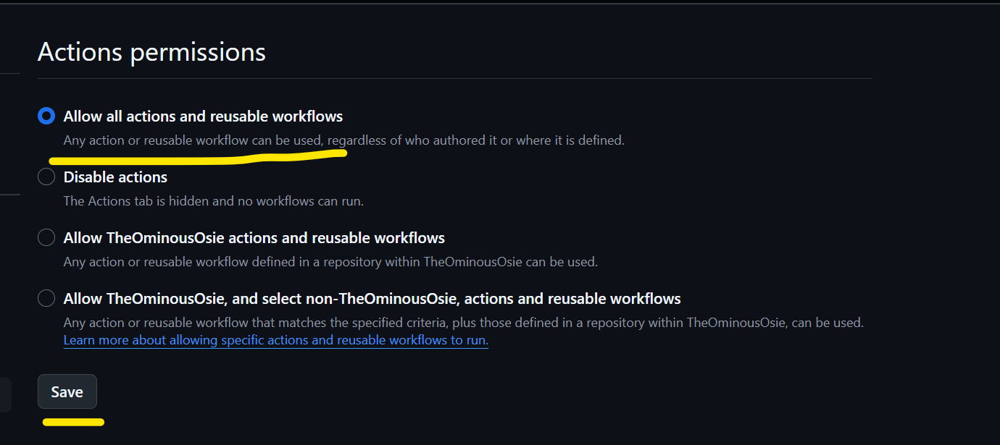

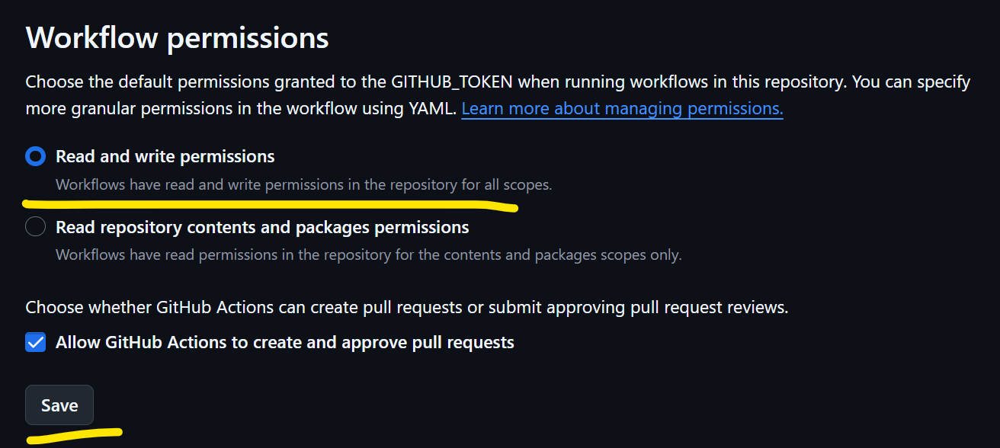

Once that is sorted, you can go back to your yml files and commit them.
It's best to commit these under `main`.

Once committed, go back to your repo fork and on the right hand side
click `Create a new Release` (or `+ (x) Releases` if you’ve previously
made a release)

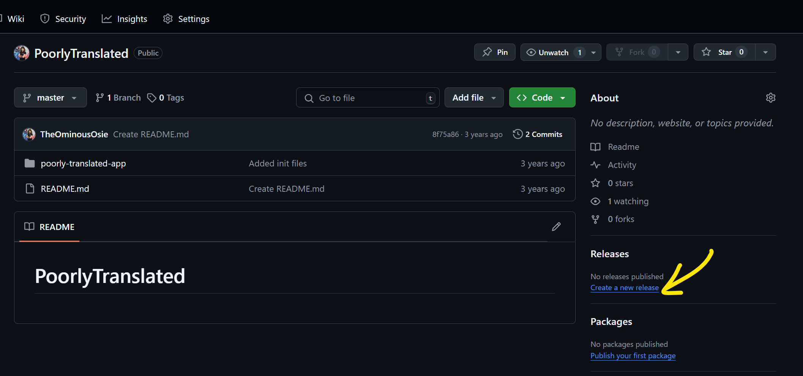

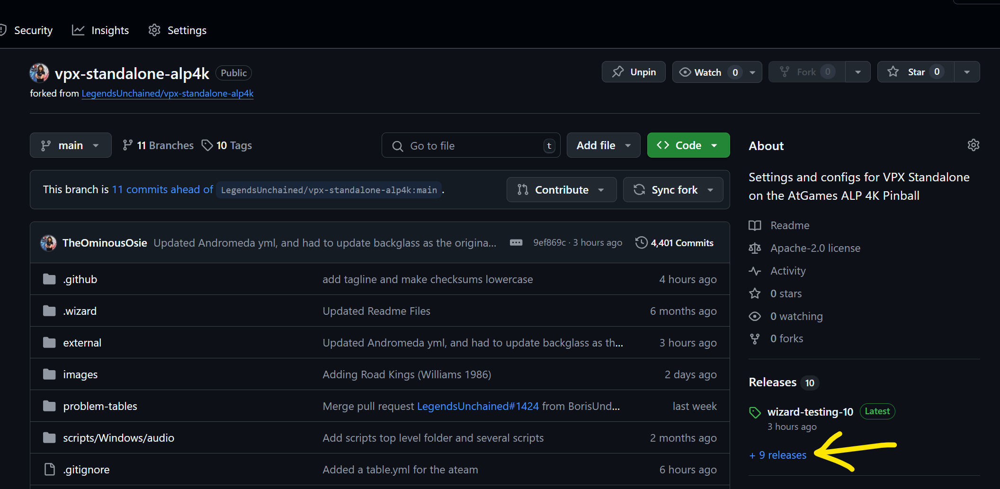

Then click `Draft a new release`

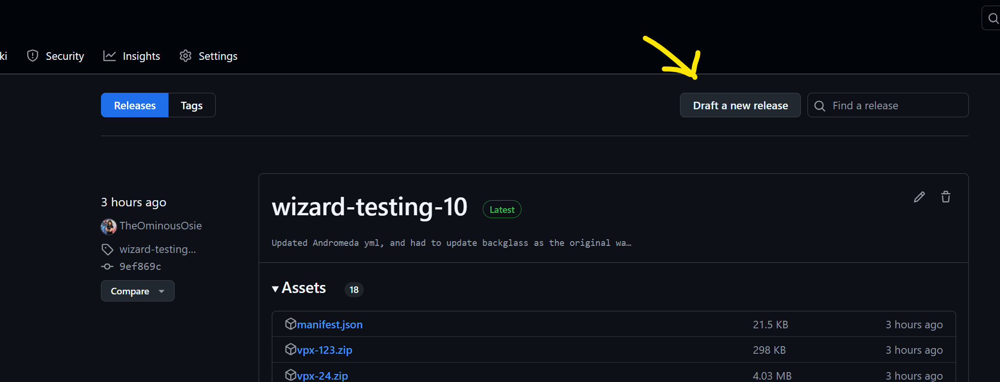

On this page, we need to give the release a name. Click the `create tag`
button, and in the text box enter a name. Something like `something-n`,
so that you can increment the number each release. I called mine
`wizard-testing-n`

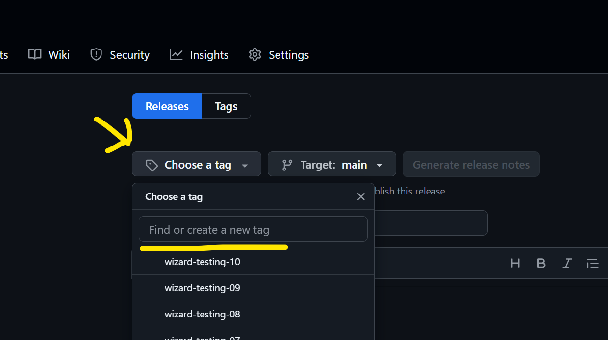

When ready, click the button underneath the text box.

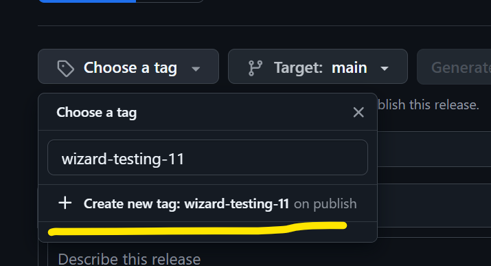

Then hit the `Publish release` button to submit it!

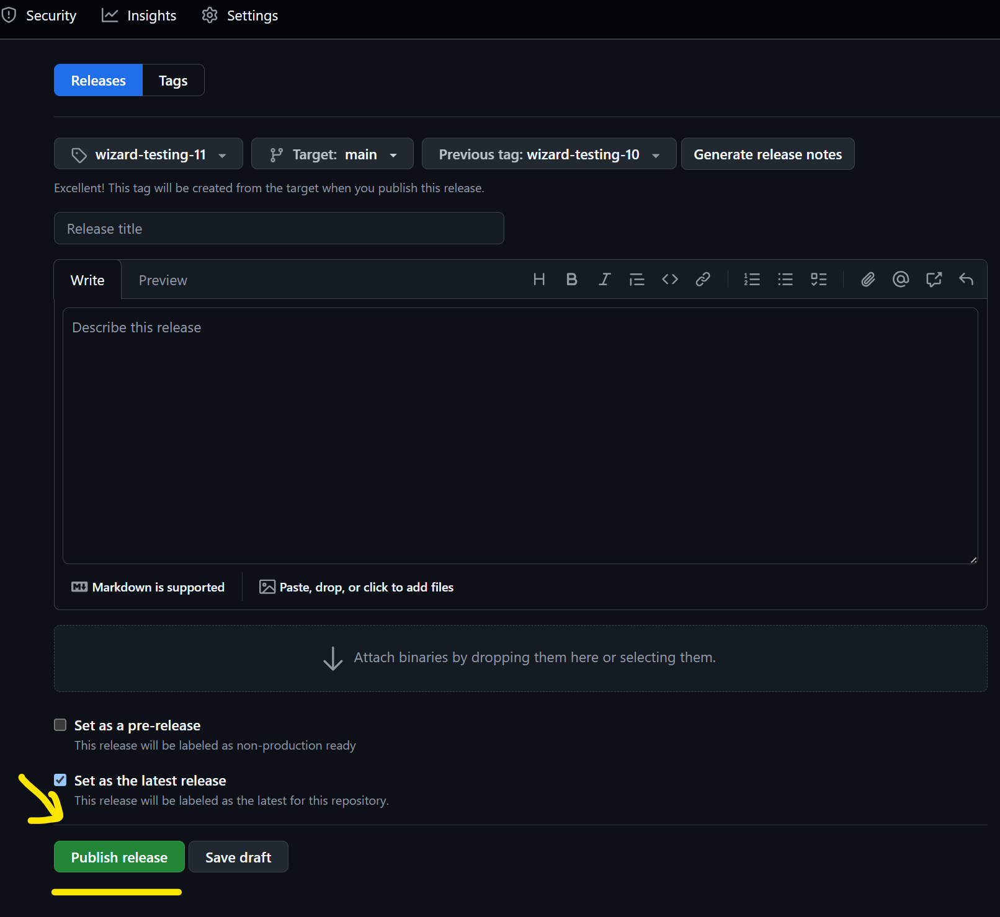

Thats it!

It will take a minute to build all the files it needs. You can see the
progress in the `Actions` tab.

To use the release, open the Table Manager, and the
`external/lu-tablemanager/` folder, add a new file called
`settings.json` and enter your repo info:

[source,json]
....
{
  "configrepo": "n-i-x/vpx-standalone-alp4k"
}
....

so for the cool kids, its:

[source,json]
....
{
  "configrepo": "TheOminousOsie/vpx-standalone-alp4k"
}
....

You can see that name in `Your Profile`, it's the same name you sent to
the Legends Unchained bot, and it's the name in the repo fork url!

