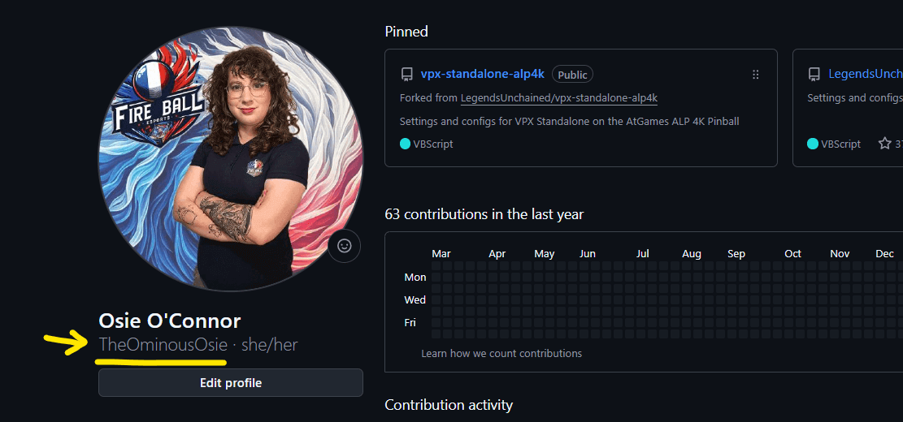
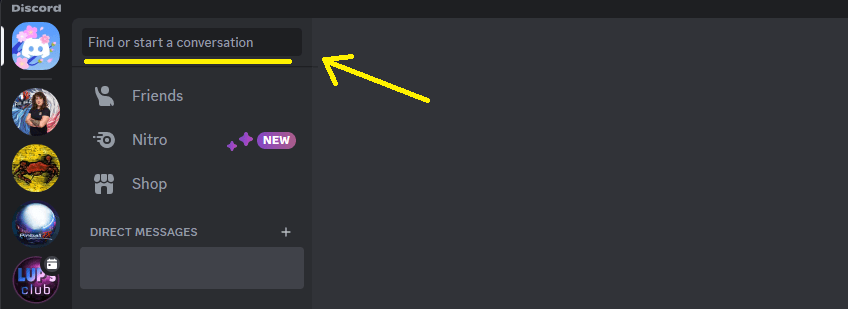
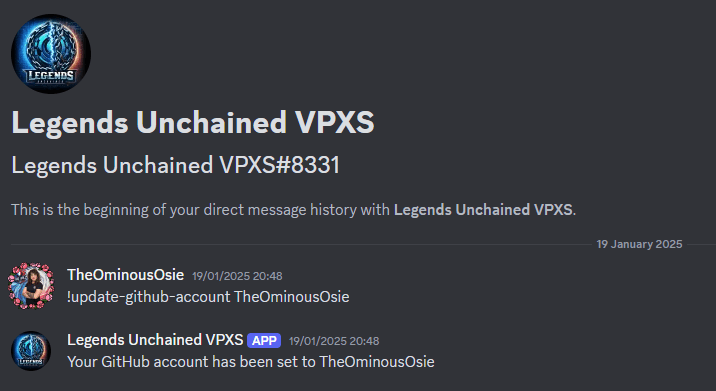
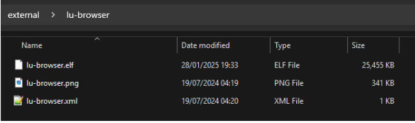
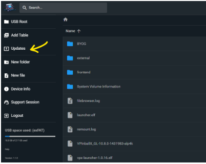
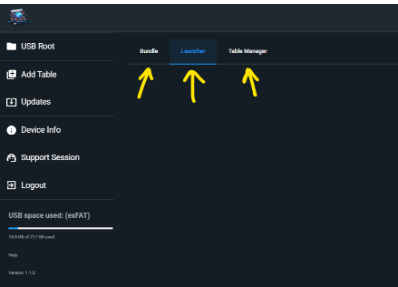
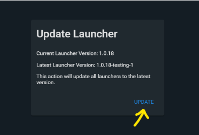

include::../attributes.adoc[]

:show-youtube-video:

= Getting Started
:toc: left
:icons: font

== PLEASE READ FIRST

From this point onwards in the documentation you will need to be a member of the
VPXS 4KP beta.

If you are not, then please read the xref:joiningthebeta.adoc[Joining the Beta] article for more information on how to join!

== _Video Guides_

=== _Setting up my USB - Start to Finish_

[NOTE]
====
Some information in this video is out-of-date. Do not download the
repo as a zip file and do not add any files to your USB drive other than
lu-tablemanager. Create an empty folder called `external' on the root of
your USB drive and add lu-tablemanager inside as shown. Then proceed to
installing the other applications using Table Manager.
====

// Allows video to adjust width for both mobile and desktop viewing
ifdef::show-youtube-video[]
++++

  <iframe width="560" height="315" src="https://www.youtube.com/embed/w0v87rA1UD0"
    title="YouTube video player" frameborder="0"
    allow="accelerometer; clipboard-write; encrypted-media; gyroscope; picture-in-picture"
    allowfullscreen></iframe>

++++
endif::show-youtube-video[]

https://youtu.be/w0v87rA1UD0?si=iTMMPrnl6ZNbJ842[YouTube Tutorial (Dr
Wraith)]

Want to set up VPX Standalone on your AtGames Legends Pinball 4K? This guide will walk
you through the complete process, updated for the latest version of
Legends Unchained. From formatting your drive, to installing Table
Manager, to grabbing the latest files — this is everything you need to
know to get your machine ready for virtual pinball greatness.

What This Video Covers:

* Formatting your flash drive to exFAT (required for everything to work
smoothly)
* Getting the newest Table Manager from Mox’s Game Room Discord
* Launching Table Manager directly from your ALP 4K
* Logging in and preparing to add your tables
* Basic troubleshooting tips — including how to apply BASS fixes and upload logs to get help if something goes wrong

=== _Linking my GitHub user to the Legends Unchained bot_

Short video tutorial specifically for linking your GitHub user to Mox’s
discord and the Legends Unchained Bot!

ifdef::show-youtube-video[]
++++

  <iframe width="560" height="315" src="https://www.youtube.com/embed/rx1DklK73FM"
    title="YouTube video player" frameborder="0"
    allow="accelerometer; clipboard-write; encrypted-media; gyroscope; picture-in-picture"
    allowfullscreen></iframe>

++++
endif::show-youtube-video[]

//video::rx1DklK73FM[youtube,width=800,height=600,poster=http://i3.ytimg.com/vi/rx1DklK73FM/hqdefault.jpg]

https://youtu.be/rx1DklK73FM?si=Y50AZwW60UOgomMx[YouTube Tutorial
(Ominous Osie)]

== _Text Guides_

=== _Compatible USBs_
// This information is in Joining the Beta and in the Getting Started Docs
// Should consider having it in one or the other but not both places.  If we need
// it in both places, then extract to a seperate file and include the file where appropriate

VPXs will work on most USB 3.0 drives, but it is highly recommended you
use a USB drive specifically from the list of compatible USBs below:

* Kingston DataTraveler Max 256GB https://amzn.to/42Ygu1k[Amazon US] |
https://www.amazon.co.uk/Kingston-DataTraveler-Type-Flash-256GB/dp/B0B57T5G5L/ref=sr_1_4?crid=315CRMHOUO8CK&dib=eyJ2IjoiMSJ9.nYs6eArqp1rbUN8HVL0fsZ4kolmlWN0y4wxwPyShbfMFaMKUw-Ut6_S3xVTQj_uWsPJty-dpt_AqZBCploj1yKOhnEop_bhRtlDZqVPeVsN7ufr-dtCfuAIxSwepI83b2gh3kE-6faAqczA5jnctcV7pAVDA223BFw2xwLiNyA1cd3-H-TxtXgEEGqPrwCUZmHcp7tj9M4W7MH7L9w-UCmsRfKOkz9xn_9jp4uO_l94.KBdZLVfqvPpdn8UVwR3cntzEvzUKmrR0tspXU3h2lGs&dib_tag=se&keywords=Kingston%2BDataTraveler%2BMax%2B256GB&qid=1746177043&sprefix=kingston%2Bdatatraveler%2Bmax%2B256gb%2Caps%2C93&sr=8-4&th=1[Amazon
UK] |
https://www.amazon.ca/Kingston-DataTraveler-256GB-Performance-DTMAXA/dp/B0B57T5G5L/ref=mp_s_a_1_3_maf_1?crid=1LBM4IJUL86EF&dib=eyJ2IjoiMSJ9.QRa55IVIPlNkKZv0lhETlcqjm4VJsvXWLg6CcVliC7EIAHMIc_3zxdGOsUuRpTMdSdACw9xU98zZkckN9dM63zRal-3JUsPRyEcg-o2-tLgKWwhmYz1MEhSXKepHOgKGQ3sWx23iLflyRxxvrc5RRlbIFSPJsqcMiJD9HqzfAG_A90DNl8TPsr0rUB8qmIDYHzSOSxGyFLtDGgujNJoRcg.-ntxiKL0ucdRsB4g7UBFgwLRbobvYgvmVjEKio0gK84&dib_tag=se&keywords=Kingston+DataTraveler+Max+256GB&qid=1746184809&sprefix=kingston+datatraveler+max+256gb%2Caps%2C118&sr=8-3[Amazon
CA]
* Kingston DataTraveler Max 512GB https://amzn.to/3ECtzFi[Amazon US] |
https://www.amazon.co.uk/Kingston-DataTraveler-Type-Flash-256GB/dp/B0B57TXS4J/ref=sr_1_4?crid=315CRMHOUO8CK&dib=eyJ2IjoiMSJ9.nYs6eArqp1rbUN8HVL0fsZ4kolmlWN0y4wxwPyShbfMFaMKUw-Ut6_S3xVTQj_uWsPJty-dpt_AqZBCploj1yKOhnEop_bhRtlDZqVPeVsN7ufr-dtCfuAIxSwepI83b2gh3kE-6faAqczA5jnctcV7pAVDA223BFw2xwLiNyA1cd3-H-TxtXgEEGqPrwCUZmHcp7tj9M4W7MH7L9w-UCmsRfKOkz9xn_9jp4uO_l94.KBdZLVfqvPpdn8UVwR3cntzEvzUKmrR0tspXU3h2lGs&dib_tag=se&keywords=Kingston%2BDataTraveler%2BMax%2B256GB&qid=1746177043&sprefix=kingston%2Bdatatraveler%2Bmax%2B256gb%2Caps%2C93&sr=8-4&th=1[Amazon
UK] |
https://www.amazon.ca/Kingston-DataTraveler-512GB-Performance-DTMAXA/dp/B0B57TXS4J/ref=mp_s_a_1_4?crid=2RQ5AEEKYPMF1&dib=eyJ2IjoiMSJ9.OpjNFtAZ4PtMSsoZiXbBVt1uC6iTL80pTH5JD642UjqakIHefr-ieCm-kU4mgBxXl12-xK2UyEoj2sRz49k4E57NkQsuZcDW_3iclcwq94_mc_K-3p1PU-KCfdgx2eVzYqmg-1KXMdxY4sfi_BPQIzLvdvDmqTgBB-G_uI6z4eUvLhLGmYtruDWWIwxg7gKTqtHgwGAIUMkr5zX6qkrk-Q.T0kpQdBaxB4A63MVVX6A5wZ-8OStUF0r2yr7YJVGWvk&dib_tag=se&keywords=kingston+datatraveler+max+512gb&qid=1746184864&sprefix=Kingston+DataTraveler+Max+%2Caps%2C133&sr=8-4[Amazon
CA]
* Samsung FIT 256GB Flash Drive https://amzn.to/3ymA382[Amazon US] |
https://www.amazon.co.uk/dp/B07HPX38XC?ref=ppx_yo2ov_dt_b_fed_asin_title&th=1[Amazon
UK] |
https://www.amazon.ca/dp/B07D7Q41PM?ref=cm_sw_r_cso_cp_apan_dp_R4MJB5WQ4KWB1FBCBYGN&ref_=cm_sw_r_cso_cp_apan_dp_R4MJB5WQ4KWB1FBCBYGN&social_share=cm_sw_r_cso_cp_apan_dp_R4MJB5WQ4KWB1FBCBYGN&starsLeft=1&th=1[Amazon
CA]
* Samsung FIT 512GB Flash Drive https://amzn.to/46uLC9M[Amazon US] |
https://www.amazon.co.uk/dp/B0CY5GCGY5?ref=ppx_yo2ov_dt_b_fed_asin_title&th=1[Amazon
UK] |
https://www.amazon.ca/dp/B0CYMB3HG4?ref=cm_sw_r_cso_cp_apan_dp_R4MJB5WQ4KWB1FBCBYGN&ref_=cm_sw_r_cso_cp_apan_dp_R4MJB5WQ4KWB1FBCBYGN&social_share=cm_sw_r_cso_cp_apan_dp_R4MJB5WQ4KWB1FBCBYGN&starsLeft=1&th=1[Amazon
CA]

The benefits are twofold:

. The Read/Write speeds on these USBs are fantastic, so you will spend less time waiting for files to upload, and it will run smoother.
. It helps eliminate one potential issue if you did have any problems running a table.

=== _Partition USB for VPXS_

// This is also in the getting started and joining the beta guides.
// Consider consolidation to one guide or extract to an included document

Once you have your USB, you need to format/partition it.

* Option 1) Single Partition (Just VPXS/BOYG) +
https://wagnerstechtalk.com/algl/#Single-Partition_Method[Wagners Guide - Single Partition]
* Option 2) Dual Partition (VPXS/BOYG, and FDX/AtGames additional storage) +
https://wagnerstechtalk.com/algl/#Dual-Partition_Method[Wagners Guide - Dual Partition]

=== _Can I still have my Attract Mode videos/BYOGs/Menu music files?_
// In the Joining the Beta and Getting Started guides.  May want to consolidate the two

Yes! All those folders can continue to exist on the same partition as
the VPXS table files/folders!

=== _Linking my GitHub user to the Legends Unchained bot_

To link your GitHub user to the Legends Unchained bot, first get your
username from your GitHub profile. It will be under your full name in
the My Profile page.

Next, in discord, go to your DMs, and in the `start conversation` search
bar start typing `Legends Unchained VPXS` and start a conversation with
that bot.

In the conversation window, message them +
`!update-github-account [username]`

So for example: +
`!update-github-account TheOminousOsie`

[#_table_manager]
== _Table Manager_

=== _What is the Table Manager?_

The Table Manager is an application that you run on your 4KP, which
produces a URL for you to navigate to on your PC/mobile.Once on the
website, you will have all the functions you need to
add/manage/remove/repair VPXS tables on your USB!

=== _How do I add the Table Manager to my USB?_

Once on the beta, go to Max’s Game Room Discord, and visit the
`#getting-started` channel.

One of the messages there by Nix contains a zip folder named
`lu-tablemanager-[version].zip` (the version number will be updated over
time). Download that file and extract it on your PC.

Next plug your USB directly into your PC, navigate to your exFat
partition drive on the PCs file browser.

Make sure your drive has an `external` folder on the root, and then copy
the `lu-tablemanager` folder from within the
`lu-tablemanager-[version].zip` extracted files.

// This image probably needs to be updated as the file name is different now.

Unplug your USB from your PC and now plug it into the 4KP, once mounted,
you should see an `external applications` tab, with a `Table Manager`
app within!

=== _Connecting to the Table Manager_

First things first, on your 4KP go to Settings > Attract Mode and
DISABLE the attract mode in-table option.

Run the `Table Manager` app on your 4KP. After a moment to load, you
should see a URL on the screen. An example URL might look something like
this: `http://168.1.0.240:9999`

Keep this app running on your 4KP, and navigate to that URL on your
PC/mobile.

Once the website loads, you will need to log in. You can find the
username and password on Nixs post on #getting-started in the discord.

You should now be in the Table Manager!

Troubleshooting:

* Verify you have completely disabled In-table Attract
Mode on your 4KP
* Make sure the app is still running on your 4KP while
you are trying to access the website
* Make sure to carefully type the URL onto your PC/mobile browser. You need everything from `http://` to the `:9999`, you do not need `(WLAN)` in the URL.
* Make sure your 4KP is on the same network as your PC/mobile. The website is being hosted
directly on the 4KP so you have to be able to access your 4KP on the network.

=== _Updating your files using Table Manager_

On initial set up of your USB, your drive will be missing both the`launcher` file and the `bundle` file.

To download the files, log into the Table Manager, and click on`Updates` on the left hand side nav menu.

Once in the update menu, there will be 3 tabs: `bundle`, `launcher`, and `table manager`.

Click on `bundle` and it should ask if you want to install it, click
yes.

This may take a little while, please be patient.

Once done, do the same for the `launcher` tab.

