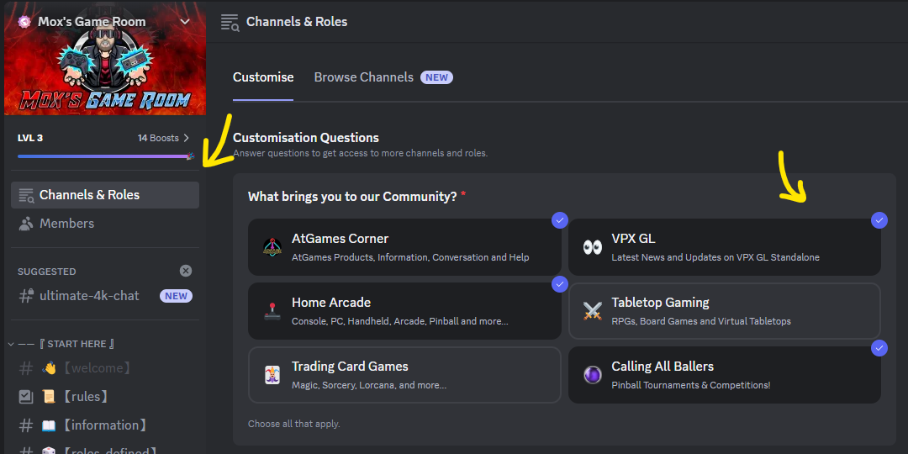
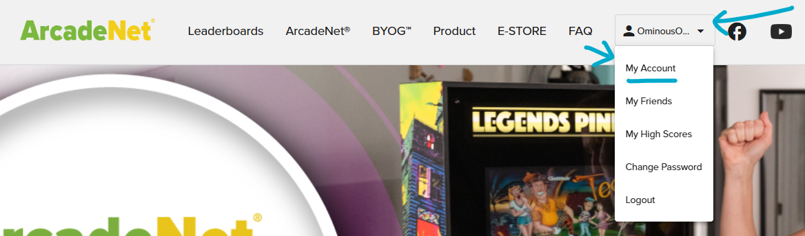
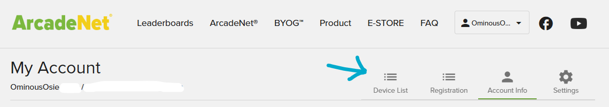
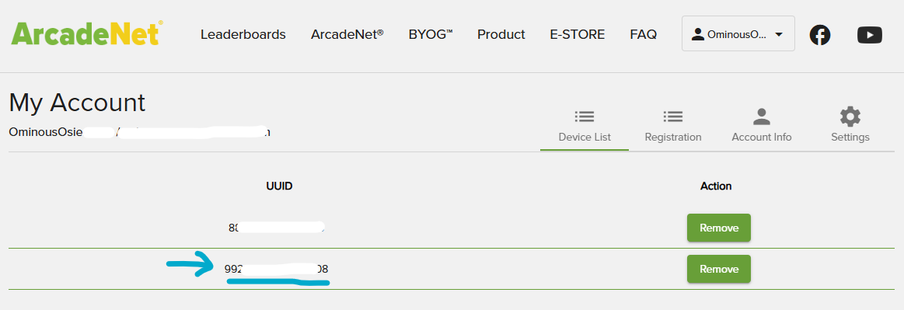
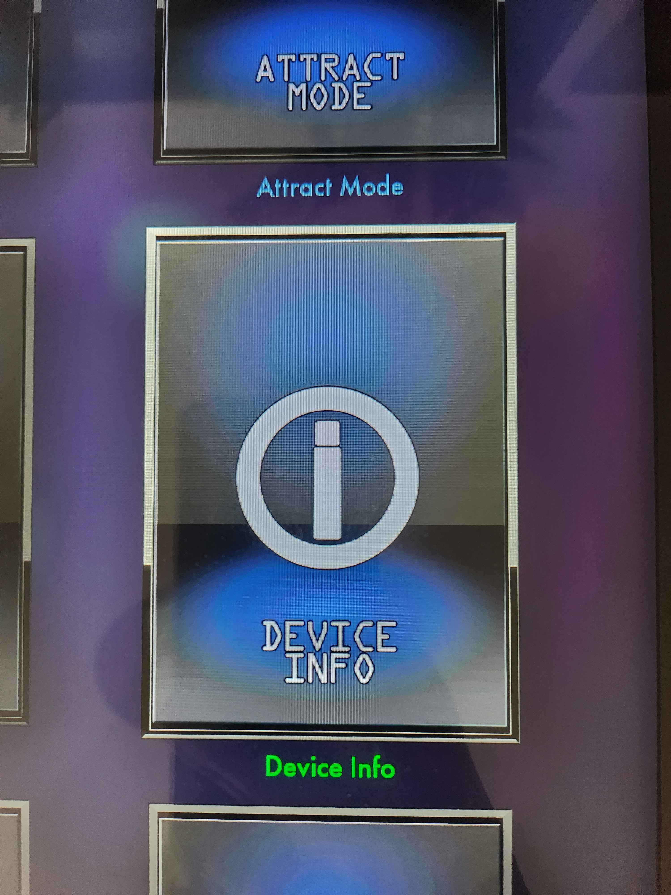
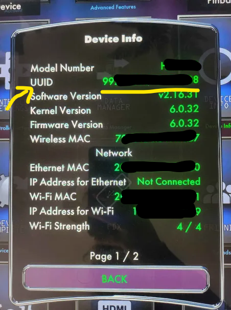

= Joining the Beta!
:icons: font
:toc: left

== _The Rules!_

* *_READ ALL INSTRUCTIONS… TWICE!_* +
Make sure to take the time to fully ready through the wiki and other support threads too.
* *_DO NOT SHARE FILES!_* +
*DO NOT* share any `VPXS Launcher` files,
`Table Manager` files, `.vpx` files, `.directb2s` files, `.c7z` serum
files, `puppack` files, `table instructions`, or `ROM` files with anyone. Doing so will
trigger the DRM and ban your account along with anyone you share files
with. Download files from official sources. The README links and the
Wizard download button links will point to official sources. +
*DO NOT* share invite codes, if you do the entire invite chain gets banned. +
Seriously, *DON’T DO IT*. There are no warnings, no second chances. Once
banned, it cannot be reversed.
* *_BE RESPECTFUL!_* +
Everyone here is doing this in their spare time
and aren’t getting paid so be nice to one another. Please be respectful
if you get a message from the mods that you didn’t expect. There is
always a reason, make sure to listen.
* *_BE PATIENT!_* +
Participate as often as possible. This is the only
way to get Beta access. *DO NOT* ask for a Beta Invite and / or ask when
VPXS GL will be released!! Listen to the advice given to you, retry
installs if something goes wrong, don’t rush through setup. Your
problems are not everyone else’s problems. People are here to help, but
helping you is not everyone’s priority.
* *_DO NOT DM OR @mention PEOPLE!_* +
*DO NOT* DM people directly asking for help unless you are asked to do so. +
If you are stuck, read through the Wiki one more time, and then ask for help in
`#general-vpx-chat` or `💬 vpx-beta-support`. +
If you are a Beta tester
using the `💬 vpx-beta-support` channel, the please be sure to read the
"How To Get Support" post before submitting. It may take a while to
get a response, so please remember to be patient.
* 🎉 *_HAVE FUN!_* +
The fun is _mandatory_! +
Once in the Beta, participate in the optional weekly tournaments, share your successes,
and enjoy!

[WARNING]
.Breaking the Rules
====
*_Breaking the rules may result in a ban from the beta._*

You may not receive another warning. Bans cannot be challenged.
====

[IMPORTANT]
.Being banned from the Mox Discord Server
====
*_Being banned from the Mox Discord Server will also result in a Beta ban!_*

Do not break any of Discords T&C’s. Follow the Mox Discord server
rules found in the `🪧Server Guide`.  The rules are located in the `rules` channel in the `Start Here` topics.
====

== _How do I join the beta?_

The beta can be joined via the
https://discord.com/invite/moxsgameroom[Mox’s Game Room] discord server.

Once you’ve joined the server, ensure you have the `VPX GL` channel role
via `Channels & Roles` > `VPX GL`

Currently, the only only way to gain access to the beta is through
server participation:

=== _Participation Reward_

* Automatic access is given to those server members who reach the
`Apprentice` server participation role.
* You gain server XP by chatting.
* All you have to do is chat in any channel in the
https://discord.com/invite/moxsgameroom[Mox’s Game Room] discord server,
and every message will gain you some XP!
* When you have gained enough XP, you level up.
* At level 10, you unlock the `Apprentice` role, your name will turn
green, and you will automatically be able to join the beta!
* To gain access, simply type `/vpx-invite` while in the
`#general-vpx-chat` channel
* Your server level can be found on
https://lurkr.gg/levels/mox[lurkr.gg/mox] (search page for your name,
you might be on page 2/3)

== _Finding your 4KP UUID_

Once you have been granted access to the bot, you will be asked for your
4KP’s UUID. This is a unique code give to your individual 4KP. We need
this value so we can grant your 4KP access to the VPX applications!

There are 2 ways to get your UUID:

=== _Via ArcadeNet_
* Visit https://www.atgames.net/arcadenet[AtGames ArcadeNet] and log
into your account
* Click on your profile dropdown, and select `My Account`

* Click on `Devices List`

* If you have multiple AtGames devices, your 4KP will be the one that
starts with `9'

=== _Via your 4KP Settings_
* Turn on your 4KP and navigate to the `Settings` tab
* Go to `Device Info`

// The width can be set on this image using the width attribute

* The UUID will be second from the top

== _What Can I Do To Prepare For The Beta?_

While you await your beta invite, there are some items that you can do to prepare ahead of time.

=== _Purchase Compatible USB_
// This information is in Joining the Beta and in the Getting Started Docs
// Should consider having it in one or the other but not both places.  If we need
// it in both places, then extract to a seperate file and include the file where appropriate

You can purchase your USB so you are ready!

VPXs will work on most USB 3.0 drives, but it is highly recommended you
use a USB drive specifically from the list of compatible USBs below:

* Kingston DataTraveler Max 256GB https://amzn.to/42Ygu1k[Amazon US] |
https://www.amazon.co.uk/Kingston-DataTraveler-Type-Flash-256GB/dp/B0B57T5G5L/ref=sr_1_4?crid=315CRMHOUO8CK&dib=eyJ2IjoiMSJ9.nYs6eArqp1rbUN8HVL0fsZ4kolmlWN0y4wxwPyShbfMFaMKUw-Ut6_S3xVTQj_uWsPJty-dpt_AqZBCploj1yKOhnEop_bhRtlDZqVPeVsN7ufr-dtCfuAIxSwepI83b2gh3kE-6faAqczA5jnctcV7pAVDA223BFw2xwLiNyA1cd3-H-TxtXgEEGqPrwCUZmHcp7tj9M4W7MH7L9w-UCmsRfKOkz9xn_9jp4uO_l94.KBdZLVfqvPpdn8UVwR3cntzEvzUKmrR0tspXU3h2lGs&dib_tag=se&keywords=Kingston%2BDataTraveler%2BMax%2B256GB&qid=1746177043&sprefix=kingston%2Bdatatraveler%2Bmax%2B256gb%2Caps%2C93&sr=8-4&th=1[Amazon
UK] |
https://www.amazon.ca/Kingston-DataTraveler-256GB-Performance-DTMAXA/dp/B0B57T5G5L/ref=mp_s_a_1_3_maf_1?crid=1LBM4IJUL86EF&dib=eyJ2IjoiMSJ9.QRa55IVIPlNkKZv0lhETlcqjm4VJsvXWLg6CcVliC7EIAHMIc_3zxdGOsUuRpTMdSdACw9xU98zZkckN9dM63zRal-3JUsPRyEcg-o2-tLgKWwhmYz1MEhSXKepHOgKGQ3sWx23iLflyRxxvrc5RRlbIFSPJsqcMiJD9HqzfAG_A90DNl8TPsr0rUB8qmIDYHzSOSxGyFLtDGgujNJoRcg.-ntxiKL0ucdRsB4g7UBFgwLRbobvYgvmVjEKio0gK84&dib_tag=se&keywords=Kingston+DataTraveler+Max+256GB&qid=1746184809&sprefix=kingston+datatraveler+max+256gb%2Caps%2C118&sr=8-3[Amazon
CA]
* Kingston DataTraveler Max 512GB https://amzn.to/3ECtzFi[Amazon US] |
https://www.amazon.co.uk/Kingston-DataTraveler-Type-Flash-256GB/dp/B0B57TXS4J/ref=sr_1_4?crid=315CRMHOUO8CK&dib=eyJ2IjoiMSJ9.nYs6eArqp1rbUN8HVL0fsZ4kolmlWN0y4wxwPyShbfMFaMKUw-Ut6_S3xVTQj_uWsPJty-dpt_AqZBCploj1yKOhnEop_bhRtlDZqVPeVsN7ufr-dtCfuAIxSwepI83b2gh3kE-6faAqczA5jnctcV7pAVDA223BFw2xwLiNyA1cd3-H-TxtXgEEGqPrwCUZmHcp7tj9M4W7MH7L9w-UCmsRfKOkz9xn_9jp4uO_l94.KBdZLVfqvPpdn8UVwR3cntzEvzUKmrR0tspXU3h2lGs&dib_tag=se&keywords=Kingston%2BDataTraveler%2BMax%2B256GB&qid=1746177043&sprefix=kingston%2Bdatatraveler%2Bmax%2B256gb%2Caps%2C93&sr=8-4&th=1[Amazon
UK] |
https://www.amazon.ca/Kingston-DataTraveler-512GB-Performance-DTMAXA/dp/B0B57TXS4J/ref=mp_s_a_1_4?crid=2RQ5AEEKYPMF1&dib=eyJ2IjoiMSJ9.OpjNFtAZ4PtMSsoZiXbBVt1uC6iTL80pTH5JD642UjqakIHefr-ieCm-kU4mgBxXl12-xK2UyEoj2sRz49k4E57NkQsuZcDW_3iclcwq94_mc_K-3p1PU-KCfdgx2eVzYqmg-1KXMdxY4sfi_BPQIzLvdvDmqTgBB-G_uI6z4eUvLhLGmYtruDWWIwxg7gKTqtHgwGAIUMkr5zX6qkrk-Q.T0kpQdBaxB4A63MVVX6A5wZ-8OStUF0r2yr7YJVGWvk&dib_tag=se&keywords=kingston+datatraveler+max+512gb&qid=1746184864&sprefix=Kingston+DataTraveler+Max+%2Caps%2C133&sr=8-4[Amazon
CA]
* Samsung FIT 256GB Flash Drive https://amzn.to/3ymA382[Amazon US] |
https://www.amazon.co.uk/dp/B07HPX38XC?ref=ppx_yo2ov_dt_b_fed_asin_title&th=1[Amazon
UK] |
https://www.amazon.ca/dp/B07D7Q41PM?ref=cm_sw_r_cso_cp_apan_dp_R4MJB5WQ4KWB1FBCBYGN&ref_=cm_sw_r_cso_cp_apan_dp_R4MJB5WQ4KWB1FBCBYGN&social_share=cm_sw_r_cso_cp_apan_dp_R4MJB5WQ4KWB1FBCBYGN&starsLeft=1&th=1[Amazon
CA]
* Samsung FIT 512GB Flash Drive https://amzn.to/46uLC9M[Amazon US] |
https://www.amazon.co.uk/dp/B0CY5GCGY5?ref=ppx_yo2ov_dt_b_fed_asin_title&th=1[Amazon
UK] |
https://www.amazon.ca/dp/B0CYMB3HG4?ref=cm_sw_r_cso_cp_apan_dp_R4MJB5WQ4KWB1FBCBYGN&ref_=cm_sw_r_cso_cp_apan_dp_R4MJB5WQ4KWB1FBCBYGN&social_share=cm_sw_r_cso_cp_apan_dp_R4MJB5WQ4KWB1FBCBYGN&starsLeft=1&th=1[Amazon
CA]

The benefits are twofold:

. The Read/Write speeds on these USBs are fantastic, so you will spend less time waiting for files to upload, and it will run smoother.
. It helps eliminate one potential issue if you did have any problems running a table.

=== _Partition USB for VPXS_

Once you have your USB, you need to format/partition it.

* Option 1) Single Partition (Just VPXS/BOYG) +
https://wagnerstechtalk.com/algl/#Single-Partition_Method[Wagners Guide - Single Partition]
* Option 2) Dual Partition (VPXS/BOYG, and FDX/AtGames additional storage) +
https://wagnerstechtalk.com/algl/#Dual-Partition_Method[Wagners Guide - Dual Partition]

=== _Can I still have my Attract Mode videos/BYOGs/Menu music files?_

Yes! All those folders can continue to exist on the same partition as
the VPXS table files/folders!
