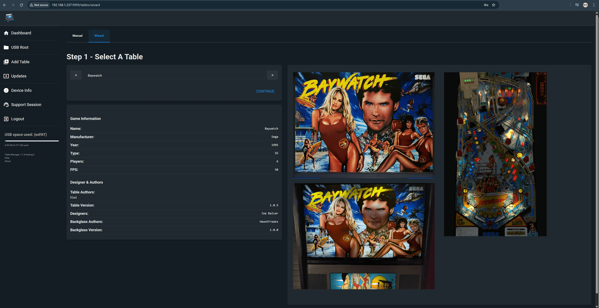
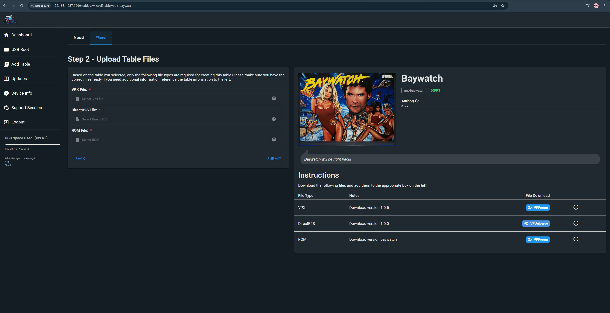
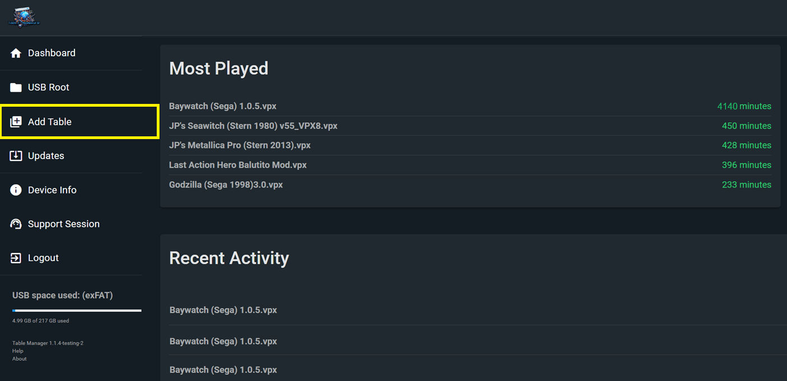
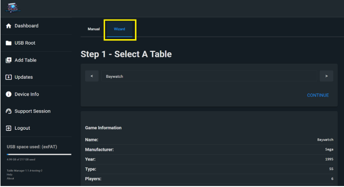
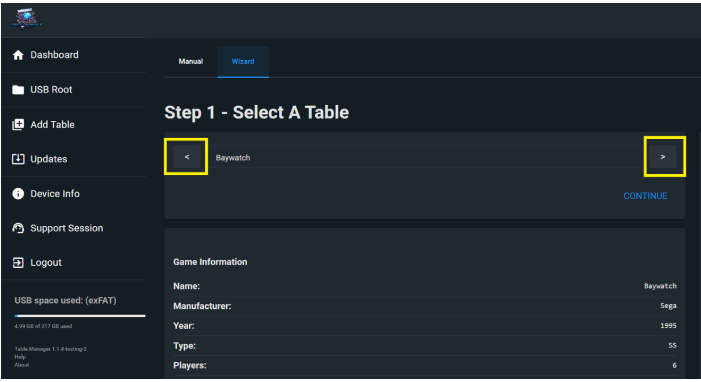
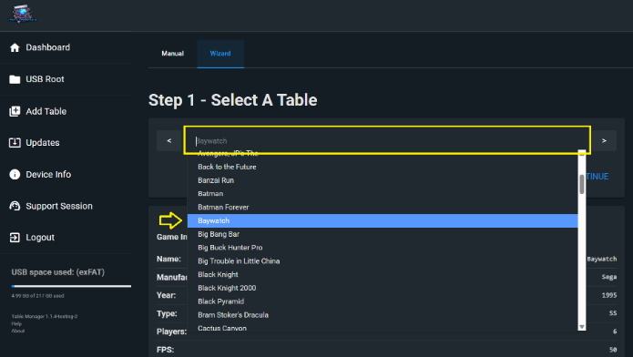
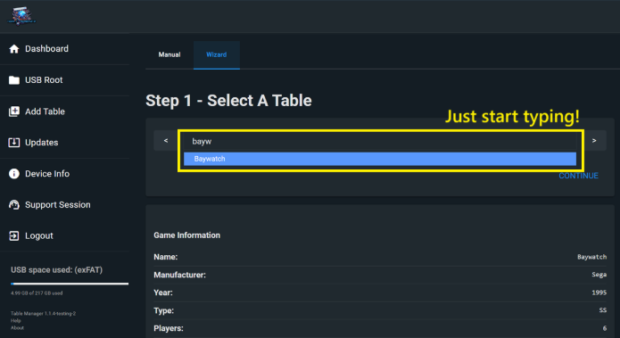

= Table Manager - Wizard
:toc: left
:icons: font

// We may want a section here to discuss how to backup your tables for archival and personal use incase your usb drive gets corrupted.

== _What is the TM (Table Manager) Wizard?_

[NOTE]
====
*_Note:_* For more information on what the `Table Manager` is, and how
to set it up, visit this article: +
xref:gettingstarted.adoc#_table_manager[Getting Started - Table Manager]
====

The TM Wizard is a tool that let’s you add VPXS tables to your USB in
the easiest way possible!

The tables added via the wizard will:

- Require minimal input from you
to install. We only need the files we can’t host: `.vpx`, `.directB2S`,
`rom.zip`, `.c7Z`
- Contain all table bug fixes/updates
- Be fully optimised. No table will be added that does not run well!
- Have full art packages; customer launcher images, custom DMD images etc.
- Have all additional customisation options, like coloured DMDs, serum DMDs,
button instructions
- Have the ROM immediately configured with optimal home play settings. Free Play enabled, Extra ball at reply, ROM volume, etc.

== _How do I get to the Wizard?_

The Wizard can be found in the Table Manager.

If you need help getting onto the Table Manager, then review this page: +

xref:gettingstarted.adoc#_setting_up_my_usb__start_to_finish[Setting up My USB]

Once in the TM, select the `Add Table` button on the left hand side nav
bar: +

The Wizard should then appear. If not, select `Wizard` from the top
centre tabs: +

== _How do I select a table to install?_

There are multiple ways to select a table to install!

- Use the left and right arrows to scroll through the list. This is a
great way to browse as you get to see all the table images and
information!

// Need new cleaner screenshot wiki has it as a txt extension

- Use the dropdown by clicking on the table name bar, from here you can
scroll and select a table!

// Need new cleaner screenshot wiki has it as a txt extension

- Search by typing! Click on the table name bar and start typing to
search the table list

== _How do I install the table?_

Once you’ve selected a table you’d like to install, click the `Continue`
button:

That will take you to the main installation page:

[NOTE]
====
*_Note: You will not be able to upload any files on the left hand
side without having clicked each of the buttons in the wizard that the table needs._*
====

. Download each of the files from the Download Links on the right hand
side. +
. Once you have downloaded all the files, unzip the ones that need to be
unzipped:
* `.vpx` file needs to be _not zipped_
* `.directB2S` file needs to be _not zipped_
* `ROM FILE` file needs to be *_zipped_*
* `.c7Z` Serum file needs to be _not zipped_
* `PUP FILE` file needs to be *_zipped_* and uploaded whole as
downloaded
. Upload each file in the inputs on the left hand side of the page
. Double-check the `File Check` tick boxes that you’ve uploaded the
correct files! If not, upload the correct one.
. If everything was successful then you should see the page like the
image below! *_If not, re-read the above instructions and any
instructions in the `Notes` field on the right hand side of the page_*
. Press `Submit` and wait!

Once you’ve hit submit, the wizard will install the table - and apply
addition fixes, like the BASS fix (if needed)

Please be patient!

image::https://github.com/user-attachments/assets/1e1c6beb-cd6c-441d-b398-381e352622a9[bg2]

== _What tables should I install first?_

There are tons of amazing tables to be found in the Wizard!

Below are some recommendations for particularly great tables, as
provided by the community!

image::https://github.com/user-attachments/assets/38ac4862-c36a-4225-b423-f999f6130b5e[bg-top]

*_https://github.com/LegendsUnchained/vpx-standalone-alp4k/blob/main/external/vpx-spacecadetge[Space
Cadet - Galaxy Edition (Original 2021)]_*

_*pointdablame:* A strong showcase of what virtual pin tables can be.
Incredibly well put together with exciting table swaps for different
goals. Plus, it is a great example of pup packs working on standalone_

_*Reboot:* A great take on the classic game that most know from Win95!
Amazing sound, art and graphics. Approachable rule set with great
feeling shots. If you even remotely like Space Cadet from back in the
day, you will love this take on it!_

image::https://github.com/user-attachments/assets/38ac4862-c36a-4225-b423-f999f6130b5e[bg-top]

*_https://github.com/LegendsUnchained/vpx-standalone-alp4k/tree/main/external/vpx-sopranos[The
Sopranos (Stern 2005)]_*

_*pointdablame:* A great theme to begin with, and the breadth of goals
and options with the ``episodes'' keep it fun. Can be a tough table at
times but in a way that makes you want to go again. The audio on the
table is almost worth it by itself._

_*Onegoodball:* Very funny if you don’t mind the language. Playfield is
so sharp, and bright. Easy to follow along to the call outs._

image::https://github.com/user-attachments/assets/38ac4862-c36a-4225-b423-f999f6130b5e[bg-top]

*_https://github.com/LegendsUnchained/vpx-standalone-alp4k/tree/main/external/vpx-big_trouble[Big
Trouble in Little China (Original 2022)]_*

_*AtlasBearsAll:* A true love letter to one of the best cult films of
all time! This table is a complete original created by some of the best
in the craft, Balutito and TeamTuga. Theme integration and artwork are
top notch, with a unique take on a traditional fan layout. Callouts are
also well incorporated and do a great job of bringing the movie to the
table. Just remember, ``I never drive faster than I can see. Besides
that, it’s all in the reflexes.''_

_*shaver:* Real showcase on the 4KP, proving you can have PuP-Pack video
on the backglass and still have solid gameplay performance. All in all,
an excellent original table. A must for fans of the movie. ``It’s all in
the reflexes!''_

image::https://github.com/user-attachments/assets/38ac4862-c36a-4225-b423-f999f6130b5e[bg-top]

*_https://github.com/LegendsUnchained/vpx-standalone-alp4k/tree/main/external/vpx-funhouse[Funhouse
(Williams 1990)]_*

_*pointdablame:* A true classic that isn’t just nostalgia. Fire it up to
trigger some memories and you may lose hours trying to hit Rudy in his
face._

_*Anonymous:* Nostalgia is a hell of a drug. And I hate Rudy so much. On
the VPX everything is just so easy to see even thought the resolution is
turned down. It plays so nice. Its fair the gap isnt too big. It doesnt
kill you for attempting a shot and failing. - QUIT PLAYING WITH THE
CLOCK!!_

image::https://github.com/user-attachments/assets/38ac4862-c36a-4225-b423-f999f6130b5e[bg-top]

*_https://github.com/LegendsUnchained/vpx-standalone-alp4k/tree/main/external/vpx-seawitch[JP’s
Seawitch (Stern 1980)]_*

_*shaver:* Became a fan of this table during VPXS tournament play. Fast,
fluid gameplay. Tough but fair. Rewarding ``Riptide'' orbit shot. If you
love drop targets, check this one out. Love the crashing waves sound fx,
too!_

_*Ominous Osie 🌸:* This table is absolutely incredible, it is the
perfect showcase of a older table that can still blow the minds of
modern audiences! Fast, furious, and with a deceptively simple yet
incredibly challenging goal!_

image::https://github.com/user-attachments/assets/38ac4862-c36a-4225-b423-f999f6130b5e[bg-top]

*_https://github.com/LegendsUnchained/vpx-standalone-alp4k/tree/main/external/vpx-baywatch[Baywatch
(Sega 1995)]_*

_*Ominous Osie 🌸:* Probably the single best table Sega produced!
Fantastic theme integration, music, and layout, one of the best tables
out there for a casual fun time! Contains the `Shark Flipper', from
which Stern’s Jaws took major inspiration!_

image::https://github.com/user-attachments/assets/38ac4862-c36a-4225-b423-f999f6130b5e[bg-top]

*_https://github.com/LegendsUnchained/vpx-standalone-alp4k/tree/main/external/vpx-scaredstiff[Scared
Stiff (Bally 1996)]_*

_*AtlasBearsAll:* A spot-on recreation of one of the perennial favorites
from the golden age of pinball; this table plays true to its real-life
counterpart. The authors even managed to recreate the spider game on the
backglass to a tee. With a playfield that flows and great humor in its
callouts, this table plays as well virtually as it does in real life.
``Let’s see how scared stiff you can get!''_

image::https://github.com/user-attachments/assets/38ac4862-c36a-4225-b423-f999f6130b5e[bg-top]

*_https://github.com/LegendsUnchained/vpx-standalone-alp4k/tree/main/external/vpx-slimerjp[JP’s
Ghostbusters Slimer (Original 2023)]_*

_*AtlasBearsAll:* Considered to be one of the more difficult real world
pins, this virtual version, built on the real table’s code, holds true
to its predecessor’s reputation. Large flipper gaps, unrelenting shots,
and the Scoleri Brothers pop-up targets all contribute to the difficulty
of this table. Don’t let that scare you off though, this table has great
movie assets with hilarious call outs, beautiful artwork, and
exceptionally fun, if not challenging, modes. ``We came. We saw. We
kicked its ass.''_

image::https://github.com/user-attachments/assets/38ac4862-c36a-4225-b423-f999f6130b5e[bg-top]

*_https://github.com/LegendsUnchained/vpx-standalone-alp4k/tree/main/external/vpx-tronlegacy[TRON
Legacy Limited Edition (Stern 2011)]_*

_*Reboot:* One of my top Stern machines from the mid 2000’s! Plays fast
and smooth and the inclusion of movie clips and sounds really take this
table over the top. It’s one I always come back to and play a few rounds
on!_

image::https://github.com/user-attachments/assets/ccd82fa1-95d6-4349-9590-21c1954f898b[bg]

== _Common Questions_

image::https://github.com/user-attachments/assets/1e1c6beb-cd6c-441d-b398-381e352622a9[bg2]

=== _What tables are in the Wizard?_

You can see a full list of tables available in the wizard on our repo
README!

https://github.com/LegendsUnchained/vpx-standalone-alp4k?tab=readme-ov-file#wizard-tables[Full
List of Wizard Tables]

image::https://github.com/user-attachments/assets/1e1c6beb-cd6c-441d-b398-381e352622a9[bg2]

=== _What were the recently added / updated tables?_

All the beta testers will be notified via the Discord server when new
tables are added, so be sure to keep an eye out!

If you want the list, you can find it on the repo’s releases page!

https://github.com/LegendsUnchained/vpx-standalone-alp4k/releases[Full
Wizard Releases]

image::https://github.com/user-attachments/assets/1e1c6beb-cd6c-441d-b398-381e352622a9[bg2]

=== _Why aren’t all the tables available in the Wizard?_

To get them added to the wizard requires a lot of effort, from a group
of volunteers who do it in their spare time!

All tables in the wizard are optimised, and if the table doesn’t run
well enough we won’t add it!

We will likely never have _all_ repo tables in the wizard, but rather,
the best of the best!

If there is a table you’d really like added, let us know in the discord!

image::https://github.com/user-attachments/assets/1e1c6beb-cd6c-441d-b398-381e352622a9[bg2]

=== _I have a suggestion / feature request for the Wizard_

That is great, and we love hearing all feedback / suggestions / feature
requests!

But first, we’d kindly ask you to double check it hasn’t already been
asked using the Discord search bar.

If not, then message us in the `#beta-testers` channel!

image::https://github.com/user-attachments/assets/1e1c6beb-cd6c-441d-b398-381e352622a9[bg2]

=== _Can you still add tables manually?_

Yes! We still have the `Add Table > Manual` tab, and you can freely play
any table on the repo via the Manual method!

We would recommend however to install any tables that are available in
the Wizard, through the Wizard and not manually!

Non-Wizard tables will not be blocked in any way.

image::https://github.com/user-attachments/assets/ccd82fa1-95d6-4349-9590-21c1954f898b[bg]

== _Common Issues_

image::https://github.com/user-attachments/assets/1e1c6beb-cd6c-441d-b398-381e352622a9[bg2]

=== _Why doesn’t this table appear in my Wizard Dropdown?_

The wizard checks what tables you already have installed and those do
not appear in the dropdown menu.

For example: 1) I am trying to install `Baywatch`, but it’s not in my
wizard table selection list… 2) Likely, I already have a `vpx-baywatch`
folder in `USB Root > External` 3) Delete the `vpx-baywatch` folder 4)
Now the `Baywatch` table is in the wizard!

image::https://github.com/user-attachments/assets/1e1c6beb-cd6c-441d-b398-381e352622a9[bg2]

=== _I already manually installed a table… can I just update it through the Wizard?_

No, you cannot currently update an existing table using the Wizard

*_That feature is planned, and will eventually exist. Please be patient
in the meantime_*

To get all the features / improvements from the wizard, then please
delete the existing folder in `USB Root > External` and reinstall using
the Wizard!

image::https://github.com/user-attachments/assets/1e1c6beb-cd6c-441d-b398-381e352622a9[bg2]

=== _I installed a table through the Wizard but it doesn’t work / crashes?_

The Wizard is a relatively complex tool that pulls data from a few
different sources when you install a table.

Sometimes the process goes wrong through things beyond our control, like
internet performance etc.

If your table doesn’t work:

*_The first thing to do is delete the folder in `USB Root > External`
and reinstall it!_*

If the table still do not work, then please raise a support ticket in
the `💬 vpx-beta-support` channel in the Discord!

image::https://github.com/user-attachments/assets/1e1c6beb-cd6c-441d-b398-381e352622a9[bg2]

=== _I updated the Table Manager… but do not see the new Wizard features?_

The TM is a website that relies heavily on JavaScript, which means that
the cache affects it a lot!

If there are new features and you aren’t seeing them, then you likely
need to reset your browser cache.

Most browsers will clear your cache by simply holding `shift` and then
pushing `F5`

If you need further help: - Google Chrome:
https://support.google.com/accounts/answer/32050?hl=en&co=GENIE.Platform%3DDesktop[How
to clear your cache] - Firefox:
https://support.mozilla.org/en-US/kb/how-clear-firefox-cache[How to
clear your cache] - Edge:
https://support.microsoft.com/en-gb/microsoft-edge/view-and-delete-browser-history-in-microsoft-edge-00cf7943-a9e1-975a-a33d-ac10ce454ca4[How
to clear your cache] - Safari:
https://support.apple.com/en-gb/105082[How to clear your cache]

link:#repo-content-pjax-container[Back to the top]