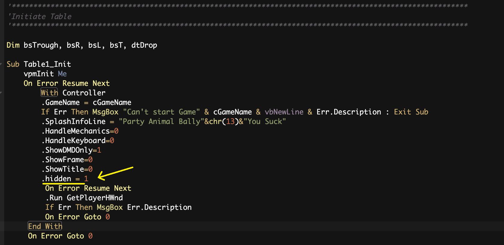
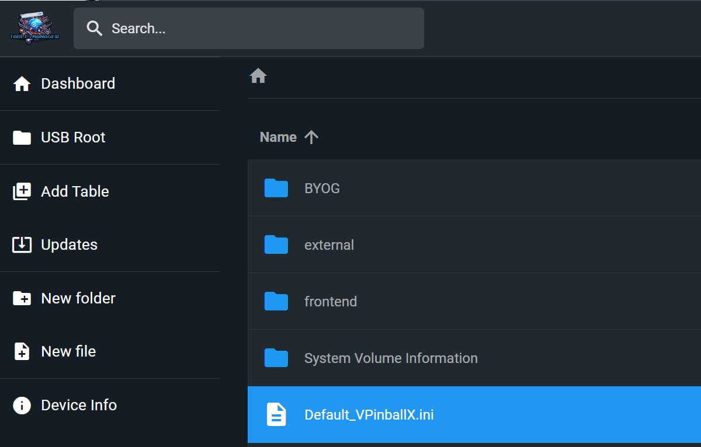

= Table Install FAQ
:source-highlighter: highlight.js
:highlightjs-languages: ini,vbscript
:toc: left
:icons: font
:toclevels: 4

== Table FAQs:

=== Table has Missing Sounds / BASS Errors in vpinball.log

This is caused by stereo sounds that we need to re-encode to mono, and
you are likely to encounter this on most tables. A series of scripts can
be used to address and resolve this.

=== Table Manager (Easy Method)

You can fix the BASS errors in the Table Manager.

Full instructions here:
xref:tablemanagerother.adoc#base-fix-table[TM - BASS Fix Table]

=== Windows (Advanced Method)

Download the Powershell scripts found
https://github.com/LegendsUnchained/vpx-standalone-alp4k/tree/main/scripts/Windows/audio[here]
to your computer.

`download-apps.ps1` will download the required `vpxtool.exe` and
`ffmpeg.exe` and unpack them for you.

`convertto-mono.ps1` will take in a vpx filename as a parameter, extract
the table, and convert any stereo table audio to mono. The original file
will be renamed with extension `.original' and the new fixed file will
be renamed correctly.

. Make a new directory and copy in both scripts.
. Copy the vpx file you want to convert to the directory
. Open a powershell terminal and navigate to the directory
. Run ./download-apps.ps1 to download the required apps
. Run ./converrto-mono.ps1 -table `vpx` (after -table start typing the
name and tab should autocomplete the file name)
. All done! Copy over the new vpx file over to your usb and replace the
original. The filenames should match up and ask you to replace.

Alternatively, `convert-all.ps1` will detect all present vpx files in a
directory and convert them in a batch. Place it in the same folder as
`converrto-mono.ps1` and all the vpx files you’d like to convert, then
execute `./convert-all.ps1` with no parameters. It will do the rest.

== Table Won’t Start - I Can Add Coins But No Lights

This is always a ROM issue.

Run through the below troubleshooting steps:

. *You are missing a ROM* Please re-install the table and make sure to
include the ROM zip file or add it manually into the
`/external/vpx-table/pinmame/roms` folder
. *The ROM is incorrectly named* Sometimes we see ROM zip files called
`romname (1).zip` etc. It is very important that the rom name is
correct. You can manually update the ROM name in the
`/external/vpx-table/pinmame/roms` folder
. *The ROM file has been unzipped* The ROM files must *never* be
unzipped. Please reinstall with the correctly zipped ROM file.
. *The cGameName variable in the `.vbs` is wrong* If you are adding a
table yourself, you might use the correct ROM but the table `.vbs` is
using a ROM alias. That means that the `cGameName` variable in the
`.vbs` is the wrong name. Updating it in the `.vbs` will correct it.

== Increase / Lower Volume

To update the volume, you’ll need a USB keyboard.

If you need one, this one works great! Rii RK707 Keyboard/Game
Controller https://amzn.to/4fqC1oC[Amazon US] |
https://www.amazon.co.uk/Rii-Multifunctional-Controller-Rechargeable-Vibration/dp/B0DHS43GW2/ref=sr_1_5?crid=T404AU16RBHE&dib=eyJ2IjoiMSJ9.ymfNMwmi9yWN1gZzs5NQuQ.rx0G0a0Zq1flLEXDpP2qRvBoNG_wXuO0MISNd-GxrI0&dib_tag=se&keywords=%28Backlit+Version%29Rii+RK707+3+in+1+Multifunctional+2.4GHz+Wireless+Portable+Game+Controller&qid=1741954502&sprefix=backlit+version+rii+rk707+3+in+1+multifunctional+2.4ghz+wireless+portable+game+controller+%2Caps%2C81&sr=8-5[Amazon
UK] |
https://www.amazon.ca/Rii-Multifunctional-Controller-Rechargeable-Vibration/dp/B07STY21PS/ref=sr_1_1?crid=BMQNFLSCUUU3&dib=eyJ2IjoiMSJ9.aiStKTCkp2jQ2ST8VLR44qIEx4AVQTEyaMGT-EfYG6QAYnJMipmnFfbgdJQHIQNRoxm4Xk-Ul3bLVcrwhFiFP4d5kLnhRnnKmGaecUDE3hPaL97GLOfEOUBlkyX8OCbCYggz9_-vBtPSns9uFGr5cAj9R7MRxkJFYOkKzria8NDHSVxoS-Xm0x-eByQA2AdMBjJu34Yq0NT8Cy8LPtDGDhCdSkybSLaLTzrwqNRx5Lvuka3umY1kmzCMWnJzJKSpKuX-4gidNu2ZO0LCHgadTGBRqh_l2K9TiNMeIjFEy4WyXseziqCmqP-cwC19cM35tf53BVa8HvhWxblCwGgqz4ih3HDUHDG8LICz2BZhNWwEhYYj0tFGBUrNS4-d_UVrHOA_YTvrOWdDfpIgBjdecSARY2G593TLvdqa51_hpafTzWXO1cPUPZejEeXlnwrE.nmfWGVYUiSUqE4yMKNAdnkc4WsCtQS2pqiSaRuD_TQI&dib_tag=se&keywords=Backlit+Version+Rii+RK707+3+in+1+Multifunctional+2.4GHz+Wireless+Portable+Game+Controller&qid=1741954574&sprefix=backlit+version+rii+rk707+3+in+1+multifunctional+2+4ghz+wireless+portable+game+controller%2Caps%2C111&sr=8-1[Amazon
CA]

As well as the below guides, there is also a list of guides on altering
the volume on different tables here:
https://www.vpforums.org/index.php?app=tutorials&cat=9[vpforum
tutorials]

'''''

*Bally / Midway / Williams:*

1. Press END key to open coin door.

2. Using the 8 and 9 keys, adjust the volume. The 8 key will
lower the volume, while the 9 key will raise the volume.

3. You may have to press END key to close the coin door.

[NOTE]
====
There may be tables where the coin door is already open when
the table loads, so you may not have to perform step 1. However, you
will not get notification that the door is open. To check to see if the
door is open, press either the 7 or 0 key. If the message appears to
open the coin door to use the buttons, then press the end key to open
the door.
====

'''''

*Capcom:*

1. Press 7 to enter menu system.
2. Using the shift keys, cycle through the menus until you see
Set Volume
3. Press 1 to select that menu
4. Using the shift keys, adjust the volume. Left Shift Key lowers
the volume, Right Shift Key raises the volume
5. To exit the menu system, press the 7 key once.

'''''

*Data East / Early Segas:*

1. Press 7 to enter the audits and adjustments menu
2. Continue to press 7 until you see Expand Adjustments (or
Expand Adjusts) in the DMD
3. Press 1 to change option to Yes
4. Continue to press 7 until you see Volume Adjustment or
Background Music Volume in the DMD
5. Press 1 to adjust the volume percentage. You can either set it
to OFF, or to 25%, 50%, 75%, 100%
6. Either continually press 7 to go through all the menu options
to reset the table and save changes, or press F3.

'''''

*Sega / Stern:*

1. Using the 8 and 9 keys, adjust the volume.
2. The 9 key lowers the volume, the 8 key raises the volume (You
may have to press the 9 key first to be able to adjust the volume)

'''''

*Alvin G tables:*

1. Using the 9 and 0 (zero) keys, adjust the volume. The 0 key
lowers the volume, the 9 key raises the volume
2. Wait until you see GAME OVER in DMD to play with the new
settings

[NOTE]
====
For these tables, this procedure will work if you use the ROM
based sound. If you use the emulated sound that is included with these
tables, you will NOT be able to adjust the volume
====

== Configure nudge buttons as magnasave

Rebind the left and right nudge buttons using the following
configuration in the ini:

[source,ini]
....
[Player]
JoyLTiltKey                     = 0
JoyRTiltKey                     = 0
JoyLMagnaSave                   = 14
JoyRMagnaSave                   = 15
....

https://github.com/LegendsUnchained/vpx-standalone-alp4k/blob/main/external/vpx-grandlizard/table.ini[Example]

== Plunger is weak

Adjust the strength of the plunger object in the script:

[source,vbscript]
....
Plunger.MechStrength = 150
....

You may need a different name than `Plunger` depending on how the table
is built. Look for the plunger object on the playfield.

If you need to increase the strength of an auto-plunger then you can do
something similar in the vbs:

[source,vbscript]
....
dim plungerIM
Set plungerIM = New cvpmImpulseP  ' <-- Just example to look out for

plungerIM.Strength = 75   ' <-- Change strength here!
....

=== How do I add altsound / altcolor?

Alts, sound and color, always go:
vpx-tablename/pinmame/alt(color/sound)/romname

In order to use an AltSound it needs to be enabled in the tablename.ini
under the Standalone header. If [Standalone] does not exist, please
create it.

[source,ini]
....
[Standalone]
AltSound = 1
....

== Backglass FAQs:

=== I want to display the backglass at the appropriate aspect ratio

Add configuration to override the b2s size in the ini:

[source,ini]
....
[Standalone]
B2SBackglassX = 5400
B2SBackglassWidth = 1201
....

Open the b2s in an editing tool
(e.g. https://github.com/vpinball/b2s-designer[B2SBackglassDesigner]) to
determine the correct sizes. Center the image using a `1920` width.

https://github.com/LegendsUnchained/vpx-standalone-alp4k/blob/main/external/vpx-frontier/table.ini[Example]

=== Part of my backglass is missing

Try turning on the b2s grill by adding the following to the ini:

[source,ini]
....
[Standalone]
B2SHideGrill = 0
....

=== FullDMD is not working

Try adding the following to the ini:

[source,ini]
....
[Standalone]
B2SHideB2SDMD              = 0
B2SHideB2SBackglass        = 0
B2SHideDMD                 = 0
B2SDMDRotation             = 1
PinMAMEWindow              = 0
....

The key here is PinMAMEWindow = 0. That’s what’s been hiding the B2SDMD.

The last 2 lines are 100% required

== DMD FAQs:

=== The DMD lags or doesn’t update sometimes or if the table has a PuP-Pack

For the DMD try turning backglass threading off. It may impact
performance, but can improve stability. If the table has a PuP-Pack,
enabling this option is essential; otherwise, the table may begin to
stutter and hang.

[source,ini]
....
[Standalone]
WindowRenderMode = 0
....

https://github.com/LegendsUnchained/vpx-standalone-alp4k/blob/25c3813a14473b1e4173565f2ff064aa2fa64448/external/vpx-jpmetallica/JP's%20Metallica%20Pro%20(Stern%202013).ini#L2[Example]

=== I want to hide the DMD as it is duplicated on the backglass

[NOTE]
====
This will not work on every table. If it doesn’t work then
there’s nothing you can do.
====

First, you will need to edit the VBS file. So if you haven’t got one yet
for this table - make sure to extract it via the
https://github.com/LegendsUnchained/vpx-standalone-alp4k/wiki/%5B03%5D-Table-Manager#extract-vbs-file[Extract
VBS file tool]

Next, open the VBS file, search for `Table1_Init` (or similar)

And add the line `.hidden = 1` to the list of settings for that tables
initialization.

=== How to add a custom DMD image to an empty DMD

If your DMD is empty (i.e. the table uses backglass scoring) then you
will see the default `Legends Unchained' logo as the image.

If you would like to replace this with another image, just add a
`dmd.png` file to your `external/vpx-table` folder!

The `dmd.png` image must: - Be lowercase - An Image size of 1920 x 1200
- Live right on the `vpx-table` folder root:
`external/vpx-table/dmd.png`

Be sure to check the repo folders for a `dmd.png` file you can add to
your table!

_Examples:_

image:../images/table_faq_empty_dmd.jpg[]

=== My DMD is cut off on the left side

`DMDLeftOffset` and `DMDRightOffset` can be defined under `[Standalone]`
with pixel values.

First of all, you need a `Default_VPinballX.ini` in the root of your USB
drive.

In the Table Manager, create a new file called `Default_VPinballX.ini`
directly in the root of the drive.

Once you have your default ini, add the below lines to the top of the
file, directly under `[Standalone]`

[source,ini]
....
[Standalone]
DMDLeftOffset = 15
DMDRightOffset = 0
....

This will make your DMD image start 15 pixels further to the right.

Edit this value until you are happy on your machine!
