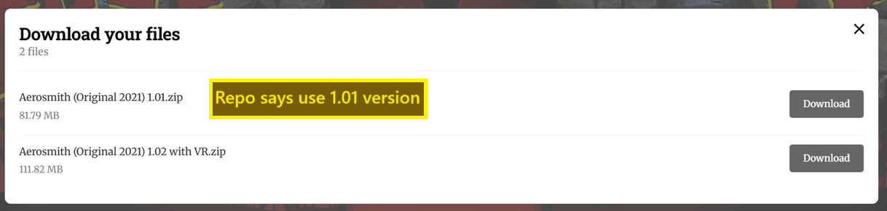

= Table Manager - Other Features
:toc: left
:icons: font

== _TM - Updates_

All updates to the launchers, VPXS bundle, and the Table Manager itself,
are done through the Table Manager!

First, open the Table Manager on your 4KP and navigate to it on your PC / mobile.

Then click `Updates` on the left hand side nav bar.

Once there, you can select what object you’d like to update using the
top nav menu:

* [1] Bundle - This is the VPXS Standalone bundle
* [2] Launcher - These are the individual `.elf` files in each table.
Updating these will update each table’s launcher to the latest version
* [3] Table Manager - This is the Table Manager itself. Updating this
will give you the latest features developed for the Table Manager

[WARNING]
====
If you have a `Table Manager` update available. UPDATE THAT
FIRST!! +
Then close the table manager, restart your 4KP, load table
manager back up, and do the other updates.
====

== _BASS Fix Table_

Occasionally, a table will have `BASS' errors (seen in the vpinball.log
file). This wont stop the table from playing, but it does cause sounds
to drop out randomly during gameplay.

We have a tool built into the Table Manager that will fix the VPX file
of a table to remove BASS errors.

To do so, open the `external` folder, and select your tables `vpx-table`
folder.

Then click on the `.vpx` file, and on the top right there will be a
`fixes' button.

Click on the button and a drop-down will appear. Select `Fix BASS
errors`

This will then take a moment.

image:../images/table_manager_other_bassfix3.png[]

Once it is done, you will have 2 .vpx files. The old .vpx file will have
been renamed so that it doesn’t load. You can test the new .vpx file
with the old one still in the folder. Once you are happy, you can delete
the old renamed file to save USB space.

== _Extract VBS File_

You can extract the tables VBS file by clicking on the `.vpx` file, and
selecting `Extract VBS file` from the `Tools` dropdown at the top right!

== _Add Table - Manual_

== Page Inputs Guide

[NOTE]
====
You do not *have* to fill in every input. But please try to
fill in as many as possible using the Repo and the Readme… Every file is
important!
====

[width="100%",cols="22%,20%,20%,18%,20%",options="header",]
|===
|Ref |Field Name |Type |Example (from `vpx-aerosmith`) |Found from
|xref:general-loader-name[#1] |*General Loader Name* |Text
|`vpx-` `aerosmith` |Typed In (found in repo README)

|xref:general-loader-table_name[#2] |*General Loader Table
Name:* |Text |`Aerosmith (Pro) (Stern/Tribute 2017)` |Typed In (found in
repo README)

|xref:general-loader-image[#3] |*General Loader Image:* |.png
file |`launcher.png` |Repo Files

|xref:vpx-file[#4] |*VPX File:* |.vpx file
|`Aerosmith (Original 2021) 1.01.vpx` |README Links

|xref:vbs-file[#5] |*VBS File:* |.vbs file |`table.vbs` |Repo
Files

|xref:ini-file[#6] |*Ini File:* |.ini file |`table.ini` |Repo
Files

|xref:directb2s-file[#7] |*DirectB2S File:* |.directb2s file
|`Aerosmith (Stern 2017) full dmd.directb2s` |README Links

|xref:rom-file[#8] |*ROM File:* |.zip file |`[EMPTY]` |README
Links

|xref:nvram-file[#9] |*NVRAM File:* |.nv file |`[EMPTY]`
|README Links

|xref:serum-file[#10] |*Serum File:* |.cRZ file |`[EMPTY]`
|README Links
|===

[[general-loader-name]]
=== _[#1] - General Loader Name:_

This is the name of the vpx folder in the repository. Only type the part
after `vpx-`.

For `vpx-aerosmith` you would input `aerosmith`.

[[general-loader-table_name]]
=== _[#2] - General Loader Table Name:_

This is the friendly name of the table and what shows up in the AtGames
UI. Tables are sorted according to this name.

This naming is user preference. If you want to use the official name of
the table, you can get this from the README in the repo files.

For example, for `vpx-aerosmith` in the repo, file
`external\vpx-aerosmith\README.md` contains
`Aerosmith (Pro) (Stern/Tribute 2017)` at the very top of the file.

[[general-loader-image]]
=== _[#3] - General Loader Image:_

This is image that will be displayed on your 4KP table selection page.
It must be a wheel image.

In the repo, we have a `launcher.png` in every table folder. For
`vpx-aerosmith` in the repo, it would be
`external\vpx-aerosmith\launcher.png`

[[vpx-file]]
=== _[#4] - VPX File:_

The VPX file is one that cannot be stored on the repo, you need to
download that file yourself.

Download links can be found in the README.md file in every table folder.
Read very carefully as some tables need a specific version to work.

Some tables versions will still be found within the regular download
button, like `vpx-aerosmith` says to use version `1.01`:

And some tables will require you to look back through the table version
history to get the right version. For example, `vpx-pirateslife`
requires version 2.0, which has to be downloaded from the vpx post
history:

[[vbs-file]]
=== _[#5] - VBS File:_

This file is not required, but if there is one for the table in the repo
then you have to upload it as it often contains bug fixes.

In the repo, the .vbs files will always be named `table.vbs`. For
`vpx-aerosmith` in the repo, it would be
`external\vpx-aerosmith\table.vbs`

[[ini-file]]
=== _[#6] - Ini File:_

This file also is not required, but if one exists in the repo then you
should upload it.

This file contains all the specific table settings. It can have button
mapping, resolution changes, POV settings, brightness settings.

This may sometimes be referred to as the tables `POV', because this file
stores all the table settings for the point-of-view.

In the repo, the .ini files will always be named `table.ini`. For
`vpx-aerosmith` in the repo, it would be
`external\vpx-aerosmith\table.ini`

[[directb2s-file]]
=== _[#7] - DirectB2S File:_

The .directb2s file is one that cannot be stored on the repo, you need
to download that file yourself.

If the table needs one, then a download link will be found in the
README.md file for that table folder. Read very carefully as some tables
need a specific version to work.

For example, for `vpx-aerosmith` you would click on the link in the
README.md and upload file `Aerosmith (Stern 2017) full dmd.directb2s`

[[rom-file]]
=== _[#8] - ROM File:_

The ROM zip file is one that cannot be stored on the repo, you need to
download that file yourself.

If the table needs one, then a download link will be found in the
README.md file for that table folder. Read very carefully as some tables
have additional steps needed to get the ROM set up.

ROM files must _always_ be zipped. DO NOT unzip them!

For example, for `vpx-24` you would click on the link in the README.md
and upload file `twenty4_150.zip`

[[nvram-file]]
=== _[#9] - NVRAM File:_

This file is not required, but if there is one for the table in the repo
then you have to upload it as it often fixes start up issues on the
table.

In the repo, the .nv files will always be named `nvram.nv`. For `vpx-24`
in the repo, it would be `external\vpx-24\nvram.nv`

[[serum-file]]
=== _[#10] - Serum File:_

This file is not required, and can only be added if you are also
uploading a ROM file.

This file makes the DMD full colour, links to the file can be found in
the README.md file.

If you would like to add a serum file yourself, you can find them all
here:
https://vpuniverse.com/files/category/173-serum-dmd-colorizations/[vpuniverse
- serum colorizations]

=== _Additional Files (Music / UltraDMD etc):_

Sometimes additional files will be needed for a table to work. These
will all be referenced in the `Instructions' section in the README.md
file of each table.

If the table required extra files, continue the above table add method
as normal, and click `ADD` at the bottom right.

Once that is done, click `GO TO TABLE`, and the table manager will
navigate to the relevant folder.

From there, you can add the files/folders you need!
