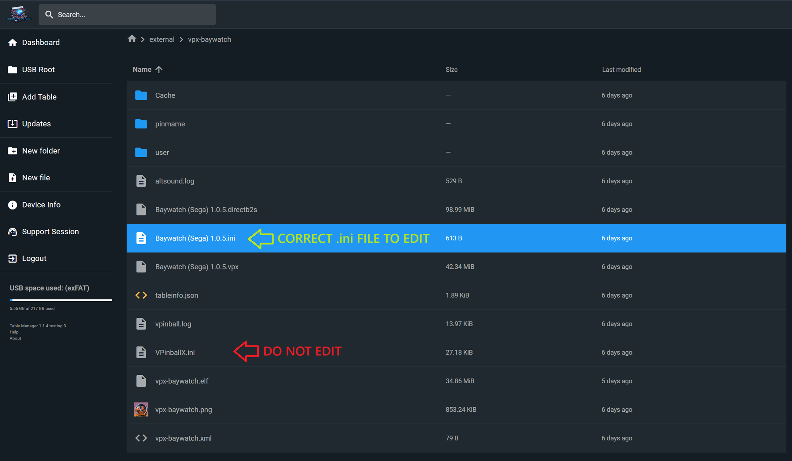

= Table Settings (.ini file)
:source-highlighter: highlight.js
:highlightjs-languages: ini,vbscript
:toc: left
:icons: font

:show-youtube-video:

== What is the table .ini file?

The table .ini file is where all the table settings are stored. This
includes POV settings, resolution settings, button mapping, dmd settings
etc.

There are multiple `.ini` files that VPXS use, but only one that we
would want to edit.

The `.ini` file that you want to edit will be called the _same name as
your `.vpx` file_, but with the `.ini` extension.

== Resolution settings

The below fields controls the resolution of the table.

[source,ini]
....
[Standalone]
BackBufferScale = 0.5

[Player]
MaxTexDimension = 3072
FXAA = 1
....

=== [BackBufferScale] - How to gain performance or increase resolution

`BackBufferScale` is the field that scales up or down the total
resolution displayed.

[width="100%",cols="25%,25%,25%,25%",options="header",]
|===
|BackBufferScale |Resolution (w/ default [MaxTexDimension]) |Graphics
|Performance
|1.000000 |Max Resolution |Best Graphics |Worst Performance

|0.833333 |3200x1800 |Amazing Graphics |Big hit to Performance

|0.666666 |2560x1440 |Better Graphics |Slight hit to Performance

|0.500000 |1920x1080 |Default Graphics |Default Performance

|0.416666 |1600x900 |Slight hit to Graphics |Better Performance

|0.355729 |1366x768 |Big hit to Graphics |Amazing Performance

|0.333333 |1280x720 |Worst Graphics |Best Performance
|===

If set to 1, then tables will display in 4K.

0.5 is the default we use for VPX standalone.

_Setting this setting, to one of the values above that is below 0.5, is
a really good way to gain additional FPS._

=== [MaxTexDimension] - How to set max resolution

`MaxTexDimension` is the maximum resolution at which textures will
display. 2048 and 4096 are also valid settings, but things start getting
pretty fuzzy at 2048. This doesn’t have a huge impact directly on
performance, but setting it below 4096 does seem to improve frame
consistency, and will get some tables to run without locking up which
would otherwise.

=== [FXAA] - How to set anti aliasing

`FXAA` is the anti aliasing. the below list are the available settings:
- 0 - Disabled - 1 - Fast FXAA - 2 - Standard FXAA - 3 - Quality FXAA -
4 - Fast NFAA - 5 - Standard DLLA - 6 - Quality SMAA

Note: Some tables actually run _better_ with FXAA set to 1 rather then
0! So make sure to double check which setting is the fastest on the
table you are testing.

== _POV_

=== _How to Edit the POV_

The below video does a great job of running through how to edit a tables
POV:

ifdef::show-youtube-video[]
++++

  <iframe width="560" height="315" src="https://www.youtube.com/embed/OWdrp5cSaMk"
    title="YouTube video player" frameborder="0"
    allow="accelerometer; clipboard-write; encrypted-media; gyroscope; picture-in-picture"
    allowfullscreen></iframe>

++++
endif::show-youtube-video[]

https://www.youtube.com/watch?v=OWdrp5cSaMk[How to Adjust POV in VPX 10.8 Visual Pinball - VP Wizards]

The basics are:

- While a table is running, plug in a keyboard and press
F12. That brings up the table settings menu.
- Press the left and right `shift` keys to change the values/page number
up or down.
- Press the left and right `control` keys to move up and down the menu
items.
- Press the `1` key, or `Start` on the cab, to save the file.

=== _Getting a Good POV_

The below photos of a real pinball machine are a good illustration of
what we are looking for in a POV. The playfield disappears away from you
towards a vanishing point, creating a keystone shape. That still happens
in lesser degrees if you pull the rails up parallel, but that’s not
really a realistic POV most of the time because pinball playfields have
depth and lcd screens do not. Then, you kind of fiddle with each table
because they may have features that you want to be sure are visible. For
instance, Megadeth would just not be the same if you were only looking
at the top of Vic’s head instead of that handsome mug.

To add a little more detail, we have chosen to prefer Cam 2 POV in
wizard tables because unlike the legacy view, they do not warp the
features of the table as the POV is adjusted. The legacy (and still
default POV) `physically' alters the table as you move it around and can
really screw shots up. Lanes may become narrower or distorted, etc.

So, in Cam 2, you are essentially given a 3d object for which you can
stretch the X and Y, or raise and lower the front or the back of the
cabinet, effectively adjusting the appearance of its pitch, and that
keystoning happens as a practical and realistic result. There is a
little more than that, but that’s the gist and the most of it. So,
commonly, you end up with the side rails. If the table has side art,
that helps conceal some of the narrowing of the table. If we can hide
the top rails, often we (mostly) will. But usually it’s going to look
like your Megadeth example to some degree.

image:../images/table_settings_pov.jpg[]

== Brightness

[source,ini]
....
[Player]
OverrideTableEmissionScale = 1
EmissionScale = 0.5
....

First is the flag that says to override the brightness, the second is
the brightness 0 to 1

== Set coin button to multiple coins

You can swap the button mapping for the AtGames button to
`JoyAddCredit2Key` to have multiple coins be added through one button
push.

[source,ini]
....
[Player]
JoyAddCreditKey =
JoyAddCredit2Key = 1
....

First is the flag that says to override the brightness, the second is
the brightness 0 to 1

== Button mapping settings

The standard buttons used by the 4KP while in a VPXS table can be
remapped, by adding the below lines to your tables `.ini` file.

ALP 4KP button id’s are as follows:

- Left Flipper: 10
- Left Nudge: 14
- Right Flipper: 11
- Right Nudge: 15
- DPad Up: 6
- DPad Down: 3
- DPad Left: 8
- DPad Right: 9
- Front Nudge: 12
- Start Button: 2
- AtGames Button: 1
- Rewind Button: 13
- A:
- X: 12
- B: 4
- Y:
- C: 15
- Z: 11

To remap an existing button, set the current mapping to 0 then assign
the button elsewhere.

For example, to remap the left and right nudge buttons to left and right
magnasave you need to unmap the current mapping of `JoyLTiltKey` and
`JoyRTiltKey` in order to move the mapping to `JoyLMagnaSave` and
`JoyRMagnaSave`.

[source,ini]
....
[Player]
JoyLTiltKey = 0
JoyRTiltKey = 0
JoyLMagnaSave = 14
JoyRMagnaSave = 15
....

Below is a full list of joykey settings:

[source,ini]
....
[Player]
JoyLFlipKey =
JoyRFlipKey =
JoyStagedLFlipKey =
JoyStagedRFlipKey =
JoyPlungerKey =
JoyAddCreditKey =
JoyAddCredit2Key =
JoyLMagnaSave =
JoyRMagnaSave =
JoyStartGameKey =
JoyFrameCount =
JoyVolumeUp =
JoyVolumeDown =
JoyLTiltKey =
JoyCTiltKey =
JoyRTiltKey =
JoyMechTiltKey =
JoyDebugKey =
JoyDebuggerKey =
JoyCustom1 =
JoyCustom2 =
JoyCustom3 =
JoyCustom4 =
JoyPMBuyIn =
JoyPMCoin3 =
JoyPMCoin4 =
JoyPMCoinDoor =
JoyPMCancel =
JoyPMDown =
JoyPMUp =
JoyPMEnter =
JoyLockbarKey =
JoyTableRecenterKey =
JoyTableUpKey =
JoyTableDownKey =
JoyPauseKey =
JoyTweakKey =
JoyExitGameKey =
....

== Make Table DMD Fullscreen

You can edit the size of the DMD screen by using the
`FlexDMDWindowWidth` and `FlexDMDWindowHeight` settings.

If you want the DMD to be fullscreen, set the width to `1920` and the
height to `1200`. Just a warning though, it will stretch the image.

[source,ini]
....
[Standalone]
FlexDMDWindowWidth = 1920
FlexDMDWindowHeight = 1200
....

== Example full table .ini

The below is an example of all (or most) available fields in a tables
.ini file.

This might not be 100% accurate as changes are being made constantly,
but it will contain most fields you’d want to edit.

[source,ini]
....
; #######################################################
; #  Visual Pinball X settings file
; #
; # This file holds all visual pinball settings.
; # If you need to reset all settings to their default,
; # just delete this file and it will be recreated on
; # next application start, eventually using your
; # existing settings from Windows registry.
; #
; # When a property is not defined (nothing after the
; # equal '=' sign), VPX will use a default value for it.
; #
; #######################################################
; # Standalone
[Standalone]
LaunchTable =
HighDPI = 0
BackBufferScale = 0.5
VPRegPath =
PinMAMEPath = pinmame/
PinMAMEWindow =
PinMAMEWindowX = 3840
PinMAMEWindowY = 0
PinMAMEWindowWidth = 1200
PinMAMEWindowHeight = 380
PinMAMEWindowRotation = 1
AltSound =
AltColor =
FlexDMDWindow =
FlexDMDWindowX = 3840
FlexDMDWindowY = 0
FlexDMDWindowWidth = 1200
FlexDMDWindowHeight = 380
FlexDMDWindowRotation = 1
B2SHideGrill =
B2SHideB2SDMD = 1
B2SHideB2SBackglass =
B2SHideDMD = 1
B2SDualMode =
B2SWindows =
B2SBackglassX = 5040
B2SBackglassY = 0
B2SBackglassWidth = 1920
B2SBackglassHeight = 1080
B2SBackglassRotation =
B2SDMDX = 3840
B2SDMDY = 0
B2SDMDWidth = 1920
B2SDMDHeight = 1200
B2SDMDRotation =
B2SDMDFlipY =
B2SPlugins =
PUPCapture =
PUPPlugin =
PUPWindows =
PUPTopperScreen =
PUPTopperWindow =
PUPTopperWindowX =
PUPTopperWindowY =
PUPTopperWindowWidth =
PUPTopperWindowHeight =
PUPTopperWindowRotation =
PUPBackglassScreen =
PUPBackglassWindow =
PUPBackglassWindowX = 5040
PUPBackglassWindowY = 0
PUPBackglassWindowWidth = 1920
PUPBackglassWindowHeight = 1080
PUPBackglassWindowRotation =
PUPDMDScreen = 0
PUPDMDWindow =
PUPDMDWindowX = 3840
PUPDMDWindowY = 0
PUPDMDWindowWidth = 1920
PUPDMDWindowHeight = 1200
PUPDMDWindowRotation =
PUPPlayfieldScreen =
PUPPlayfieldWindow =
PUPPlayfieldWindowX =
PUPPlayfieldWindowY =
PUPPlayfieldWindowWidth =
PUPPlayfieldWindowHeight =
PUPPlayfieldWindowRotation =
PUPFullDMDScreen = 0
PUPFullDMDWindow =
PUPFullDMDWindowX = 3840
PUPFullDMDWindowY = 0
PUPFullDMDWindowWidth = 1920
PUPFullDMDWindowHeight = 1080
PUPFullDMDWindowRotation =
DOFPlugin = 0
WindowRenderer = 1
WindowRenderMode = 1
ZeDMD = 0
ZeDMDDevice =
ZeDMDDebug =
ZeDMDRGBOrder =
ZeDMDBrightness =
ZeDMDSaveSettings =
Pixelcade = 0
PixelcadeDevice =
FindDisplays =
DMDServer =
DMDServerAddr =
DMDServerPort =
WebServer =
WebServerAddr =
WebServerPort =
WebServerDebug =

; #######################################################
; # Player settings
[Player]
; Main audio settings
Sound3D = 0
SoundDevice =
SoundDeviceBG =
PlayMusic =
MusicVolume =
PlaySound =
SoundVolume =

; Nudge
LRAxis =
LRAxisFlip =
UDAxis =
UDAxisFlip =
PBWEnabled =
PBWNormalMount =
PBWDefaultLayout =
PBWRotationCB =
PBWRotationvalue =
PBWAccelGainX =
PBWAccelGainY =
PBWAccelMaxX =
PBWAccelMaxY =
TiltSensCB =
TiltSensValue =
EnableNudgeFilter =
EnableLegacyNudge =
LegacyNudgeStrength =

; Plunger
PlungerAxis = 5
ReversePlungerAxis =
DeadZone = 0
PlungerRetract =

; Behavior while playing
EnableMouseInPlayer =
EnableCameraModeFlyAround =

; Main Input API
InputApi =

; Keyboard input mappings
DisableESC =
LFlipKey =
RFlipKey =
StagedLFlipKey =
StagedRFlipKey =
LTiltKey =
RTiltKey =
CTiltKey =
PlungerKey =
FrameCount =
DebugBalls =
Debugger =
AddCreditKey =
AddCreditKey2 =
StartGameKey =
MechTilt =
RMagnaSave =
LMagnaSave =
ExitGameKey =
VolumeUp =
VolumeDown =
LockbarKey =
Enable3DKey =
TableRecenterKey =
TableUpKey =
TableDownKey =
EscapeKey =
PauseKey =
TweakKey =
; For keyboard codes to use with JoyCustom$Key:
; https://github.com/vpinball/vpinball/blob/standalone/standalone/README.md#keyboard
JoyCustom1Key = 28
JoyCustom2Key =
JoyCustom3Key =
JoyCustom4Key =

; Joystick input mappings
;
; ALP 4KP button id's are as follows:
; Left Flipper: 10
; Left Nudge: 14
; Right Flipper: 11
; Right Nudge: 15
; DPad Up: 6
; DPad Down: 3
; DPad Left: 8
; DPad Right: 9
; Front Nudge: 12
; Start Button: 2
; AtGames Button: 1
; Rewind Button: 13
; A:
; X: 12
; B: 4
; Y:
; C: 15
; Z: 11
;
; To remap an existing button, set the current mapping to 0 then assign the button elsewhere.
;
; For example, to remap the left and right nudge buttons to left and right magnasave you need
; to unmap the current mapping of JoyLTiltKey and JoyRTilt key in order to move the mapping
; to JoyLMagnaSave and JoyRMagnaSave.
;
; JoyLTiltKey = 0
; JoyRTiltKey = 0
; JoyLMagnaSave = 14
; JoyRMagnaSave = 15
JoyLFlipKey =
JoyRFlipKey =
JoyStagedLFlipKey =
JoyStagedRFlipKey =
JoyPlungerKey =
JoyAddCreditKey =
JoyAddCredit2Key =
JoyLMagnaSave =
JoyRMagnaSave =
JoyStartGameKey =
; Map rewind to JoyExitGameKey
JoyExitGameKey = 13
JoyFrameCount =
JoyVolumeUp =
JoyVolumeDown =
JoyLTiltKey =
JoyCTiltKey =
JoyRTiltKey =
JoyMechTiltKey =
JoyDebugKey =
JoyDebuggerKey =
; Map dpadUp to JoyCustom1Key
JoyCustom1 = 6
JoyCustom2 =
JoyCustom3 =
JoyCustom4 =
JoyPMBuyIn =
JoyPMCoin3 =
JoyPMCoin4 =
JoyPMCoinDoor =
JoyPMCancel =
JoyPMDown =
JoyPMUp =
JoyPMEnter =
JoyLockbarKey =
JoyTableRecenterKey =
JoyTableUpKey =
JoyTableDownKey =
JoyPauseKey =
JoyTweakKey =

; Rumble feedback
RumbleMode =

; Video options
Display =
FullScreen =
WindowPosX =
WindowPosY =
Width =
Height =
Render10Bit =
ColorDepth = 32
; Defines the view mode used when running a table
; 0 - Desktop (default)
; 1 - Fullscreen: Gives you a top-down view on the playfield. For cabinet use or multi-window on desktop.
; 2 - Full Single Screen (FSS): Tries to show the whole machine including backglass if set up by the tabledesigner. Falls back to desktop view.
BGSet = 1
RefreshRate =
; Sync the frame rate with the refresh rate of your monitor
; 0 - None: No synchronization.
; 1 - Vertical Sync: Synchronize on video sync which avoids video tearing, but has higher input latency.
; 2 - Adaptive Sync: Synchronize on video sync, except for late frames (below target FPS), also has higher input latency.
; 3 - Frame Pacing (default): Targets real time simulation with low input- and video-latency (also dynamically adjusts framerate).
SyncMode = 0
MaxFramerate =
MaxPrerenderedFrames =
FXAA = 1
Sharpen = 0
ScaleFXDMD =
DisableAO = 1
DynamicAO = 0
SSRefl = 0
PFReflection = 0
MaxTexDimension = 3072
AAFactor =
MSAASamples =
DisableDWM = 1
UseNVidiaAPI =
ForceBloomOff = 1
ForceAnisotropicFiltering = 0
CompressTextures =
SoftwareVertexProcessing = 0

; Stereo rendering (VR have its own dedicated section)
Stereo3D = 0
Stereo3DEnabled = 0
Stereo3DFake =
; Anaglyph settings
Stereo3DBrightness =
Stereo3DSaturation =
Stereo3DDefocus =
; True stereo settings
Stereo3DEyeSeparation =
; Parallax stereo settings
Stereo3DYAxis =
Stereo3DOffset =
Stereo3DMaxSeparation =
Stereo3DZPD =

; Ball options
DisableLightingForBalls = 1
BallAntiStretch =
OverwriteBallImage =
BallImage =
DecalImage =
BallTrail = 0
BallTrailStrength = 0.392157

; Replace table's scene lighting emission scale setup, eventually based on automatic Day/Night computed from geographic position
OverrideTableEmissionScale = 0
EmissionScale =
DynamicDayNight =
Latitude =
Longitude =

; Visual nudge strength
NudgeStrength =

; Level of detail for ball and ramps
AlphaRampAccuracy = 10

; External application capture options
CaptureExternalDMD =
DMDSource =
CapturePUP =
BGSource =

; Counters decremented after each run
NumberOfTimesToShowTouchMessage = 0

; Show the touch overlay
TouchOverlay =

; Use cache to limit stutters and speedup loading
CacheMode =

; Display physical setup
ScreenWidth =
ScreenHeight =
ScreenInclination =
ScreenPlayerX = 0.000000
ScreenPlayerY = 0.000000
ScreenPlayerZ = 70.000000
BAMHeadTracking =

; #######################################################
; # Camera default layout
[Defaults\Camera]
; Desktop default (desktop in landscape)
DesktopMode =
DesktopFov =
DesktopLookAt =
DesktopViewVOfs =
DesktopCamX =
DesktopCamY =
DesktopCamZ =
DesktopScaleX =
DesktopScaleY =
DesktopScaleZ =
; Full Single Screen defaults (desktop in portrait with backglass at top)
FSSMode =
FSSFov =
FSSLookAt =
FSSViewVOfs =
FSSCamX =
FSSCamY =
FSSCamZ =
FSSScaleX =
FSSScaleY =
FSSScaleZ =

; #######################################################
; # Override of table properties
[TableOverride]
Difficulty =
ToneMapper =

; Desktop POV
ViewDTMode =
ViewDTScaleX =
ViewDTScaleY =
ViewDTScaleZ =
ViewDTPlayerX =
ViewDTPlayerY =
ViewDTPlayerZ =
ViewDTLookAt =
ViewDTRotation =
ViewDTFOV =
ViewDTLayback =
ViewDTHOfs =
ViewDTVOfs =
ViewDTWindowTop =
ViewDTWindowBot =

; Cabinet POV
ViewCabMode = 0
ViewCabScaleX = 0.818596
ViewCabScaleY = 1.037503
ViewCabScaleZ = 0.904995
ViewCabPlayerX = -48.500000
ViewCabPlayerY = -0.000000
ViewCabPlayerZ = -340.000000
ViewCabLookAt = 5.000000
ViewCabRotation = 90.000000
ViewCabFOV = 42.999908
ViewCabLayback = 48.000000
ViewCabHOfs =
ViewCabVOfs =
ViewCabWindowTop =
ViewCabWindowBot =

; Full Single Screen POV
ViewFSSMode =
ViewFSSScaleX =
ViewFSSScaleY =
ViewFSSScaleZ =
ViewFSSPlayerX =
ViewFSSPlayerY =
ViewFSSPlayerZ =
ViewFSSLookAt =
ViewFSSRotation =
ViewFSSFOV =
ViewFSSLayback =
ViewFSSHOfs =
ViewFSSVOfs =
ViewFSSWindowTop =
ViewFSSWindowBot =

; #######################################################
; # VR Player preferences
[PlayerVR]
; VR device setting
AskToTurnOn =
ScaleToFixedWidth =
ScaleAbsolute =
ScaleRelative =
NearPlane =
EyeFBFormat =

; Table settings
Slope =
Orientation =
TableX =
TableY =
TableZ =

; Preview
VRPreviewDisabled =
VRPreview =
ShrinkPreview =
WindowPosX =
WindowPosY =
PreviewWidth =
PreviewHeight =

; #######################################################
; # Controller preferences
[Controller]
ForceDisableB2S =
DOFContactors =
DOFKnocker =
DOFChimes =
DOFBell =
DOFGear =
DOFShaker =
DOFFlippers =
DOFTargets =
DOFDroptargets =

; #######################################################
; # Editor preferences
[Editor]
; Behavior
SelectTableOnStart =
SelectTableOnPlayerClose =

; Viewport settings
ShowDragPoints =
DrawLightCenters =
GridSize =
RenderSolid =
BackgroundColor =
FillColor =
ElementSelectColor =
ElementSelectLockedColor =
DefaultMaterialColor =
GroupElementsInCollection =
Units =

; Auto save
AutoSaveOn =
AutoSaveTime =

; Debug tools
ThrowBallsAlwaysOn =
ThrowBallSize =
ThrowBallMass =
BallControlAlwaysOn =
EnableLog =
LogScriptOutput =

; Main window
WindowMaximized =
WindowLeft =
WindowTop =
WindowRight =
WindowBottom =

; Properties window
PropertiesVisible =
PropertiesFloating =

; Script window
AlwaysViewScript =
CodeViewPosX =
CodeViewPosY =
CodeViewPosWidth =
CodeViewPosHeight =

; Search/Select window
SearchSelectPosX =
SearchSelectPosY =
SearchSelectWidth =
SearchSelectHeight =

; Image manager
ImageMngPosX =
ImageMngPosY =
ImageMngWidth =
ImageMngHeight =

; Debugger
DebuggerPosX =
DebuggerPosY =
DebuggerWidth =
DebuggerHeight =

; Collection manager
CollectionMngPosX =
CollectionMngPosY =

; Material manager
MaterialMngPosX =
MaterialMngPosY =
MaterialMngWidth =
MaterialMngHeight =

; Sound manager
SoundMngPosX =
SoundMngPosY =

; Renderprobe manager
RenderProbeMngPosX =
RenderProbeMngPosY =
RenderProbeMngWidth =
RenderProbeMngHeight =

; #######################################################
; # Script Editor preferences
[CVEdit]
BackGroundColor =
BackGroundSelectionColor =
DisplayAutoComplete =
DisplayAutoCompleteAfter =
DwellDisplay =
DwellHelp =
DwellDisplayTime =

Default =
Default_color =
Default_FontPointSize =
Default_Font =
Default_FontWeight =
Default_FontItalic =
Default_FontUnderline =
Default_FontStrike =

ShowVBS =
ShowVBS_color =
ShowVBS_FontPointSize =
ShowVBS_Font =
ShowVBS_FontWeight =
ShowVBS_FontItalic =
ShowVBS_FontUnderline =
ShowVBS_FontStrike =

ShowComponents =
ShowComponents_color =
ShowComponents_FontPointSize =
ShowComponents_Font =
ShowComponents_FontWeight =
ShowComponents_FontItalic =
ShowComponents_FontUnderline =
ShowComponents_FontStrike =

ShowSubs =
ShowSubs_color =
ShowSubs_FontPointSize =
ShowSubs_Font =
ShowSubs_FontWeight =
ShowSubs_FontItalic =
ShowSubs_FontUnderline =
ShowSubs_FontStrike =

ShowRemarks =
ShowRemarks_color =
ShowRemarks_FontPointSize =
ShowRemarks_Font =
ShowRemarks_FontWeight =
ShowRemarks_FontItalic =
ShowRemarks_FontUnderline =
ShowRemarks_FontStrike =

ShowLiterals =
ShowLiterals_color =
ShowLiterals_FontPointSize =
ShowLiterals_Font =
ShowLiterals_FontWeight =
ShowLiterals_FontItalic =
ShowLiterals_FontUnderline =
ShowLiterals_FontStrike =

ShowVPcore =
ShowVPcore_color =
ShowVPcore_FontPointSize =
ShowVPcore_Font =
ShowVPcore_FontWeight =
ShowVPcore_FontItalic =
ShowVPcore_FontUnderline =
ShowVPcore_FontStrike =

EverythingElse =
EverythingElse_color =
EverythingElse_FontPointSize =
EverythingElse_Font =
EverythingElse_FontWeight =
EverythingElse_FontItalic =
EverythingElse_FontUnderline =
EverythingElse_FontStrike =

; #######################################################
; # Recent directory
[RecentDir]
LoadDir =
ImageDir =
ImportDir =
SoundDir =
MaterialDir =
POVDir =
PhysicsDir =
TableFileName0 =
TableFileName1 =
TableFileName2 =
TableFileName3 =
TableFileName4 =
TableFileName5 =
TableFileName6 =
TableFileName7 =

; #######################################################
; # User custom defaults for parts

[DefaultProps\Bumper]
Force =
Scatter =
HeightScale =
RingSpeed =
Orientation =
Threshold =
Surface =
TimerEnabled =
TimerInterval =
CapVisible =
BaseVisible =
RingVisible =
SkirtVisible =
ReflectionEnabled =
HasHitEvent =
Collidable =

[DefaultProps\Decal]
Width =
Height =
Rotation =
Image =
Surface =
DecalType =
Text =
Sizing =
Color =
VerticalText =
FontSize =
FontName =
FontWeight =
FontCharSet =
FontItalic =
FontUnderline =
FontStrikeThrough =

[DefaultProps\EMReel]
Image =
Sound =
UseImageGrid =
Visible =
ImagesPerRow =
Transparent =
ReelCount =
Width =
Height =
ReelSpacing =
MotorSteps =
DigitRange =
UpdateInterval =
BackColor =
TimerEnabled =
TimerInterval =

[DefaultProps\Flasher]
Height =
RotX =
RotY =
RotZ =
Color =
TimerEnabled =
TimerInterval =
ImageA =
ImageB =
Opacity =
ModulateVsAdd =
FilterAmount =
Visible =
AddBlend =
DMD =
DisplayTexture =
ImageMode =
Filter =

[DefaultProps\Flipper]
; Physics
Scatter =
Strength =
EOSTorque =
EOSTorqueAngle =
ReturnStrength =
Mass =
Speed =
Elasticity =
ElasticityFalloff =
Friction =
RampUp =

; Geometry and visuals
StartAngle =
EndAngle =
BaseRadius =
EndRadius =
Length =
MaxDifLength =
TimerEnabled =
TimerInterval =
Color =
RubberColor =
Surface =
Height =
RubberThickness =
RubberHeight =
RubberWidth =
Visible =
Enabled =
ReflectionEnabled =

[DefaultProps\Gate]
Elasticity =
Friction =
AntiFriction =
Scatter =
GravityFactor =
Length =
Height =
Rotation =
ShowBracket =
Collidable =
AngleMin =
AngleMax =
Visible =
TimerEnabled =
TimerInterval =
Surface =
TwoWay =
ReflectionEnabled =
GateType =

[DefaultProps\HitTarget]
; Physics
Elasticity =
ElasticityFalloff =
Friction =
Scatter =

; Visuals
LegacyMode =
TimerEnabled =
TimerInterval =
Visible =
IsDropped =
Position_Z =
DropSpeed =
ScaleX =
ScaleY =
ScaleZ =
Orientation =
Image =
HitEvent =
HitThreshold =
TargetType =
Collidable =
DisableLighting =
DisableLightingBelow =
ReflectionEnabled =
RaiseDelay =

[DefaultProps\Kicker]
TimerEnabled =
TimerInterval =
Enabled =
HitAccuracy =
HitHeight =
Orientation =
Radius =
Scatter =
KickerType =
Surface =
FallThrough =
Legacy =

[DefaultProps\Light]
Falloff =
FalloffPower =
LightState =
TimerEnabled =
TimerInterval =
Color =
ColorFull =
OffImage =
BlinkPattern =
BlinkInterval =
Intensity =
TransmissionScale =
Surface =
FadeSpeedUp =
FadeSpeedDown =
Bulb =
ImageMode =
ShowBulbMesh =
StaticBulbMesh =
ShowReflectionOnBall =
ScaleBulbMesh =
BulbModulateVsAdd =
BulbHaloHeight =

[DefaultProps\LightSequence]
UpdateInterval =
Collection =
CenterX =
CenterY =
TimerEnabled =
TimerInterval =

[DefaultProps\Plunger]
Height =
Width =
ZAdjust =
Stroke =
PullSpeed =
ReleaseSpeed =
PlungerType =
AnimFrames =
Color =
Image =
TimerEnabled =
TimerInterval =
Surface =
MechPlunger =
AutoPlunger =
MechStrength =
ParkPosition =
Visible =
ScatterVelocity =
MomentumXfer =
CustomTipShape =
CustomRodDiam =
CustomRingGap =
CustomRingDiam =
CustomRingWidth =
CustomSpringDiam =
CustomSpringGauge =
CustomSpringLoops =
CustomSpringEndLoops =
ReflectionEnabled =

[DefaultProps\Primitive]
Elasticity =
ElasticityFalloff =
Friction =
Scatter =
SideColor =
Visible =
StaticRendering =
DrawTexturesInside =
Position_Z =
Size_X =
Size_Y =
Size_Z =
RotAndTra0 =
RotAndTra1 =
RotAndTra2 =
RotAndTra3 =
RotAndTra4 =
RotAndTra5 =
RotAndTra6 =
RotAndTra7 =
RotAndTra8 =
Image =
NormalMap =
HitEvent =
HitThreshold =
AddBlend =
Opacity =
Color =
EdgeFactorUI =
CollisionReductionFactor =
Collidable =
IsToy =
DisableLighting =
DisableLightingBelow =
ReflectionEnabled =
BackfacesEnabled =
DisplayTexture =
ObjectSpaceNormalMap =

[DefaultProps\Ramp]
HeightBottom =
HeightTop =
WidthBottom =
WidthTop =
RampType =
TimerEnabled =
TimerInterval =
Image =
ImageMode =
ImageWalls =
LeftWallHeight =
RightWallHeight =
LeftWallHeightVisible =
RightWallHeightVisible =
HitEvent =
HitThreshold =
Elasticity =
Friction =
Scatter =
Collidable =
Visible =
ReflectionEnabled =
WireDiameter =
WireDistanceX =
WireDistanceY =

[DefaultProps\Rubber]
Height =
HitHeight =
Thickness =
HitEvent =
TimerEnabled =
TimerInterval =
Image =
Elasticity =
ElasticityFalloff =
Friction =
Scatter =
Collidable =
Visible =
EnableStaticRendering =
EnableShowInEditor =
RotX =
RotY =
RotZ =
ReflectionEnabled =

[DefaultProps\Spinner]
Length =
Rotation =
ShowBracket =
Height =
AngleMax =
AngleMin =
Elasticity =
AntiFriction =
Scatter =
Visible =
TimerEnabled =
TimerInterval =
Image =
Surface =
ReflectionEnabled =

[DefaultProps\Wall]
Elasticity =
ElasticityFallOff =
Friction =
Scatter =
Width =
Length =
TimerEnabled =
TimerInterval =
HitEvent =
HitThreshold =
SlingshotThreshold =
TopImage =
SideImage =
Droppable =
Flipbook =
IsBottomSolid =
HeightBottom =
HeightTop =
DisplayTexture =
SlingshotForce =
SlingshotAnimation =
Visible =
SideVisible =
Collidable =
DisableLighting =
DisableLightingBelow =
ReflectionEnabled =

[DefaultProps\TextBox]
Width =
Height =
BackColor =
FontColor =
TimerEnabled =
TimerInterval =
Transparent =
DMD =

[DefaultProps\Timer]
TimerEnabled =
TimerInterval =

[DefaultProps\Trigger]
TimerEnabled =
TimerInterval =
Enabled =
Visible =
HitHeight =
Radius =
Rotation =
WireThickness =
ScaleX =
ScaleY =
Shape =
Surface =
AnimSpeed =
ReflectionEnabled =

; #######################################################
; # Version of tables and application used
[Version]
VPinball =

....
