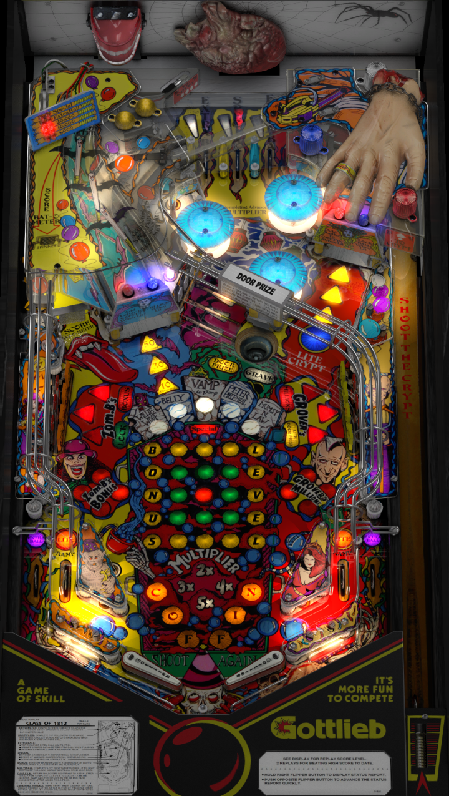

# Class of 1812 (Gottlieb 1991)

---

## Files
| File Type | Link | Version | Author |
|:---------:|:----:|:-------:|:------:|
| VPX | [VP Universe](https://vpuniverse.com/files/file/5491-class-of-1812/) | 1.0 | [ninuzzu](https://vpuniverse.com/profile/5530-ninuzzu/) |
| B2S | [VP Universe](https://vpuniverse.com/files/file/17846-class-of-1812-gottlieb-1991-b2s/) | 1.5 | [hauntfreaks](https://vpuniverse.com/profile/5216-hauntfreaks/) |
| DMD | N/A | N/A | N/A |
| ROM | [Pinball Nirvana](https://pinballnirvana.com/forums/resources/clas1812.1668/) | N/A | N/A |

**Tested by:** [mcap]

---

## Status 
**Minimum VPX Standalone build:** 10.8.0-1989-a764013
| Playfield | Controls | Backglass | DMD | ROM Required | FPS | 
|-----------|----------|-----------|-----|--------------|-----|
| :white_check_mark: | :white_check_mark: | :white_check_mark: | :x: | :white_check_mark: | 47 |

---

## Instructions

- Make sure to use the Table Manager to install this table.
- Instructions can be found on the wiki [Add Table - Manual](https://github.com/LegendsUnchained/vpx-standalone-alp4k/wiki/%5B04%5D-%F0%9F%A7%A1-TM-%E2%80%90-Other-Features#add-table---manual)
- If the table requires any additional files/steps, click `GO TO TABLE` after adding, and the TM will open to the relevant table folder.

## Notes
If your ROM is adding 3 credits per coin:
- Insert a USB Keyboard into the ALP. If you need one [this one works well](https://amzn.to/4fqC1oC).
- Press 7 when starting the game to enter ROM menu
- Immediately Press 8 to enter game adjustments
- Press 7 to advance to the adjustment you want to modify. The center slot credit menu is adjustment number 11. 
- Press 8 or 9 to increase or decrease the setting.  (In this case, hit 8 twice, to go from 3 to 1)
- Press F3 to save
