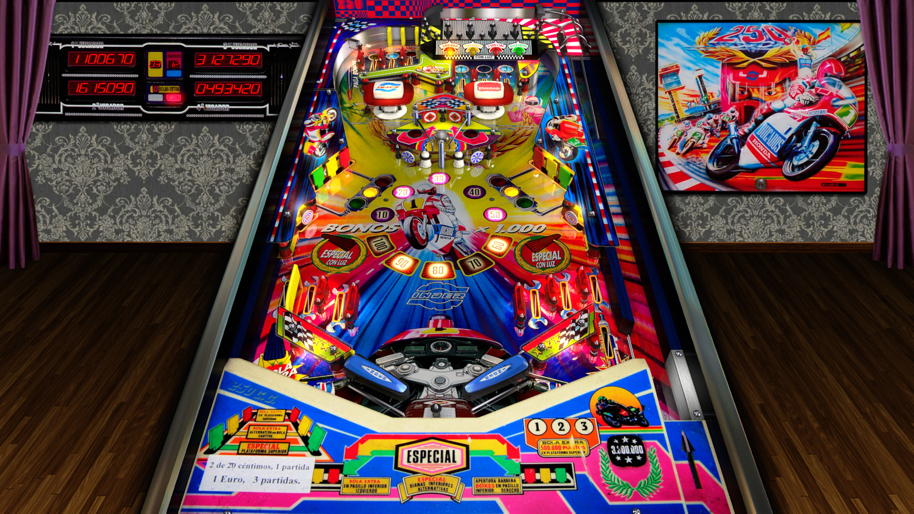

# 250cc (Inder, 1992)

---

## Files
| File Type | Link | Version | Author |
|:---------:|:----:|:-------:|:------:|
| VPX | [VP Forums](https://www.vpforums.org/index.php?app=downloads&showfile=14252) | 5.5.0 | [jpsalas](https://www.vpforums.org/index.php?s=543a5ca562cc33a89debe8ace8834f1e&showuser=277) |
| B2S | [VP Forums](https://www.vpforums.org/index.php?app=downloads&showfile=7697) | 1.0 | [Piggei](https://www.vpforums.org/index.php?app=downloads&showfile=7697) |
| DMD | N/A | N/A | N/A |
| ROM | [VP Forums](https://www.vpforums.org/index.php?app=downloads&showfile=431) | N/A | N/A |

**Tested by:** [Boris]

---

## Status 
**Minimum VPX Standalone build:** 10.8.0-1989-a764013
| Playfield | Controls | Backglass | DMD | ROM Required | FPS | 
|-----------|----------|-----------|-----|--------------|-----|
| :white_check_mark: | :white_check_mark: | :white_check_mark: | :x: | :white_check_mark: | 60 |

---

## Instructions
- Copy the contents of this repo folder to your USB drive
- Add your personalized launcher.elf and rename it to vpx-250cc.elf
- Download the table and directb2s versions listed above, extract (if necessary) and copy them to external/vpx-250cc
- Make sure (.vpx), (.directb2s), and (.ini) files are all named the same
- Place ROM zip file into vpx-250cc/pinmame/roms folder. DO NOT UNZIP!
