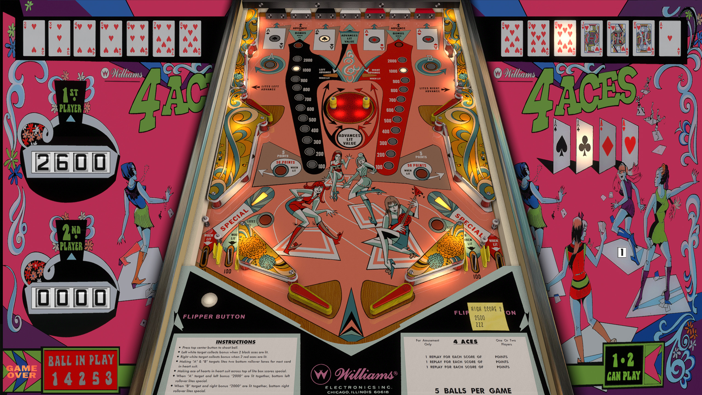

# 4 Aces (Williams 1979)

---

## Files
| File Type | Link | Version | Author |
|:---------:|:----:|:-------:|:------:|
| VPX | [VP Forums](https://www.vpforums.org/index.php?app=downloads&showfile=17632) | 5.5.0 | [JPSalas](https://www.vpforums.org/index.php?showuser=277) |
| B2S | [VP Universe](https://vpuniverse.com/files/file/23077-4-aces-williams-1970-backglass/) | 1.0.1 | [Abhcoide](https://vpuniverse.com/profile/48895-abhcoide/) |
| DMD | N/A | N/A | N/A |
| ROM | N/A | N/A | N/A |

**Tested by:** [Boris]

---

## Status 
**Minimum VPX Standalone build:** 10.8.0-1989-a764013
| Playfield | Controls | Backglass | DMD | ROM Required | FPS | 
|-----------|----------|-----------|-----|--------------|-----|
| :white_check_mark: | :white_check_mark: | :white_check_mark: | :x: | :x: | 60 |

---

## Instructions

- Install this table through the Table Manager, using the `Add Table` > `Manual` page
- If you need help, more infomation found on the wiki: [Add Table - Manual](https://github.com/LegendsUnchained/vpx-standalone-alp4k/wiki/%5B04%5D-%F0%9F%A7%A1-TM-%E2%80%90-Other-Features#add-table---manual)
- If the table requires any additional files/steps, click `GO TO TABLE` after adding, and the TM will open to the relevant table folder.
<!-- ADD EXTRA INSTRUCTIONS BELOW, DONT FORGET A FUN TAGLINE! i.e. "Baywatch will be right back!" -->
- Press up to launch ball from the drain!

## Notes
Press up to launch ball from the drain!

