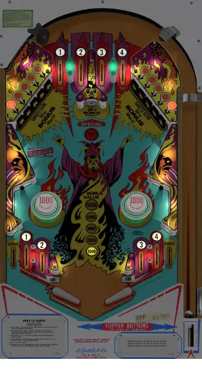

# Abra Ca Dabra (Gottlieb 1975)

---

## Files
| File Type | Link | Version | Author(s) | 
|-----------|--------|----------|--------------|
| **VPX** | [vpforums](https://www.vpforums.org/index.php?app=downloads&showfile=13283) | 8.0 | Batch, Pinuck, BorgDog |
| **B2S** | [vpforums](https://www.vpforums.org/index.php?app=downloads&showfile=13216) | 1.0 | HauntFreaks |

**Tested by:** Boris, Curt

---

## Status 

| Backglass | DMD | ROM Required | Has Puppack | FPS |
|-----------|-----|-----|-----|-----|
| ✅ | ❌ | ❌ | ❌ | 60 |

---

## Instructions

- Install this table through the Table Manager, using the `Add Table` > `Manual` page
- If you need help, more information can be found on the wiki: [TM - Add Table - Manual](https://github.com/LegendsUnchained/vpx-standalone-alp4k/wiki/%5B04%5D-%F0%9F%A7%A1-TM-%E2%80%90-Other-Features#add-table---manual)
- If the table requires any additional files/steps, click `GO TO TABLE` after adding, and the TM will open to the relevant table folder.
- "Abra Ca Dabra, B!"
