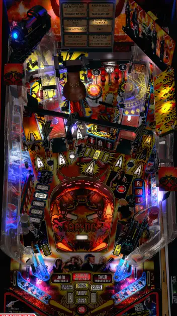

# AC/DC (LUCI Premium) (Stern 2013)

---

## Files
| File Type | Link | Version | Author(s) | 
|-----------|--------|----------|--------------|
| **VPX** | [vpuniverse](https://vpuniverse.com/files/file/12471-acdc-luci-stern-2013-vpw-mod/) | 1.13 | VPW, Fluffhead35, nFozzy |
| **B2S** | [vpuniverse](https://vpuniverse.com/files/file/11475-acdc-luci-premium-stern-2013-b2s-with-full-dmd/) | 3.1 | HauntFreaks |
| **ROM** | [f002](https://f002.backblazeb2.com/file/gamecode/ACD170LE.BIN) | acd_170h | N/A |
| **SERUM** | [vpuniverse](https://vpuniverse.com/files/file/17697-acdc-64-colors/) | 1.01 | PastorLUL |

**Tested by:** MissleToad

---

## Status 

| Backglass | DMD | ROM Required | Has Puppack | FPS |
|-----------|-----|-----|-----|-----|
| ✅ | ✅ | ✅ | ❌ | 60 |

---

## Instructions

- Install this table through the Table Manager, using the `Add Table` > `Manual` page
- If you need help, more infomation found on the wiki: [TM - Add Table - Manual](https://github.com/LegendsUnchained/vpx-standalone-alp4k/wiki/%5B04%5D-%F0%9F%A7%A1-TM-%E2%80%90-Other-Features#add-table---manual)
- Rom Instructions:
  1) Download 'AC/DC LE 1.70.0 Game Code' from the provided link
  2) Zip up the downloaded 'ACD170LE.BIN' file
  3) Rename that zip file to 'acd_170h.zip'
- ⚡🍈🍈👙WARNING⚡Default Playfield image has NSFW images.  You can disable this in the .vbs under 'TABLE OPTIONS'
- If the table requires any additional files/steps, click `GO TO TABLE` after adding, and the TM will open to the relevant table folder.
- It's a long way to the top if you wanna rock n' roll!
