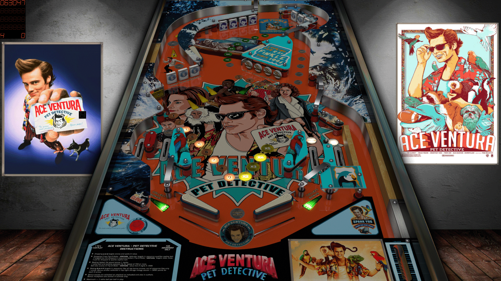

# Ace Ventura Pet Detective (TBA 2019)

---

## Files
| File Type | Link | Version | Author | 
|:---------:|:----:|:-------:|:------:|
| VPX | [VP Forums](https://www.vpforums.org/index.php?app=downloads&showfile=14343) | 1.0 | [ivantba](https://www.vpforums.org/index.php?showuser=123858) |
| B2S | Included with VPX | N/A | N/A |
| DMD | N/A | N/A | N/A |
| ROM | [VP Forums](https://www.vpforums.org/index.php?app=downloads&showfile=575) | stest | [destruk](https://www.vpforums.org/index.php?showuser=5) |

**Tested by:** [Mox]

---

## Status
**Minimum VPX Standalone build:** 10.8.0-2006-6d603fb
| Playfield | Controls | Backglass | DMD | ROM Required | FPS | 
|:---------:|:--------:|:---------:|:---:|:------------:|:---:|
| :white_check_mark: | :white_check_mark: | :white_check_mark: | :x: | :white_check_mark: | 60 |

---

## Instructions
- Copy the **vpx-aceventura** folder to the `external` directory of your USB drive
- Add your personalized launcher.elf and rename it to **vpx-aceventura.elf**
- Download and extract the **VPX** and **DIRECTB2S** files ONLY, and copy them into the **vpx-aceventura** folder
- Make sure (.vpx), (.directb2s), and (.ini) files are all named the same -- No need to rename VPReg.ini
- Download the **ROM** version listed above and copy it into `\vpx-aceventura\pinmame\roms` (DO NOT UNZIP)
- "May I ass you a few questions?"
