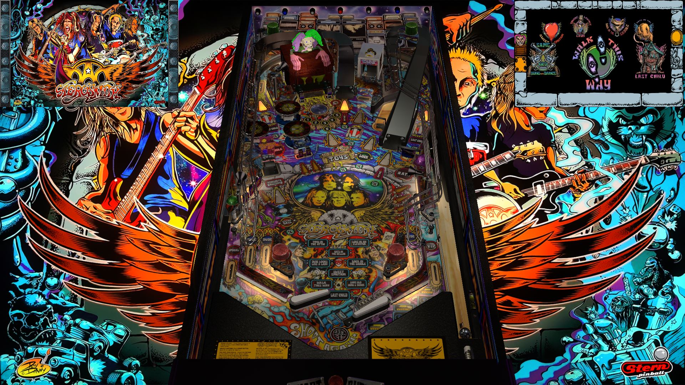

# Aerosmith (Pro) (Stern/Tribute 2017) 

---

## Files
| File Type | Link | Version | Author |
|:---------:|:----:|:-------:|:------:|
| VPX | [VP Universe](https://vpuniverse.com/files/file/13413-aerosmith-stern-2017flex-b2s-with-full-dmd/) | 1.0 | [allknowing2012](https://vpuniverse.com/profile/5615-allknowing2012/) |
| B2S | [VP Universe](https://vpuniverse.com/files/file/13413-aerosmith-stern-2017flex-b2s-with-full-dmd/) | 3.1 | [hauntfreaks](https://vpuniverse.com/profile/5216-hauntfreaks/) |
| DMD | N/A | N/A | N/A |
| ROM | N/A | N/A | N/A |

**Tested by:** [OminousOsie]

---

## Status
**Minimum VPX Standalone build:** 10.8.0-1989-a764013
| Playfield | Controls | Backglass | DMD | ROM Required | FPS | 
|-----------|----------|-----------|-----|--------------|-----|
| :white_check_mark: | :white_check_mark: | :white_check_mark: | :white_check_mark: | :x: | 44 |

---

## Instructions
- Copy the contents of this repo folder to your USB drive
- Add your personalized launcher.elf and rename it to vpx-aerosmith.elf
- Download the table and directb2s versions listed above, extract (if necessary) and copy them to external/vpx-aerosmith
- Download the PupPack, copy the contents of the music folder into external/vpx-aerosmith/Music/Aerosmith/
- Make sure (.vpx), (.directb2s), (.ini) and (.vbs) files are all named the same
- Do NOT rename VPReg.ini file

## Notes
- Music Files
- Author: [allknowing2012](https://vpuniverse.com/profile/5615-allknowing2012/)
- Version: 1.0 
- Download: MEGA download link for PupPack in 'About This File' section, under 'Extra: PuP Pack Location'
- Link: [VP Universe] https://vpuniverse.com/files/file/13403-aerosmith-pro-sterntribute-2017-v102zip-with-vr/