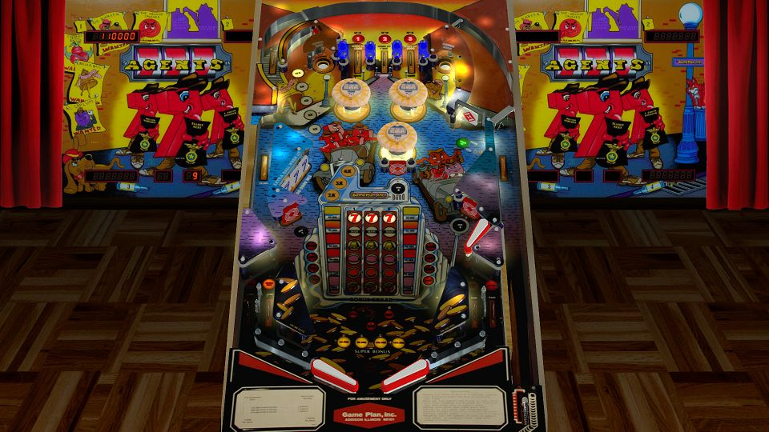

# Agents 777 (Game Plan 1984)

---

## Files
| File Type | Link | Version | Author | 
|:---------:|:----:|:-------:|:------:|
| VPX | [VP Forums](https://www.vpforums.org/index.php?app=downloads&showfile=11576) | 1.0 | [hmueck](https://www.vpforums.org/index.php?showuser=58245) |
| B2S | [VP Universe](https://vpuniverse.com/files/file/3093-agents-777-game-plan-1984/) | 1.1 | [Wildman](https://vpuniverse.com/profile/5-wildman/) |
| DMD | N/A | N/A | N/A |
| ROM | [VP Forums](https://www.vpforums.org/index.php?app=downloads&showfile=84) | agent777 | [destruk](https://www.vpforums.org/index.php?showuser=5) |

**Tested by:** [Mox]

---

## Status 
**Minimum VPX Standalone build:** 10.8.0-2042-1431983
| Playfield | Controls | Backglass | DMD | ROM Required | FPS |
|:---------:|:--------:|:---------:|:---:|:------------:|:---:|
| :white_check_mark: | :white_check_mark: | :white_check_mark: | :white_check_mark: | :white_check_mark: | 55 |

---

## Instructions

- Install this table through the Table Manager, using the `Add Table` > `Manual` page
- If you need help, more information found on the wiki: [TM - Add Table - Manual](https://github.com/LegendsUnchained/vpx-standalone-alp4k/wiki/%5B04%5D-%F0%9F%A7%A1-TM-%E2%80%90-Other-Features#add-table---manual)
- If the table requires any additional files/steps, click `GO TO TABLE` after adding, and the TM will open to the relevant table folder.

