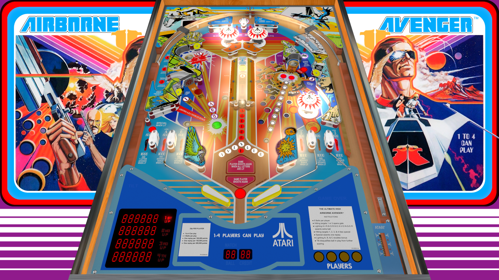

# Airborne Avenger (Atari 1977)

---

## Files
| File Type | Link | Version | Author | 
|:---------:|:----:|:-------:|:------:|
| VPX | [VP Forums](https://www.vpforums.org/index.php?app=downloads&showfile=13676) | 1.4 | [DarthMarino](https://www.vpforums.org/index.php?showuser=39983) |
| B2S | [VPUniverse](https://vpuniverse.com/files/file/12964-airborne-avenger-atari-1977-b2s-with-full-dmd/) | 1.0.0 | [hauntfreaks](https://vpuniverse.com/profile/5216-hauntfreaks/) |
| DMD | N/A | N/A | N/A |
| ROM | [VPUniverse](https://vpuniverse.com/files/file/1160-airborne-avenger/) | aavenger.zip | [VPUStaff](https://vpuniverse.com/profile/50-vpustaff/) |

**Tested by:** [Mox]

---

## Status 
**Minimum VPX Standalone build:** 10.8.0-2042-1431983
| Playfield | Controls | Backglass | DMD | ROM Required | FPS |
|:---------:|:--------:|:---------:|:---:|:------------:|:---:|
| :white_check_mark: | :white_check_mark: | :white_check_mark: | :x: | :white_check_mark: | 60 |

---

## Instructions
- Copy the **vpx-airavenger** folder to the `external` directory of your USB drive
- Add your personalized launcher.elf and rename it to **vpx-airavenger**
- Download and extract the **VPX** and **DIRECTB2S** versions listed above and copy them into the **vpx-airavenger** folder
- Make sure (.vpx), (.directb2s), and (.ini) files are all named the same
- Download the **ROM** version listed above and copy it into `\vpx-airavenger\pinmame\roms` (DO NOT UNZIP)
