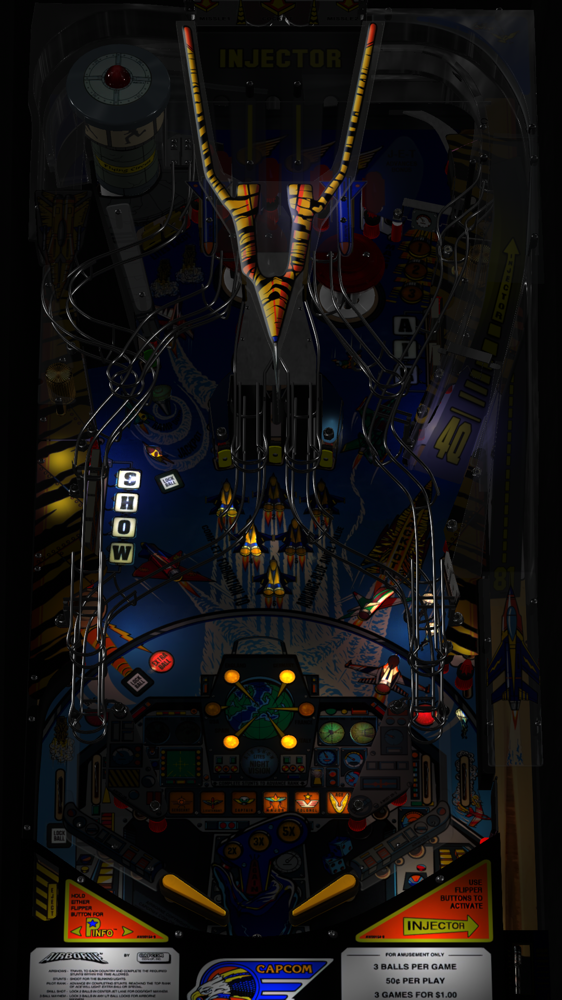

# Airborne (Capcom 1996)

---

## Files
| File Type | Link | Version | Author |
|:---------:|:----:|:-------:|:------:|
| VPX | [vpforums](https://vpuniverse.com/files/file/14791-airborne-capcom-1996/) | 1.0 | [versins77](https://vpuniverse.com/profile/29661-versins77/) |
| B2S | [VP Universe](https://vpuniverse.com/files/file/2184-airbornecapcom1996/) | 2.0 | [wildman](https://vpuniverse.com/profile/5-wildman/) |
| DMD | N/A | N/A | N/A |
| ROM | [vpforums](https://vpuniverse.com/files/file/1281-airborne-capcom-1996-abv106/) | abv106.zip | N/A |

**Tested by:** [kaoticBPR]

---

## Status
**Minimum VPX Standalone build:** 10.8.0-1989-a764013
| Playfield | Controls | Backglass | DMD | ROM Required | FPS | 
|-----------|----------|-----------|-----|--------------|-----|
| :white_check_mark: | :white_check_mark: | :white_check_mark: | :white_check_mark: | :white_check_mark: | 37 |

---

## Instructions

- Install this table through the Table Manager, using the `Add Table` > `Manual` page
- If you need help, more infomation found on the wiki: [TM - Add Table - Manual](https://github.com/LegendsUnchained/vpx-standalone-alp4k/wiki/%5B04%5D-%F0%9F%A7%A1-TM-%E2%80%90-Other-Features#add-table---manual)
- If the table requires any additional files/steps, click `GO TO TABLE` after adding, and the TM will open to the relevant table folder.

