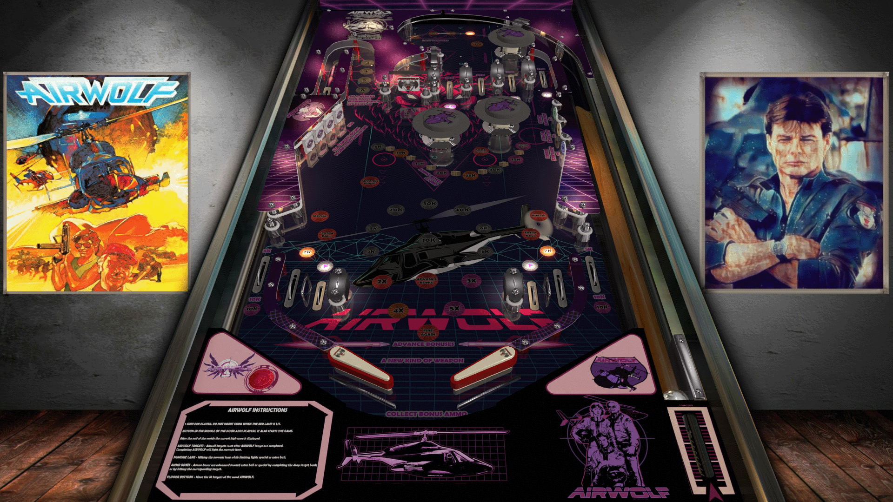

# Airwolf (TBA 2020)

---

## Files
| File Type | Link | Version | Author |
|:---------:|:----:|:-------:|:------:|
| VPX | [VP Forums](https://www.vpforums.org/index.php?app=downloads&showfile=14775) | N/A | [ivantba](https://www.vpforums.org/index.php?showuser=123858) |
| B2S | Included with VPX | N/A | N/A |
| DMD | N/A | N/A | N/A |
| ROM | [VP Forums](https://www.vpforums.org/index.php?app=downloads&showfile=564) | cosmic.zip | [destruk](https://www.vpforums.org/index.php?showuser=5) |

**Tested by:** [TechZombie]

---

## Status 
**Minimum VPX Standalone build:** 10.8.0-1989-a764013
| Playfield | Controls | Backglass | DMD | ROM Required | FPS | 
|-----------|----------|-----------|-----|--------------|-----|
| :white_check_mark: | :white_check_mark: | :white_check_mark: | :x: | :white_check_mark: | 60 |

---

## Instructions
- Copy the contents of this repo folder to your USB drive
- Add your personalized launcher.elf and rename it to vpx-airwolf.elf
- Download the table and directb2s listed above, extract (if necessary) and copy them to external/vpx-airwolf
- Select/Copy Music Folder and move to external/vpx-airwolf
- Make sure (.vpx), (.directb2s), (.ini), and (.vbs) files are all named the same
- The ROM zip file gets copied to vpx-airwolf/pinmame/roms (Do not unzip)
- "Sometimes, Hawke, you amaze even me. Good luck!" - Archangel
