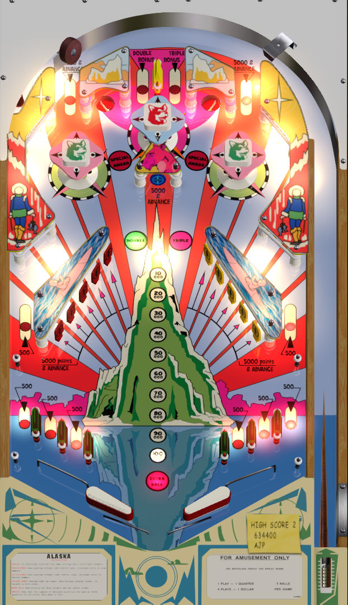

# Alaska (Interflip 1978)

---

## Files
| File Type | Link | Version | Author |
|:---------:|:----:|:-------:|:------:|
| VPX | [VPForums](https://www.vpforums.org/index.php?app=downloads&showfile=16800) | 1.1 | [jejepinball](https://www.vpforums.org/index.php?s=3b0a5c7e845216cee68c2f1ca3da5281&app=core&module=search&do=user_activity&search_app=downloads&mid=108032) |
| B2S | [VPForums](https://www.vpforums.org/index.php?app=downloads&showfile=16800) | 1.0 | 7he S4ge  |
| DMD | N/A | N/A | N/A |
| ROM | N/A | N/A | N/A |

**Tested by:** [Curt]

---

## Status 
**Minimum VPX Standalone build:** 10.8.0-1989-a764013
| Playfield | Controls | Backglass | DMD | ROM Required | FPS | 
|-----------|----------|-----------|-----|--------------|-----|
| :white_check_mark: | :white_check_mark: | :white_check_mark: | :x: | :x: | 60 |

---

## Instructions

- Make sure to use the Table Manager to install this table.
- Instructions can be found on the wiki [Add Table - Manual](https://github.com/LegendsUnchained/vpx-standalone-alp4k/wiki/%5B04%5D-%F0%9F%A7%A1-TM-%E2%80%90-Other-Features#add-table---manual)
- If the table requires any additional files/steps, click `GO TO TABLE` after adding, and the TM will open to the relevant table folder.

## NOTE
- The directb2s file has a graphic bug in displaying scores. To overcome it, my .vbs inserts a kludge to start every game with a score of 1 point, and subtract it when the game ends. I'm very open to other solutions, just edit as needed.
