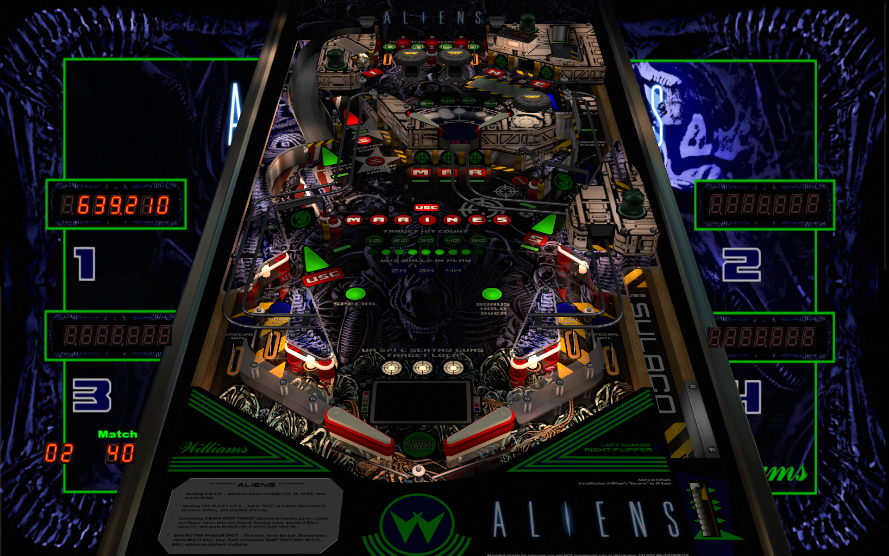

# Aliens (Original 2020)

---

## Files
| File Type | Link | Version | Author |
|:---------:|:----:|:-------:|:------:|
| VPX | [VPUniverse](https://vpuniverse.com/files/file/19644-aliens-30-final-release/) | 3.0 | [delta23](https://vpuniverse.com/profile/1187-delta23/) |
| B2S | [VPUniverse](https://vpuniverse.com/files/file/19644-aliens-30-final-release/) | N/A | [delta23](https://vpuniverse.com/profile/1187-delta23/) |
| DMD | N/A | N/A | N/A |
| ROM | [vpforums](https://www.vpforums.org/index.php?app=downloads&showfile=889) | N/A | N/A |

**Tested by:** [kaoticBPR]

---

## Status 
**Minimum VPX Standalone build:** 10.8.0-1989-a764013
| Playfield | Controls | Backglass | DMD | ROM Required | FPS | 
|-----------|----------|-----------|-----|--------------|-----|
| :white_check_mark: | :white_check_mark: | :white_check_mark: | :x: | :white_check_mark: | 60 |

---

## Instructions

- Make sure to use the Table Manager to install this table.
- Instructions can be found on the wiki [Add Table - Manual](https://github.com/LegendsUnchained/vpx-standalone-alp4k/wiki/%5B04%5D-%F0%9F%A7%A1-TM-%E2%80%90-Other-Features#add-table---manual)
- If the table requires any additional files/steps, click `GO TO TABLE` after adding, and the TM will open to the relevant table folder.
- Place Music Folder in the vpx-aliens folder
- "Game Over Man, Game Over!"

