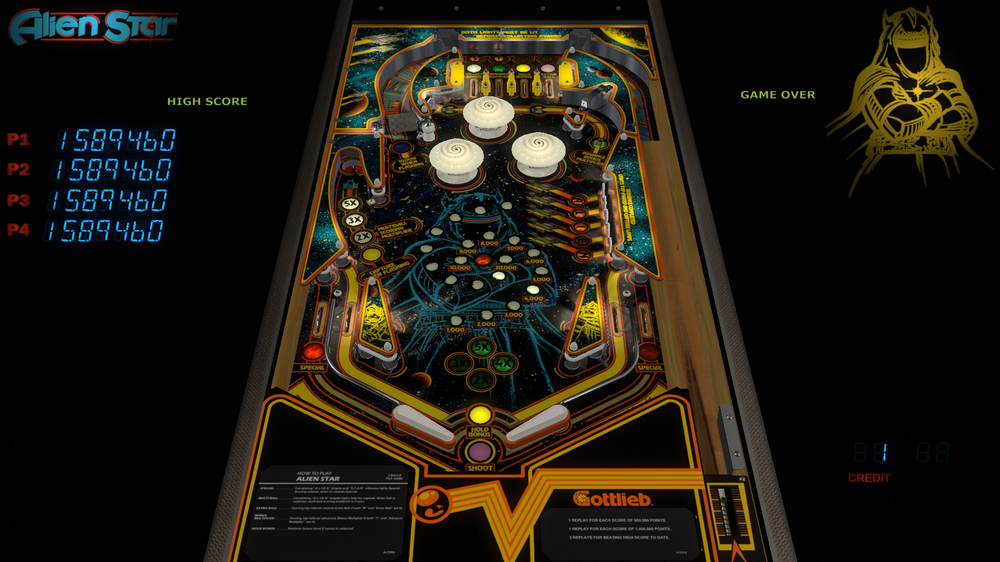

# Alien Star (Gottlieb 1984)

---

## Files
| File Type | Link | Version | Author |
|:---------:|:----:|:-------:|:------:|
| VPX | [VPUniverse](https://vpuniverse.com/files/file/18211-alien-star-gottlieb-1984/) | 2.0.2 | [UnclePaulie](https://vpuniverse.com/profile/16685-unclepaulie/) |
| B2S | [VP Universe](https://vpuniverse.com/files/file/13215-alien-star-gottlieb-1984) | 2.0 | [hauntfreaks](https://vpuniverse.com/profile/5216-hauntfreaks/) |
| DMD | N/A | N/A | N/A |
| ROM | [Pinball Nirvana](https://pinballnirvana.com/forums/resources/alienstr.1519/) | N/A | N/A |

**Tested by:** [kaoticBPR]

---

## Status 
**Minimum VPX Standalone build:** 10.8.0-1989-a764013
| Playfield | Controls | Backglass | DMD | ROM Required | FPS | 
|-----------|----------|-----------|-----|--------------|-----|
| :white_check_mark: | :white_check_mark: | :white_check_mark: | :white_check_mark: | :white_check_mark: | 42 |

---

## Instructions

