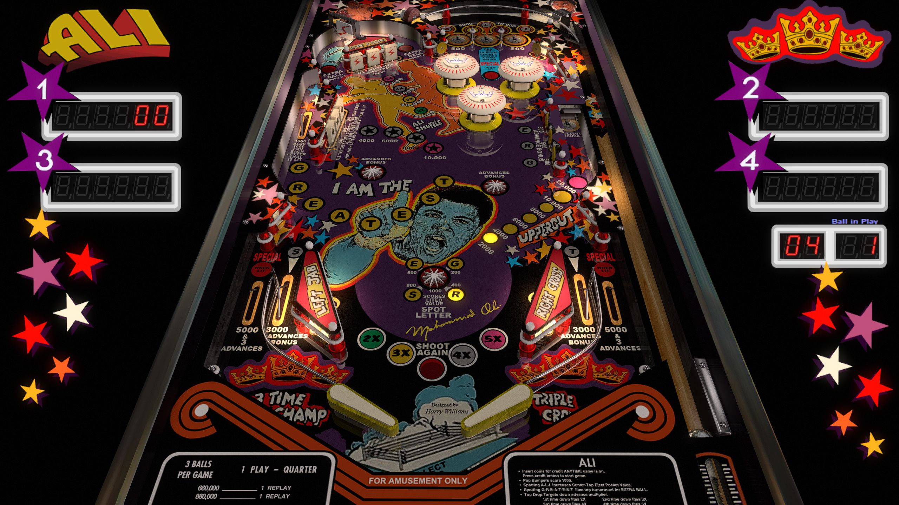

# Ali, JP's (Stern 1980)

---

## Files
| File Type | Link | Version | Author |
|:---------:|:----:|:-------:|:------:|
| VPX | [VP Forums](https://www.vpforums.org/index.php?app=downloads&showfile=12902) | 5.5.0 | [JPSalas](https://www.vpforums.org/index.php?showuser=277) |
| B2S | [VP Universe](https://vpuniverse.com/files/file/21356-ali-stern-1980-b2s/) | 1.0.0 | [Wildman](https://vpuniverse.com/profile/5-wildman/) |
| DMD | N/A | N/A | N/A |
| ROM | [VP Forums](https://www.vpforums.org/index.php?app=downloads&showfile=741) | N/A | N/A |

**Tested by:** [Boris]

---

## Status 
**Minimum VPX Standalone build:** 10.8.0-1989-a764013
| Playfield | Controls | Backglass | DMD | ROM Required | FPS | 
|-----------|----------|-----------|-----|--------------|-----|
| :white_check_mark: | :white_check_mark: | :white_check_mark: | :x: | :white_check_mark: | 60 |

---

## Instructions
- Copy this repo folder into the "external" folder on your USB drive
- Add your personalized launcher.elf and rename it to vpx-alijp.elf
- Download the table and directb2s versions listed above, extract them (if necessary) and copy them to external/vpx-alijp
- Make sure any (.vpx), (.directb2s), and (.ini) files are all named the same
- Download the ROM listed above and copy it to vpx-alijp\pinmame\roms -- DO NOT UNZIP!
