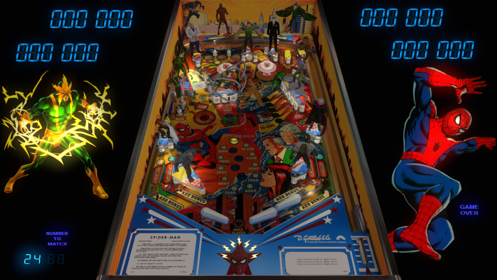

# Amazing Spiderman (Gottlieb 1980) Sinister Six Edition

---

## Files
| File Type | Link | Version | Author |
|:---------:|:----:|:-------:|:------:|
| VPX | [Pinball Nirvana](https://pinballnirvana.com/forums/resources/amazing-spiderman-gottlieb-1980-sinister-six-edition.8400/) | v1.1 | [xenonph](https://www.vpforums.org/index.php?showuser=14100) |
| B2S | Included with VPX | v1.0 | N/A |
| DMD | N/A | N/A | N/A |
| ROM | [Pinball Nirvana](https://pinballnirvana.com/forums/resources/spidermn.2352/) | spidermn.zip | [Rock-ola](https://pinballnirvana.com/forums/members/rock-ola.1/) |

**Tested by:** [TechZombie]

---

## Status 
**Minimum VPX Standalone build:** 10.8.0-1983-b84441e
| Playfield | Controls | Backglass | DMD | ROM Required | FPS | 
|-----------|----------|-----------|-----|--------------|-----|
| :white_check_mark: | :white_check_mark: | :white_check_mark: | :white_check_mark: | :white_check_mark: | 48 |

---

## Instructions
- Copy the contents of this repo folder to your USB drive
- Add your personalized launcher.elf and rename it to vpx-amazingspidermansse.elf
- Download the table zip above, extract it and copy Amazing Spiderman (Gottlieb 1980) Sinister Six Edition v1.1.vpx
- and Amazing Spiderman (Gottlieb 1980) Sinister Six Edition v1.0.directb2s to vpx-amazingspidermansse.
- Place ROM file (spidermn.zip) into vpx-amazingspidermansse/pinmame/roms -- Do NOT unzip!
- Make sure (.vpx) (.direct2b2s) and (.ini) are all named the same. 
- "My Vpin Sense is tingling!" --- Spider-Man

