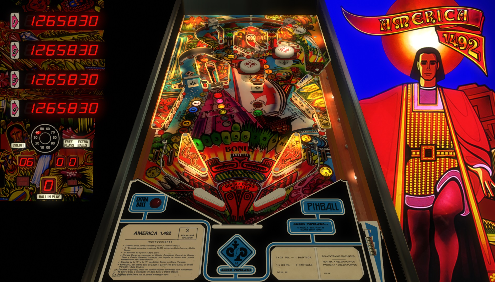

# America 1492 (Juegos Populares 1986)

---

## Files
| File Type | Link | Version | Author |
|:---------:|:----:|:-------:|:------:|
| VPX | [VPForums](https://www.vpforums.org/index.php?app=downloads&showfile=18607) | 2.0 | [javito](https://www.vpforums.org/index.php?showuser=11433) |
| B2S | [VPForums](https://www.vpforums.org/index.php?app=downloads&showfile=12323) | N/A | [STAT](https://www.vpforums.org/index.php?showuser=11253) |
| DMD | N/A | N/A | N/A |
| ROM | [IPDB](https://www.ipdb.org/files/5013/america.zip) | america.zip | N/A |

**Tested by:** [evilwraith]

---

## Status 
**Minimum VPX Standalone build:** 10.8.0-1989-a764013
| Playfield | Controls | Backglass | DMD | ROM Required | FPS | 
|-----------|----------|-----------|-----|--------------|-----|
| :white_check_mark: | :white_check_mark: | :white_check_mark: | :x: | :white_check_mark: | 48 |

---

## Instructions

- Install this table through the Table Manager, using the `Add Table` > `Manual` page
- If you need help, more information found on the wiki: [TM - Add Table - Manual](https://github.com/LegendsUnchained/vpx-standalone-alp4k/wiki/%5B04%5D-%F0%9F%A7%A1-TM-%E2%80%90-Other-Features#add-table---manual)
- If the table requires any additional files/steps, click `GO TO TABLE` after adding, and the TM will open to the relevant table folder.

