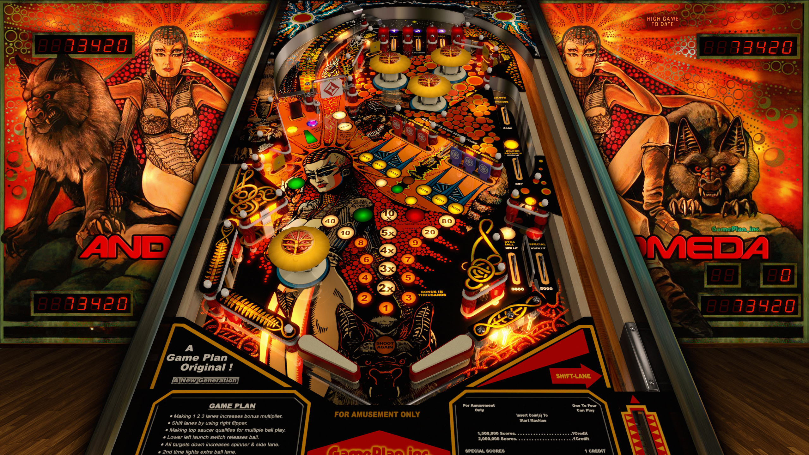

# Andromeda (Game Plan 1985)

---

## Files
| File Type | Link | Version | Author | 
|-----------|--------|----------|--------------|
| **VPX** | [VPForums](https://www.vpforums.org/index.php?app=downloads&showfile=14871) | 5.5.0 | [jpsalas](https://www.vpforums.org/index.php?showuser=277) |
| **B2S** | [VPUniverse](https://vpuniverse.com/files/file/11306-andromeda-game-plan-1985-alt-backglass-with-full-dmd/) | 1.0 | [ryguy417](https://vpuniverse.com/profile/31096-ryguy417/) |
| **DMD** | -- | -- | -- |
| **ROM** | [VPForums](https://www.vpforums.org/index.php?app=downloads&showfile=544) | -- | [Williams](https://www.vpforums.org/index.php?app=core&module=search&do=user_activity&search_app=downloads&mid=5) |

**Tested by:** [Curt]

---

## Status 
**Minimum VPX Standalone build:** 10.8.0-1989-a764013
| Playfield | Controls | Backglass | DMD | ROM Required | FPS | 
|-----------|----------|-----------|-----|--------------|-----|
| :white_check_mark: | :white_check_mark: | :white_check_mark: | :x: | :white_check_mark: | 58 |

---

## Instructions
- Copy the contents of this repo folder to your USB drive
- Add your personalized launcher.elf and rename it to `vpx-andromeda.elf`
- Download the table and directb2s versions listed above, extract (if necessary) and copy them into `vpx-andromeda`
- Rom file (andromed.zip) stays in zip folder, place zip file in `vpx-andromeda/pinmame/roms`
- Make sure `(.vpx)` `(.direct2b2s)` `(.vbs)` and `(.ini)` are all named the same.

---

## Note
- You can swap in the 'easy' .vbs file for an Easy Mode experience--This one gives extended duration Ball Saves on Ball 1, easy-to-earn Free Credits, and 55 fps.
