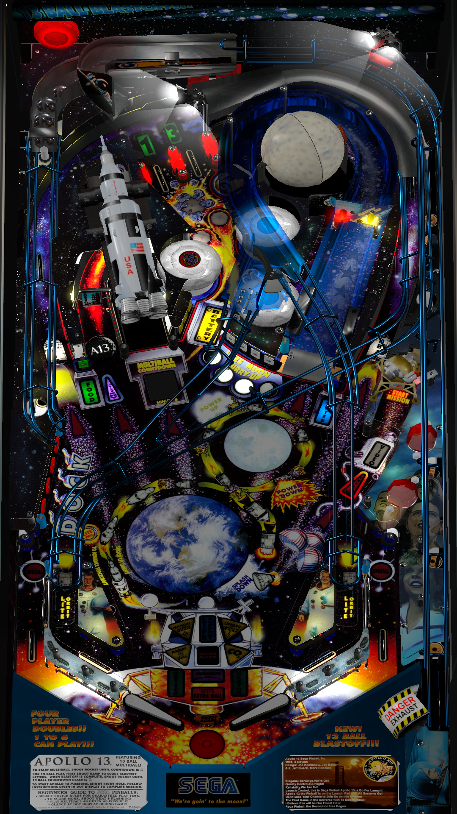

# Apollo 13 (Sega 1995)

---

## Files
| File Type | Link | Version | Author |
|:---------:|:----:|:-------:|:------:|
| VPX | [VP Forums](https://www.vpforums.org/index.php?app=downloads&showfile=14766) | 1.62 | [balater](https://www.vpforums.org/index.php?s=ecc80ff65f52642febea09026be698f8&showuser=112487) |
| B2S | [VP Universe](https://vpuniverse.com/files/file/10898-apollo-13-sega-1995-b2s-with-full-dmd/) | 3.0 | [hauntfreaks](https://vpuniverse.com/profile/5216-hauntfreaks/) |
| DMD | N/A | N/A | N/A |
| ROM | [VP Forums](https://www.vpforums.org/index.php?app=downloads&showfile=1063) | apollo13.zip | [destruk](https://www.vpforums.org/index.php?showuser=5) |

**Tested by:** [mcap]

---

## Status 

Minimum VPX Standalone build: 10.8.0-1989-a764013

| Playfield | Controls | Backglass | DMD | ROM Required | FPS | 
|-----------|----------|-----------|-----|--------------|-----|
| :white_check_mark: | :white_check_mark: | :white_check_mark: | :white_check_mark: | :white_check_mark: | 47 |

## Instructions

- Copy the contents of this repo folder to your USB drive
- Add your personalized launcher.elf and rename it to vpx-apollo13.elf
- Download the table, directb2s, and ROM versions listed above and copy them into this folder
- Make sure (.vpx), (.directb2s), and (.ini) files are all named the same
- Place ROM zip file into vpx-apollo13/pinmame/roms folder. DO NOT UNZIP!
- "Houston, we have a problem!"
