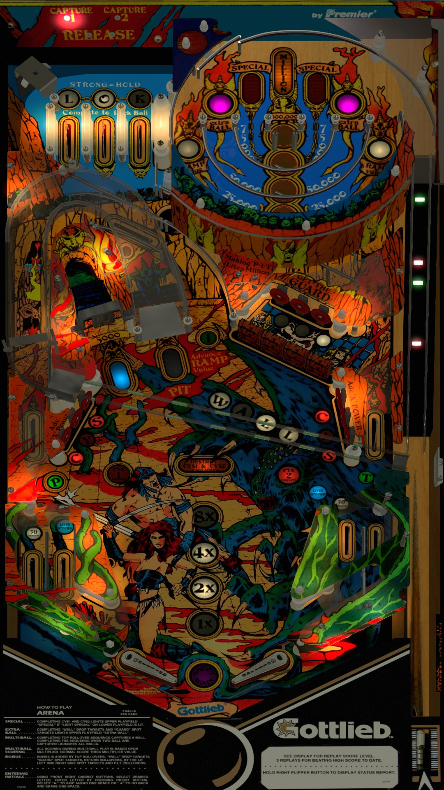

# Arena 1.0c (Gottlieb 1987)

---

## Files
| File Type | Link | Version | Author | 
|:---------:|:----:|:-------:|:------:|
| VPX | [VP Forums](https://www.vpforums.org/index.php?app=downloads&showfile=15411) | 1.0c | [goldchicco](https://www.vpforums.org/index.php?showuser=88795) |
| B2S | [VP Universe](https://vpuniverse.com/files/file/3099-arena-gottlieb-1987/) | 3.0 | [Wildman](https://vpuniverse.com/profile/5-wildman/) |
| DMD | N/A | N/A | N/A |
| ROM | [Pinball Nirvana](https://pinballnirvana.com/forums/resources/arena.1532/) | arena | [Rock-ola](https://pinballnirvana.com/forums/members/rock-ola.1/) |

**Tested by:** [Mox]

---

## Status 
**Minimum VPX Standalone build:** 10.8.0-2042-1431983
| Playfield | Controls | Backglass | DMD | ROM Required | FPS |
|:---------:|:--------:|:---------:|:---:|:------------:|:---:|
| :white_check_mark: | :white_check_mark: | :white_check_mark: | :white_check_mark: | :white_check_mark: | 45 |

---

## Instructions
- Copy the **vpx-arena1C3S** folder to the `external` directory of your USB drive
- Add your personalized launcher.elf and rename it to **vpx-arena1C3S**
- Download and extract the **VPX** and **DIRECTB2S** files and copy it them to the **vpx-arena1C3S** folder
- Make sure (.vpx), (.directb2s), and (.ini) files are all named the same
- Download the **ROM** version listed above and copy it into `\vpx-arena1C3S\pinmame\roms` (DO NOT UNZIP)
