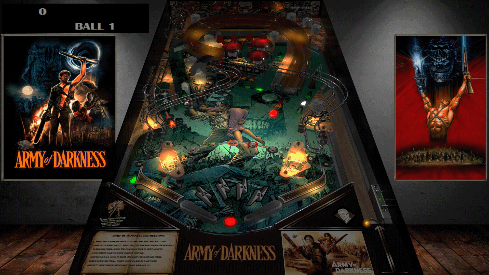

# Evil Dead 3 Army of Darkness (Original 2020)

 

## *️⃣  Table Statistics

| Playfield | Controls | Backglass | DMD | ROM Required | FPS | 
|-----------|----------|-----------|-----|--------------|-----|
| :white_check_mark: | :white_check_mark: | :white_check_mark: | :x: | :x: | 52 |

 

**VPXS 4KP Testers:**
  - T3chZombie
  - Mox
  - OminousOsie 🌸

 

---

 

## ❇️ Available in the Wizard! 🪄✨

 

This table is available through the Table Manager Wizard, which makes installation quick and easy!

### How to install:

1.  Open the **Table Manager**
2.  Click the **Add Table** button
3.  Select the **Wizard** tab
4.  Find and select this table from the dropdown menu: **`Evil Dead 3 Army of Darkness`**
5.  Follow the on-screen instructions to download and upload the required files
6. *"Look, maybe I didn't say every single little tiny syllable, no. But basically I said them, yeah."*

 

Using the Wizard ensures you get the latest table version, have all required files (ROM, backglass, etc.), and have all the VPXS 4KP team's table tweaks and improvements!

 

__*We hope you enjoy!!*__

*The VPXS 4KP Wizard team:*
<pre>
- n-i-x            - Mox              - Lloydbraun
- Boris Undead     - 'Coffee' Joe     - Ominous Osie 🌸
- Bla1ze           - evilwraith       - Silentkat        
- mrandromeda      - SScorpio         - pointdablame
</pre>

 

---

 

## ➕ Optional Extras

> All optional extras can be added to the table after the Wizard installation via: 
> -  Clicking `"Go to table"` directly after wizard installation
> -  Navigate to the table folder using the `USB Root` tab.

 

### ⏯️ Music Files:

1.  Download table folder from [VP Forums](https://www.vpforums.org/index.php?app=downloads&showfile=14777) (by [ivantba](https://www.vpforums.org/index.php?showuser=123858))
2.  Extract the folder `Media pack (for PinballX)` --> `Visual Pinball` --> `Table Audio` from the zip.
3.  In the Table Manager, within `external/vpx-armyofdarkness`, create a folder called `music`
4.  Place `Evil Dead 3 Army of Darkness (TBA 2020).mp3` in `external\vpx-armyofdarkness\music\` in the Table Manager
5.  You should then have `external/vpx-armyofdarkness/music` > `Evil Dead 3 Army of Darkness (TBA 2020).mp3`
6.  Enjoy! Hail to the king baby!

 
 
 
 
 
