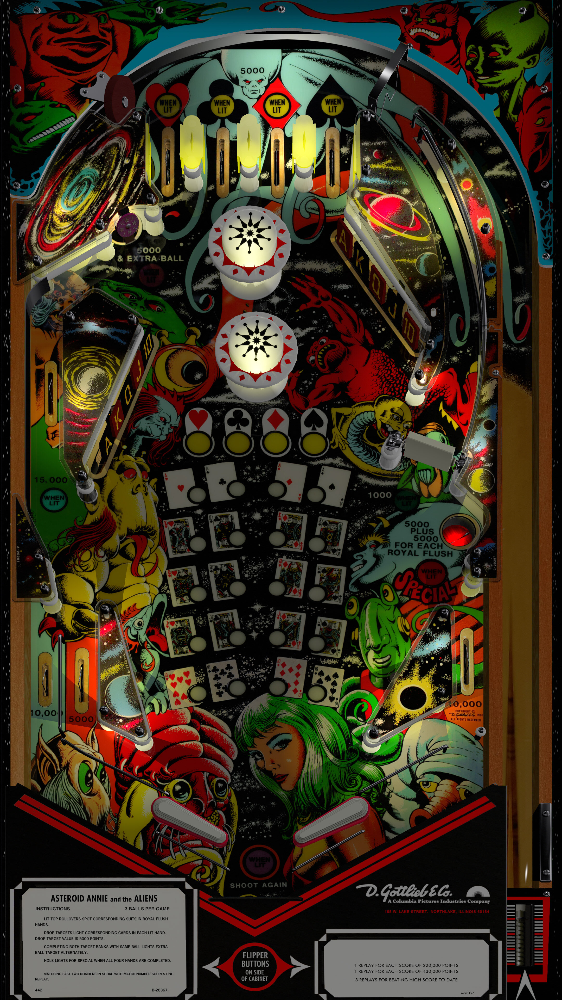

# Asteroid Annie (Gottlieb 1980)

---

## Files
| File Type | Link | Version | Author |
|:---------:|:----:|:-------:|:------:|
| VPX | [VP Universe](https://vpuniverse.com/files/file/8649-asteroid-annie-eb-mod/) | Asteroid Annie - EB Mod | [hauntfreaks](https://vpuniverse.com/profile/5216-hauntfreaks/) |
| B2S | [VP Universe](https://vpuniverse.com/files/file/14156-asteroid-annie-gottlieb-1980-b2s/) | N/A | [hauntfreaks](https://vpuniverse.com/profile/5216-hauntfreaks/) |
| DMD | N/A | N/A | N/A |
| ROM | [Pinball Nirvana](https://pinballnirvana.com/forums/resources/astannie-zip.8426/) | astannie.zip | [MoxAssault](https://pinballnirvana.com/forums/members/moxassault.47593/) |

**Tested by:** [CoffeeAtJoes]

---

## Status 
**Minimum VPX Standalone build:** 10.8.0-1983-b84441e
| Playfield | Controls | Backglass | DMD | ROM Required | FPS | 
|-----------|----------|-----------|-----|--------------|-----|
| :white_check_mark: | :white_check_mark: | :white_check_mark: | :x: | :white_check_mark: | 60 |

---

## Instructions
- Copy the contents of this repo folder to your USB drive
- Add your personalized launcher.elf and rename it to vpx-astannie.elf
- Download the table & backglass zips above, extract them and copy them to the external/vpx-astannie folder
- Place the ROM zip (astannie.zip) in the /vpx-astannie/pinmame/roms folder. (Do not un-zip!)
- Make sure (.vpx), (.direct2b2s) and (.ini) are all named the same
- "She knows when to hold 'em... knows when to fold 'em..."

## Notes
- DMD on backglass
- Thank you Mox, for help with the ROM!