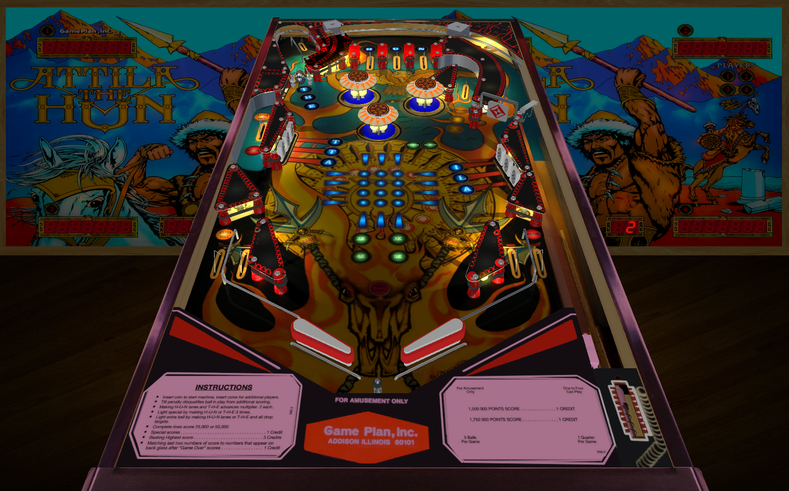

# Attila The Hun (Game Plan 1984)

---

## Files
| File Type | Link | Version | Author | 
|:---------:|:----:|:-------:|:------:|
| VPX | [VP Forums](https://www.vpforums.org/index.php?app=downloads&showfile=13486) | 1.0a | [HSM](https://www.vpforums.org/index.php?showuser=78127) |
| B2S | Included with VPX | N/A | N/A |
| DMD | N/A | N/A | N/A |
| ROM | [Pinball Nirvana](https://pinballnirvana.com/forums/resources/attila.1539/) | attila.zip | [Rock-ola](https://pinballnirvana.com/forums/members/rock-ola.1/) |

**Tested by:** [Mox]

---

## Status 
**Minimum VPX Standalone build:** 10.8.0-2042-1431983
| Playfield | Controls | Backglass | DMD | ROM Required | FPS |
|:---------:|:--------:|:---------:|:---:|:------------:|:---:|
| :white_check_mark: | :white_check_mark: | :white_check_mark: | :x: | :white_check_mark: | 60 |

---

## Instructions
- Copy the **vpx-atilla** folder to the `external` directory of your USB drive
- Add your personalized launcher.elf and rename it to **vpx-atilla**
- Download and extract the **VPX** and **DIRECTB2S** versions listed above and copy them into the **vpx-atilla** folder
- Make sure (.vpx), (.directb2s), and (.ini) files are all named the same
- Download the **ROM** version listed above and copy it into `\vpx-atilla\pinmame\roms` (DO NOT UNZIP)
