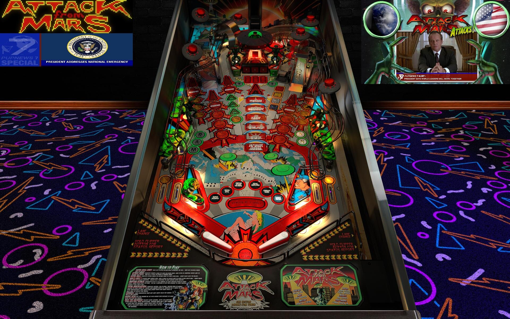

# Attack from Mars (Bally 1995)

---

## Files
| File Type | Link | Version | Author |
|:---------:|:----:|:-------:|:------:|
| VPX | [VP Universe](https://vpuniverse.com/files/file/16113-attack-from-mars-bally-1995-g5k-1311vpx/) | 1.3.11 | [g5k](https://vpuniverse.com/profile/14065-g5k/) |
| B2S | [VP Universe](https://vpuniverse.com/files/file/12165-attack-from-mars-bally-1995-b2s-with-full-dmd/) | 1.0 | [hauntfreaks](https://vpuniverse.com/profile/5216-hauntfreaks/) |
| DMD | [VP Universe](https://vpuniverse.com/files/file/19896-attack-from-mars-serum-colorization/) | 2.0 | [KRAKEN](https://vpuniverse.com/profile/35517-kraken/) |
| ROM | [VP Forums](https://www.vpforums.org/index.php?app=downloads&showfile=1340) | afm_113b.zip | [destruk](https://www.vpforums.org/index.php?showuser=5) |

**Tested by:** [mcap]

---

## Status 
**Minimum VPX Standalone build:** 10.8.0-1989-a764013
| Playfield | Controls | Backglass | DMD | ROM Required | FPS | 
|-----------|----------|-----------|-----|--------------|-----|
| :white_check_mark: | :white_check_mark: | :white_check_mark: | :white_check_mark: | :white_check_mark: | 30 |

---

## Instructions
- Copy the contents of this repo folder to your USB drive
- Add your personalized launcher.elf and rename it to vpx-attackfrommars.elf
- Download the table and directb2s versions listed above and copy them into this folder
- Make sure (.vpx), (.directb2s), and (.ini) files are all named the same
- For color DMD: Place the .cRZ file in "external\vpx-attackfrommars\pinmame\altcolor\afm_113b" (create the folders if needed)

