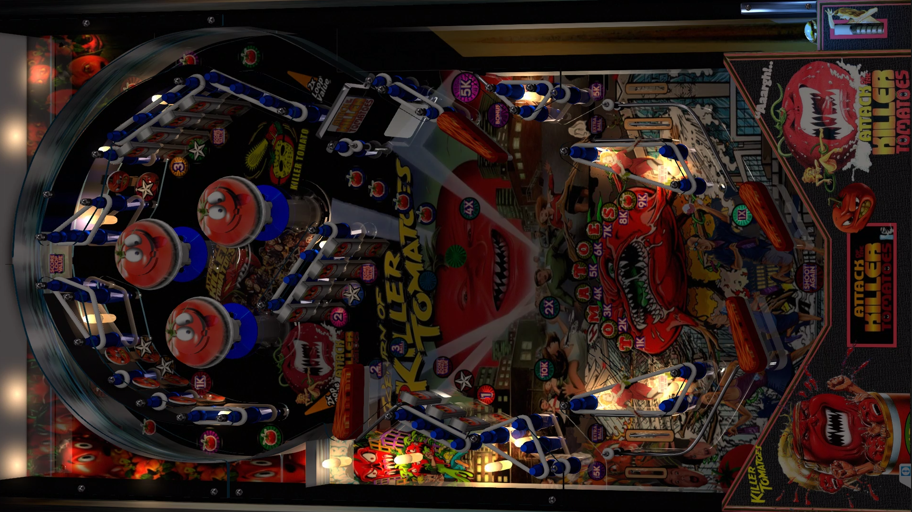

# Attack of the Killer Tomatoes (MusicMOD) (Iceman 2023)

---

## Files
| File Type | Link | Version | Author |
|:---------:|:----:|:-------:|:------:|
| VPX | [VP Universe](https://vpuniverse.com/files/file/15298-attack-of-the-killer-tomatoes-iceman-2023-musicmod/) | 1.0.0 | [nagaidevil](https://vpuniverse.com/profile/40780-nagaidevil/) |
| B2S | Included with VPX | N/A | N/A |
| DMD | N/A | N/A | N/A |
| ROM | [VP Universe](https://www.vpforums.org/index.php?app=downloads&showfile=742) | seawitch.zip | [destruk](https://www.vpforums.org/index.php?showuser=5) |

**Tested by:** [TechZombie]

---

## Status 
**Minimum VPX Standalone build:** 10.8.0-1989-a764013
| Playfield | Controls | Backglass | DMD | ROM Required | FPS | 
|-----------|----------|-----------|-----|--------------|-----|
| :white_check_mark: | :white_check_mark: | :white_check_mark: | :x: | :white_check_mark: | 60 |

---

## Instructions

- Install this table through the Table Manager, using the `Add Table` > `Manual` page
- If you need help, more information found on the wiki: [TM - Add Table - Manual](https://github.com/LegendsUnchained/vpx-standalone-alp4k/wiki/%5B04%5D-%F0%9F%A7%A1-TM-%E2%80%90-Other-Features#add-table---manual)
- If the table requires any additional files/steps, click `GO TO TABLE` after adding, and the TM will open to the relevant table folder.
- Copy (Tomatoes) folder to vpx-attackofthekillertomatoes/music
- "Hey, can somebody please pass the ketchup? Whoops!" - Sam Smith

## Notes
- Music Folder is included in Table Download
