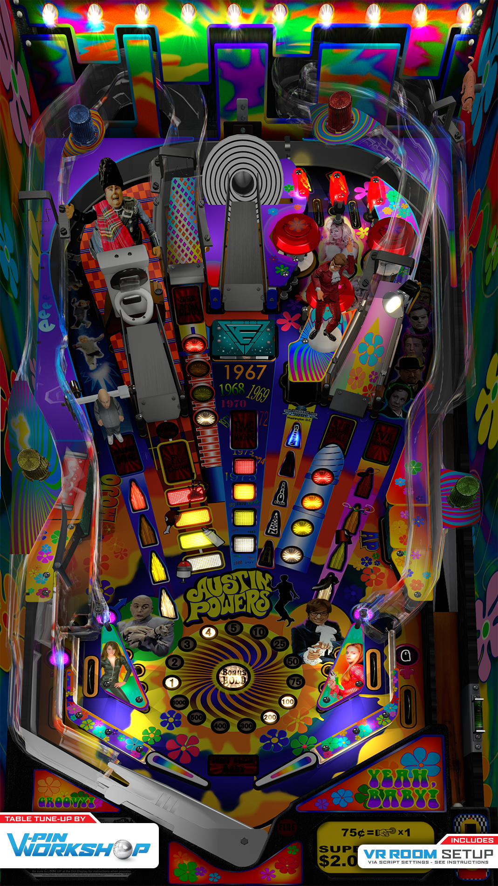

# Austin Powers (Stern 2001)

---

## Files
| File Type | Link | Version | Author |
|:---------:|:----:|:-------:|:------:|
| VPX | [VP Forums](https://www.vpforums.org/index.php?app=downloads&showfile=15332) | 1.0.3 | [hauntfreaks](https://vpuniverse.com/profile/5216-hauntfreaks/) |
| B2S | [VP Universe](https://vpuniverse.com/files/file/14003-austin-powers-stern-2001-b2s-with-full-dmd/) | 1.0.0 | [hauntfreaks](https://vpuniverse.com/profile/5216-hauntfreaks/) |
| DMD | N/A | N/A | N/A |
| ROM | [VP Forums](https://www.vpforums.org/index.php?app=downloads&showfile=1115) | austin.zip | [destruk](https://www.vpforums.org/index.php?showuser=5) |

**Tested by:** [T3chZombie]

---

## Status 
**Minimum VPX Standalone build:** 10.8.0-1983-b84441e
| Playfield | Controls | Backglass | DMD | ROM Required | FPS | 
|-----------|----------|-----------|-----|--------------|-----|
| :white_check_mark: | :white_check_mark: | :white_check_mark: | :white_check_mark: | :white_check_mark: | 37 |

---

## Instructions
- Copy the contents of this repo folder to your USB drive
- Add your personalized launcher.elf and rename it to vpx-austinpowers.elf
- Download the table and directb2s versions listed above, extract (if necessary) and copy them to external/vpx-austinpowers
- Make sure (.vpx), (.directb2s), and (.ini) files are all named the same
- Rom file stays in zip folder, place zip file in vpx-austinpowers/pinmame/roms
- "Mr. Powers, I bid you adieu!" --Dr. Evil
- "Get in my belly!" --Fat Bastard
- "Oh Behave!" "Yeah baby yeah!" --Austin Powers
