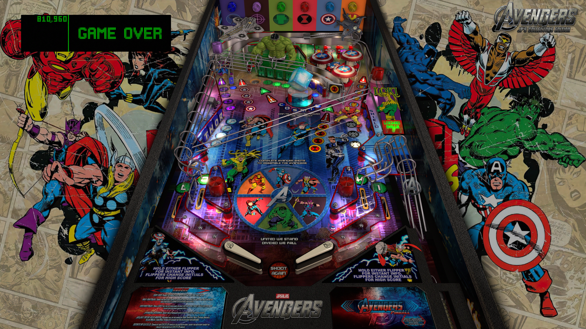

# JP's Avengers LE (Stern 2012)

---

## Files
| File Type | Link | Version | Author |
|:---------:|:----:|:-------:|:------:|
| VPX | [VP Forums](https://www.vpforums.org/index.php?app=downloads&showfile=14537) | 5.5.0 | [jpsalas](https://www.vpforums.org/index.php?s=543a5ca562cc33a89debe8ace8834f1e&showuser=277) |
| B2S | [VP Universe](https://vpuniverse.com/files/file/2452-the-avengers-premium-stern-2013/) | 1.0 | [Wildman](https://vpuniverse.com/profile/5-wildman/) |
| DMD | N/A | N/A | N/A |
| ROM | [VP Universe](https://vpuniverse.com/files/file/3917-avengers-the-limited-edition-v17/) | avs_170h.zip | [CarnyPriest](https://vpuniverse.com/profile/1146-carnypriest/) |

**Tested by:** [mcap]

---

## Status 
**Minimum VPX Standalone build:** 10.8.0-1989-a764013
| Playfield | Controls | Backglass | DMD | ROM Required | FPS | 
|-----------|----------|-----------|-----|--------------|-----|
| :white_check_mark: | :white_check_mark: | :white_check_mark: | :white_check_mark: | :white_check_mark: | 59 |

---

## Instructions
- Copy the contents of this repo folder to your USB drive
- Add your personalized launcher.elf and rename it to vpx-avengersclassic.elf
- Download the table and directb2s versions listed above and copy them into this folder
- Make sure (.vpx), (.directb2s), and (.ini) files are all named the same
- "Hulk Smash!" your high score
