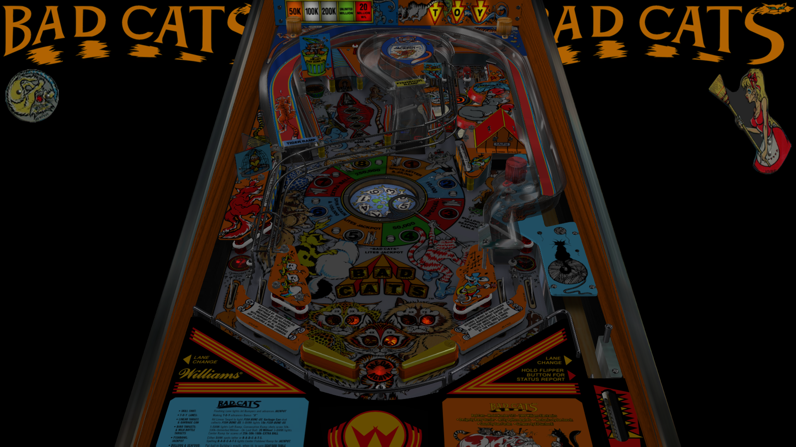

# Bad Cats (Williams 1989)

---

## Files
| File Type | Link | Version | Author |
|:---------:|:----:|:-------:|:------:|
| VPX | [VP Forums](https://www.vpforums.org/index.php?app=downloads&showfile=12401) | 1.2.1a | [Unclewilly](https://www.vpforums.org/index.php?s=582515d2c70108c6e0b0ff449083190c&showuser=12) |
| B2S | [VP Universe](https://vpuniverse.com/files/file/17478-bad-cats-williams-1989-b2s-authentic/) | 2.0 | [Hauntfreaks](https://vpuniverse.com/profile/5216-hauntfreaks/) |
| DMD | N/A | N/A | N/A |
| ROM | [VP Forums](https://www.vpforums.org/index.php?app=downloads&showfile=931) | bcats_l5.zip | N/A |

**Tested by:** [Officially-Unofficial]

---

## Status 
**Minimum VPX Standalone build:** 10.8.0-1983-b84441e
| Playfield | Controls | Backglass | DMD | ROM Required | FPS | 
|-----------|----------|-----------|-----|--------------|-----|
| :white_check_mark: | :white_check_mark: | :white_check_mark: |:white_check_mark: | :white_check_mark: | 50 |

---

## Instructions
- Copy the contents of this repo folder to your USB drive
- Add your personalized launcher.elf and rename it to `vpx-badcats.elf`
- Download the table and directb2s versions listed above, extract (if necessary) and copy them to `external/vpx-badcats`
- Make sure (`.vpx`), (`.directb2s`), and (`.vbs`) files are all named the same
- Place ROM `bcats_l5.zip` file into `vpx-badcats/pinmame/roms` folder. DO NOT UNZIP!
- NOTE: Backboard image (TOY image) renders upsidedown.  This is a table issue and not a VPX issue
- Meow, Meow, Meow
