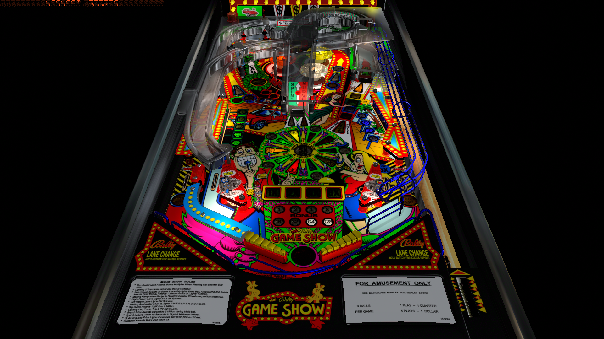

# Bally Game Show, The (Bally 1990)

---

## Files
| File Type | Link | Version | Author |
|:---------:|:----:|:-------:|:------:|
| VPX | [VP Forums](https://www.vpforums.org/index.php?app=downloads&showfile=17768) | 1.1.1.1 | [WED21](https://www.vpforums.org/index.php?s=3de704e3c35f0e5ebfa93740284ec896&showuser=89286) |
| B2S | [VP Universe](https://vpuniverse.com/files/file/10916-the-bally-game-show-bally-1990-b2s-full-dmd/) | 2.5 | [hauntfreaks](https://vpuniverse.com/profile/5216-hauntfreaks/) |
| DMD | N/A | N/A | N/A |
| ROM | [VP Universe](https://vpuniverse.com/files/file/574-game-show-lu-4-europe/) | gs_lu4.zip | [VPUStaff](https://vpuniverse.com/profile/50-vpustaff/) |

**Tested by:** [mcap]

---

## Status 
**Minimum VPX Standalone build:** 10.8.0-1989-a764013
| Playfield | Controls | Backglass | DMD | ROM Required | FPS | 
|-----------|----------|-----------|-----|--------------|-----|
| :white_check_mark: | :white_check_mark: | :white_check_mark: | :white_check_mark: | :white_check_mark: | 33 |

---

## Instructions
- Copy the contents of this repo folder to your USB drive
- Add your personalized launcher.elf and rename it to vpx-ballygameshow.elf
- Download the table and directb2s versions listed above, extract (if necessary) and copy them to external/vpx-ballygameshow
- Make sure the (.vpx), (.directb2s) and (.ini) files are all named the "exact" same
- Place ROM (gs_lu4.zip) in the external/vpx-ballygameshow/pinmame/roms folder. Do Not unzip!
