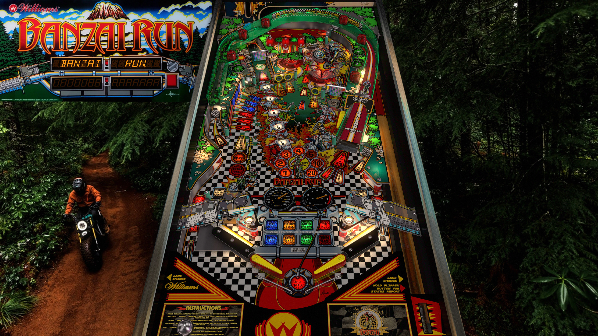

# Banzai Run (Williams 1988)

---

## Files
| File Type | Link | Version | Author |
|:---------:|:----:|:-------:|:------:|
| VPX | [VPForums](https://www.vpforums.org/index.php?app=downloads&showfile=17036) | 5.5.0 | [JPSalas](https://www.vpforums.org/index.php?showuser=277) |
| B2S | [VPUniverse](https://vpuniverse.com/files/file/13322-banzai-run-williams-1988-marquee-backglass/) | 1.0 | [HiRez00](https://vpuniverse.com/profile/19941-hirez00/) |
| DMD | N/A | N/A | N/A |
| ROM | [VPForums](http://www.vpforums.org/index.php?app=downloads&showfile=909) | bnzai_l3 | N/A |

**Tested by:** [kaoticBPR]

---

## Status 
**Minimum VPX Standalone build:** 10.8.0-1989-a764013
| Playfield | Controls | Backglass | DMD | ROM Required | FPS | 
|-----------|----------|-----------|-----|--------------|-----|
| :white_check_mark: | :white_check_mark: | :white_check_mark: | :white_check_mark: | :white_check_mark: | 50 |

---

## Instructions
- Copy the contents of this repo folder to your USB drive
- Add your personalized launcher.elf and rename it to vpx-banzairun.elf
- Download the table and directb2s versions listed above, extract (if necessary) and copy them to external/vpx-banzairun
- Make sure (.vpx), (.directb2s), and (.ini) files are all named the same - DO NOT RENAME VPReg.ini file!
- Place bnzai_l3.zip in the external/vpx-banzairun/pinmame/roms folder. *Do Not unzip*!
- "Challenge racers, Win the race up the mountain, Banzai!"
