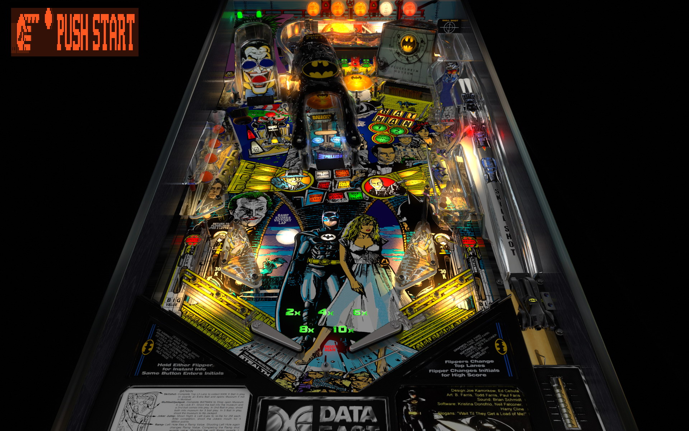

# Batman (Data East 1991)

---

## Files
| File Type | Link | Version | Author |
|:---------:|:----:|:-------:|:------:|
| VPX | [VP Forums](https://www.vpforums.org/index.php?app=downloads&showfile=15137) | 2.0 | [Bigus1](https://www.vpforums.org/index.php?showuser=107629) |
| B2S | [VP Universe](https://vpuniverse.com/files/file/13523-batman-data-east-1991-b2s-with-full-dmd/) | 1.0 | [hauntfreaks](https://vpuniverse.com/profile/5216-hauntfreaks/) |
| DMD | N/A | N/A | N/A |
| ROM | [VP Forums](https://www.vpforums.org/index.php?app=downloads&showfile=832) | btmn_106.zip | [destruk](https://www.vpforums.org/index.php?showuser=5) |

**Tested by:** [mcap], Bla1ze

---

## Status 
**Minimum VPX Standalone build:** 10.8.0-1989-a764013
| Playfield | Controls | Backglass | DMD | ROM Required | FPS | 
|-----------|----------|-----------|-----|--------------|-----|
| :white_check_mark: | :white_check_mark: | :white_check_mark: | :white_check_mark: | :white_check_mark: | 60 |

---

## Instructions
- Copy the contents of this repo folder to your USB drive
- Add your personalized launcher.elf and rename it to vpx-batman.elf
- Download the table and directb2s versions listed above and copy them into this folder
- Make sure (.vpx), (.directb2s), (.ini) and (.vbs) files are all named the same

