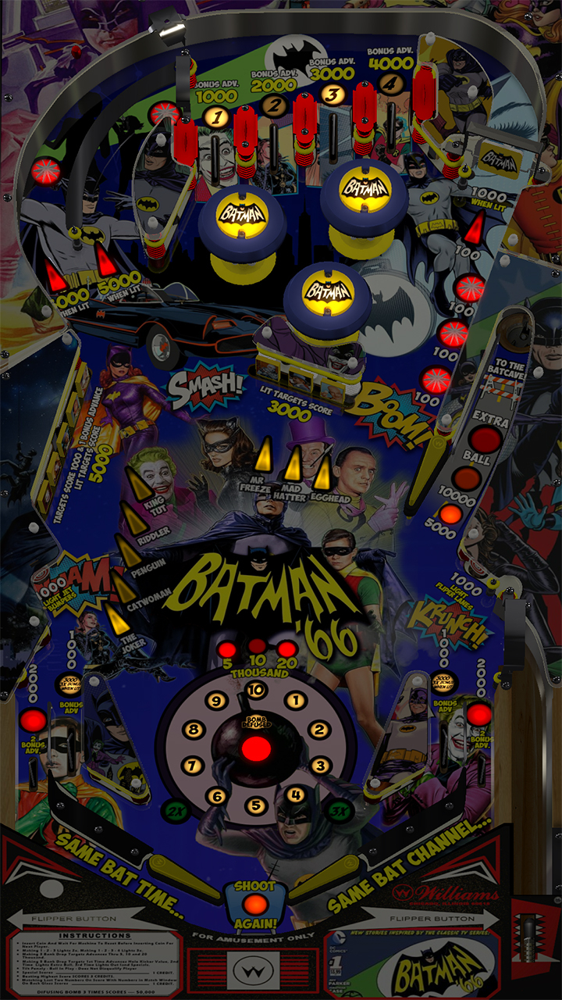
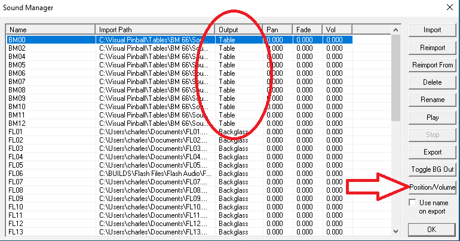

# Batman '66 (luvthecubs re-skin of Flash--Williams 1979)

---

## Files
| File Type | Link | Version | Author |
|:---------:|:----:|:-------:|:------:|
| VPX | [VPForums](https://www.vpforums.org/index.php?app=downloads&showfile=13652) | 1.2 | [luvthecubs](https://www.vpforums.org/index.php?showuser=32651) |
| B2S | Included with VPX | N/A | N/A |
| DMD | N/A | N/A | N/A |
| ROM | [VPForums](https://www.vpforums.org/index.php?app=downloads&showfile=758) | flash_l1.zip | Williams |

**Tested by:** [Curt]

---

## Status 
**Minimum VPX Standalone build:** 10.8.0-1989-a764013
| Playfield | Controls | Backglass | DMD | ROM Required | FPS | 
|-----------|----------|-----------|-----|--------------|-----|
| :white_check_mark: | :white_check_mark: | :white_check_mark: | :x: | :white_check_mark: | 60 |

---

## Instructions
- Copy the contents of this repo folder to your USB drive
- Add your personalized launcher.elf and rename it to `vpx-batman66flash.elf`
- Download the table and directb2s versions listed above, extract (if necessary) and copy them into `vpx-batman66flash`
- Rom file (flash_l1.zip) stays in zip folder, place zip file in `vpx-batman66flash/pinmame/roms`
- Make sure `(.vpx)` `(.directb2s)` and `(.ini)` are all named the same.

## Notes
- **TO GET ALL MUSIC AND SOUNDS TO PLAY**
- To hear all sounds you will need to patch the table. There are two ways to accomplish this using a Windows PC
- Option 1
  - Download and run VPUPatcher from [VPUniverse](https://vpuniverse.com/files/file/2581-vpuremix-system-vppatching-system-vpx-only/).
  - Follow the VPUniverse instructions to apply the `vpx-batman66flash.dif` to the `.vpx` file.
  - I chose the simple output name of "patched," and got the full filename you see below.
  - These should be your results:
| File | Size (Windows Explorer)| [Size](https://md5file.com/calculator) | [Hash](https://md5file.com/calculator) |
|-----------|--------|----------|----------|
| `Batman 66 (Original 2018).vpx` | 146,616 kb | 150134784 bytes | MD5: 7f18278326ee54c1528ad9bb07172b40 |
| `patched.vpx_VPUMod.vpx` | 146,704 kb | 150224896 bytes | MD5: 2c91d62446d13e5b60c449680d1fc3e4|
> **OR**
- Option 2
  - Open the table in VPinballX on your computer.
  - Open the Sound Editor (F2 in Windows).
  - Change the output location of the first 11 sounds in the list from "Table" to "Backglass."
  - Save the table, and THEN move it to your USB drive
