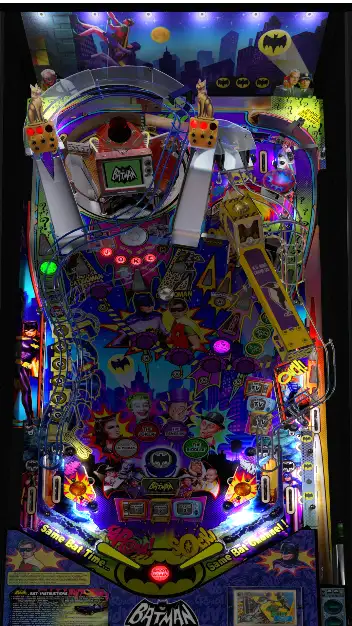

# Batman '66 Premium (Stern 2016)

---

## Files
| File Type | Link | Version | Author(s) | 
|-----------|--------|----------|--------------|
| **VPX** | [vpuniverse](https://vpuniverse.com/files/file/6868-batman-66-stern-tribute%C2%A0/) | 1.1.0 | Daphishbowl, Mr H, MPT3k |
| **B2S** | [vpuniverse](https://vpuniverse.com/files/file/6949-batman-66-stern-2016-b2s/) | 1.0.0 | HauntFreaks |
| **ROM** | [N/A](#) | N/A | N/A |
| **PUPPACK** | [mega](https://mega.nz/file/XMIgnRwC#LmRlA5GjAzxrWdjxl4O87PxqjUldOF4kA-fLoU0odFQ) |  | Daphishbowl |

**Tested by:** Curt

---

## Status 

| Backglass | DMD | ROM Required | Has Puppack | FPS |
|-----------|-----|-----|-----|-----|
| ✅ | ✅ | ❌ | ✅ | 55 |

---

## Instructions

- Install this table through the Table Manager, using the `Add Table` > `Manual` page
- REQUIRES VPinballX_GL-10.8.0-3abac0f bundle
- There will be occasional freeze-ups, and framerate during multi ball drops severely, but it is playable.
- The 2-screen and 3-screen PuPs both have different graphic bugs. These instructions are for 2 screens, but feel free to try 3.
- Click `GO TO TABLE` after adding, and the TM will open to the table folder. At that time:
  - Create a folder titled `pupvideos` in the 4KP table folder
  - unzip the PuP File on your computer 
  - In the folder `b66_orig/PuP-Pack_Options/Option 2 - 2 Screen - 16x9`, copy the files `playlists.pup`, `screens.pup`, and `triggers.pup`
  - Paste these files into the top-level `b66_orig` folder, replacing the copies that are there.
  - Upload the `b66_orig` folder on your computer to the `pupvideos` folder on your 4KP
- If you need help, more information can be found on the wiki: [TM - Add Table - Manual](https://github.com/LegendsUnchained/vpx-standalone-alp4k/wiki/%5B04%5D-%F0%9F%A7%A1-TM-%E2%80%90-Other-Features#add-table---manual)

- 'Holy battering ballsaves! It's coming back!'
