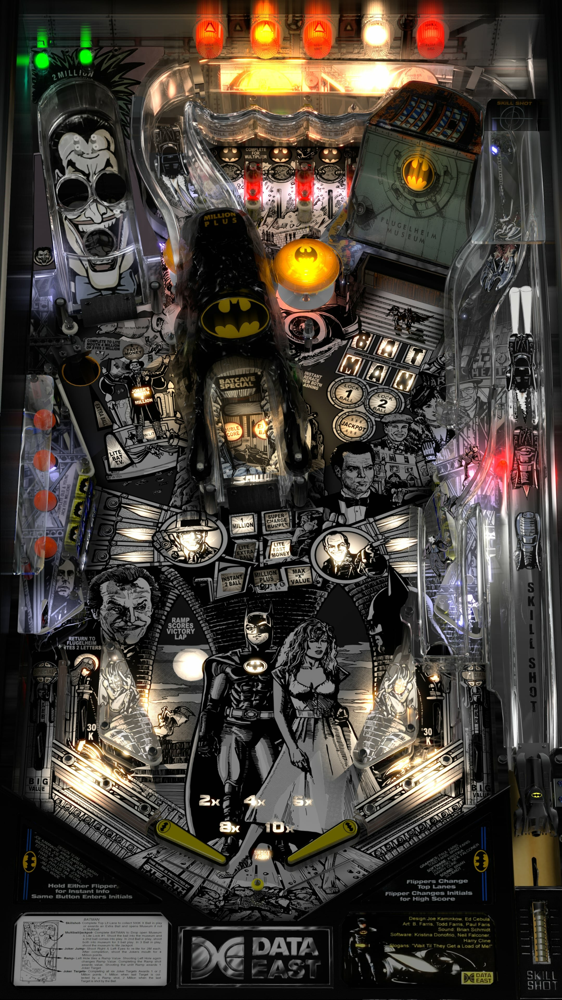

# Batman BW Edition (Data East 1991)

---

## Files
| File Type | Link | Version | Author | 
|-----------|--------|----------|--------------|
| **VPX** | [VP Universe](https://vpuniverse.com/files/file/6977-batman-data-east-1991-sg1bson-bw-mod/) | 1.0  `1998557568_BatmanDataEastBWMod.zip` | [SG1bsoN](https://vpuniverse.com/profile/34010-sg1bson/) |
| **B2S** | Included in table zip | 1.0 | |
| **DMD** | Included in table zip | 1.0 | |
| **ROM** | [VP Forums](https://www.vpforums.org/index.php?app=downloads&showfile=832) | **SHA:** fe2d2356d2366b67ffe14695d210279879035cb7   **MD5:** 6bc12de01f7dfa179845e1190a936bc9 | |

**Tested by:** Mar3nBu

---

## Status 

**Minimum VPX Standalone build:** 10.8.0-1989-a764013
| Playfield | Controls | Backglass | DMD | ROM Required | FPS | 
|-----------|----------|-----------|-----|--------------|-----|
| :white_check_mark: | :white_check_mark: | :white_check_mark: | :white_check_mark: | :white_check_mark: | 47 |

---

## Instructions

- Install this table through the Table Manager, using the `Add Table` > `Manual` page
- If you need help, more infomation found on the wiki: [TM - Add Table - Manual](https://github.com/LegendsUnchained/vpx-standalone-alp4k/wiki/%5B04%5D-%F0%9F%A7%A1-TM-%E2%80%90-Other-Features#add-table---manual)
- If the table requires any additional files/steps, click `GO TO TABLE` after adding, and the TM will open to the relevant table folder.

