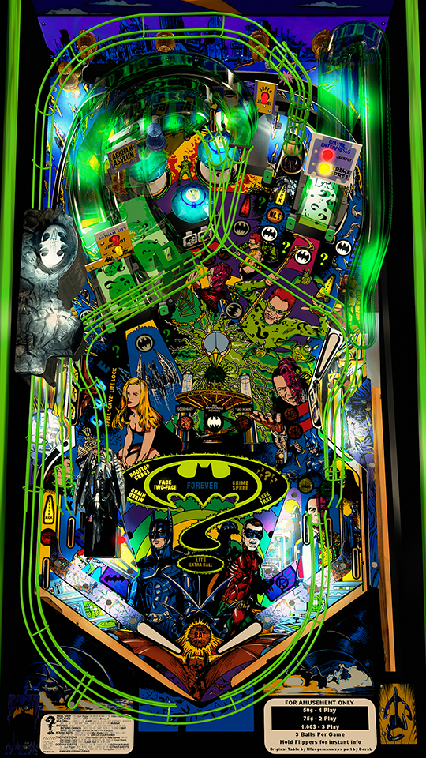

# Batman Forever (Sega 1995)

---

## Files
| File Type | Link | Version | Author | 
|-----------|--------|----------|--------------|
| **VPX** | [VP Universe](https://vpuniverse.com/files/file/11601-batman-forever-sega-1995-with-vr-room/) | 1.3 | [drakkon](https://vpuniverse.com/profile/51568-drakkon/) |
| **B2S & DMD** | [VP Universe](https://vpuniverse.com/files/file/17563-batman-forever-sega-1995-b2s-with-full-dmd/) | 1.0 | [Hauntfreaks](https://vpuniverse.com/profile/5216-hauntfreaks/) |
| **ROM** | [VP Forums](https://www.vpforums.org/index.php?app=downloads&showfile=871) | **SHA:** a93b6f149547dcf93ba524c0b8234592e1cbc12e  **MD5:** 66d63871f98b5efefd7a67c4189c6946 |  |

**Tested by:** [Bla1ze]

---

## Status 

**Minimum VPX Standalone build:** 10.8.0-1983-a764013
| Playfield | Controls | Backglass | DMD | ROM Required | FPS | 
|-----------|----------|-----------|-----|--------------|-----|
| :white_check_mark: | :white_check_mark: | :white_check_mark: | :white_check_mark: | :white_check_mark: | 45 |

---

## Instructions

- Copy the contents of this repo folder to your USB drive
- Add your personalized launcher.elf and rename it to `vpx-batmanforever.elf`
- Download the table and directb2s versions listed above, extract (if necessary) and copy them into `vpx-batmanforever`
- Rom file (`batmanf.zip`) stays in zip folder, place zip file in `vpx-batmanforever/pinmame/roms`
- Make sure `(.vpx)` `(.direct2b2s)` `(.vbs)` and `(.ini)` are all named the same.
> Do you have a thing for bats? 🦇
s