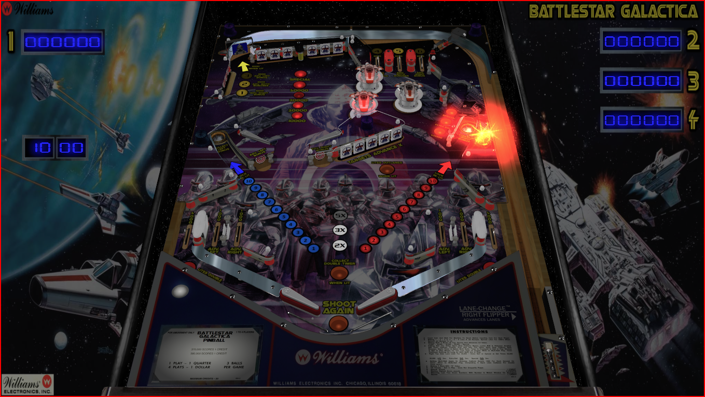

# Battlestar Galactica (Original 2018)

Authors: [xenonph](https://www.vpforums.org/index.php?showuser=14100)  
Download File Name: Battlestar Galactica (Williams 1980) v2.1.zip  
Filename: Battlestar Galactica (Williams 1980) Mod v2.1.vpx  
Download: [VPUniverse](https://vpuniverse.com/files/file/5061-battlestar-galactica-williams-1980/)

There are several DirectB2S backglasses included with Table.rar file, choose whichever you prefer. 

ROM

Authors: [destruk](https://www.vpforums.org/index.php?showuser=5)  
Filename: scrpn_l1.zip  
Download: [VP Forums](https://www.vpforums.org/index.php?app=downloads&showfile=779)

Tested by: TechZombie

## Status 

Minimum VPX Standalone build: 10.8.0-1989-a764013

| Playfield | Controls | Backglass | DMD | ROM Required | FPS | 
|-----------|----------|-----------|-----|--------------|-----|
| :white_check_mark: | :white_check_mark: | :white_check_mark: | :x: | :white_check_mark: | 47 |

## Instructions

- Install this table through the Table Manager, using the `Add Table` > `Manual` page
- If you need help, more infomation found on the wiki: [TM - Add Table - Manual](https://github.com/LegendsUnchained/vpx-standalone-alp4k/wiki/%5B04%5D-%F0%9F%A7%A1-TM-%E2%80%90-Other-Features#add-table---manual)
- If the table requires any additional files/steps, click `GO TO TABLE` after adding, and the TM will open to the relevant table folder.
- Select/Copy Battlestar Folder and move to external/vpx-battlestargalactica/music
- Lieutenant Starbuck: "Yes... you certainly have a way of cutting through the felgercarb."

