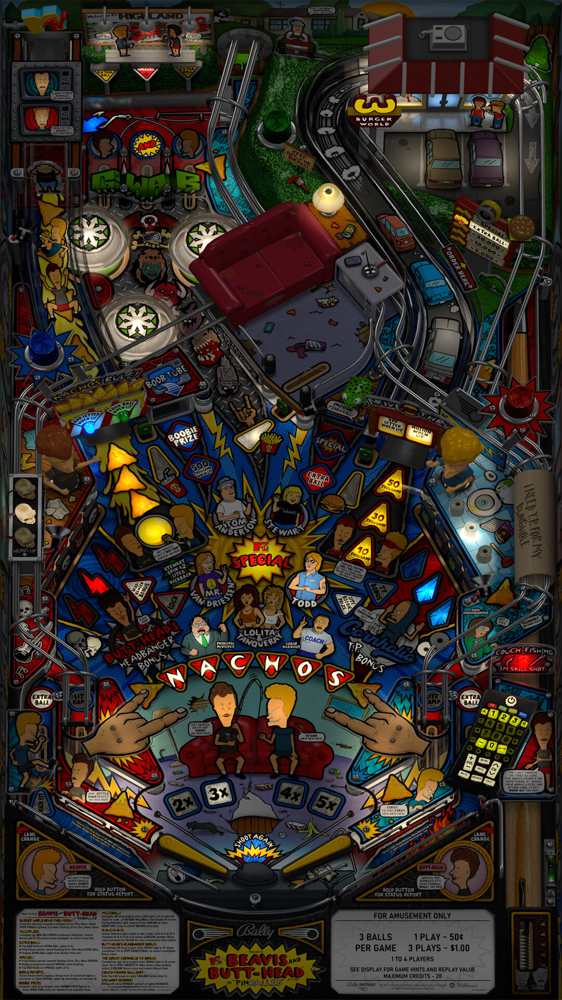

# Beavis and Butt-head: Pinballed (Original 2024)

Authors: [watacaractr](https://vpuniverse.com/profile/5551-watacaractr/)
Version: 1.1
Download: [VP Universe](https://vpuniverse.com/files/file/18299-beavis-and-butt-head-pinballed-original-2024/)

DirectB2S

Authors: [watacaractr](https://vpuniverse.com/profile/5551-watacaractr/)
Version: 1.0
Download: [VP Universe](https://vpuniverse.com/files/file/18258-beavis-and-butt-head-pinballed-bally-1993-directb2s-3-screen/)

## Status 

Minimum VPX Standalone build: 10.8.0-1989-a764013
| Playfield | Controls | Backglass | DMD | ROM Required | FPS | 
|-----------|----------|-----------|-----|--------------|-----|
| :white_check_mark: | :white_check_mark: | :white_check_mark: | :white_check_mark: | :white_check_mark: | 34 |

## Instructions

- Copy the contents of this repo folder to your USB drive
- Add your personalized launcher.elf and rename it to vpx-bbhpinballed.elf
- Download the table and directb2s versions listed above and copy them into this folder

## Special Instructions
- Copy the included altsound folder "beav_butt" to (external\vpx-bbhpinballed\pinmame\altsound\); you may need to create the altsound folder in pinmame
- Copy the included "beav_butt.nv" file to (external\vpx-bbhpinballed\pinmame\nvram) - DONE FOR YOU
- Copy the included "beav_butt.vbs" file in the main folder (external\vpx-bbhpinballed) - DONE FOR YOU - DO NOT RENAME THIS FILE
- Copy the included rom "beav_butt" zip file in to the roms folder (external\vpx-bbhpinballed\pinmame\roms)
- Copy and paste the "altsound.ini" file from (external\vpx-bbhpinballed\pinmame\altsound\beav_butt) to (external\vpx-bbhpinballed) - DONE FOR YOU

## THIS TABLE IS LOUD; LOWER YOUR ALP4K SOUND TO 5 AND ADJUST ACCORDINGLY

