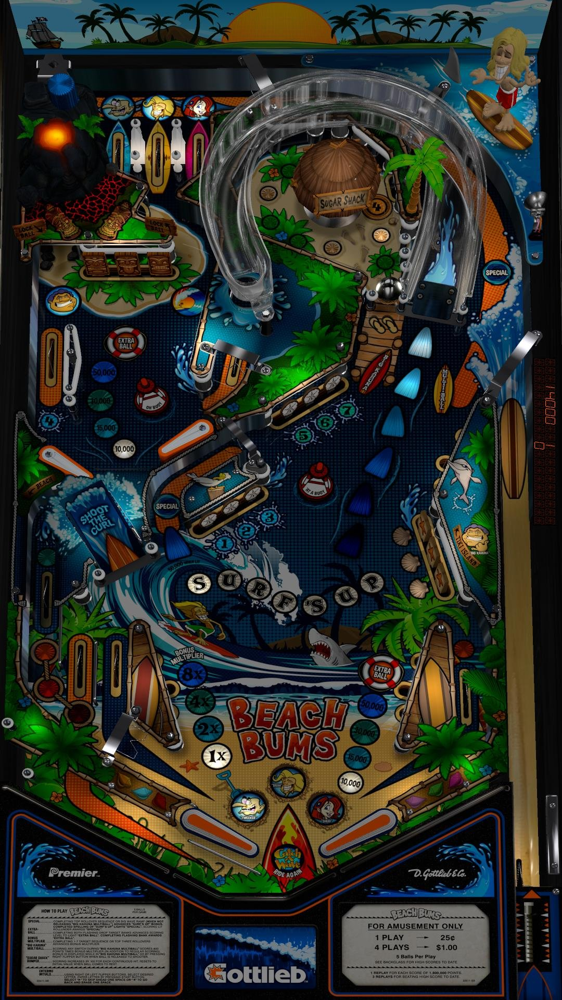

# Beach Bums (Original 2018)

Authors: [watacaractr](https://vpuniverse.com/profile/5551-watacaractr/)
Version: 1.0
Download: [VP Universe](https://vpuniverse.com/files/file/5182-beach-bums-10-2018/)

DirectB2S

Authors: [watacaractr](https://vpuniverse.com/profile/5551-watacaractr/)
Version: 1.0
Download: [VP Universe](https://vpuniverse.com/files/file/5183-beach-bums-10-2018-3scr-directb2s/)

ROM/Music - Included with VPX download

## Status 

Minimum VPX Standalone build: 10.8.0-1989-a764013
| Playfield | Controls | Backglass | DMD | ROM Required | FPS | 
|-----------|----------|-----------|-----|--------------|-----|
| :white_check_mark: | :white_check_mark: | :white_check_mark: | :white_check_mark: | :white_check_mark: | 42 |

## Instructions

- Install this table through the Table Manager, using the `Add Table` > `Manual` page
- If you need help, more information found on the wiki: [TM - Add Table - Manual](https://github.com/LegendsUnchained/vpx-standalone-alp4k/wiki/%5B04%5D-%F0%9F%A7%A1-TM-%E2%80%90-Other-Features#add-table---manual)
- If the table requires any additional files/steps, click `GO TO TABLE` after adding, and the TM will open to the relevant table folder.

