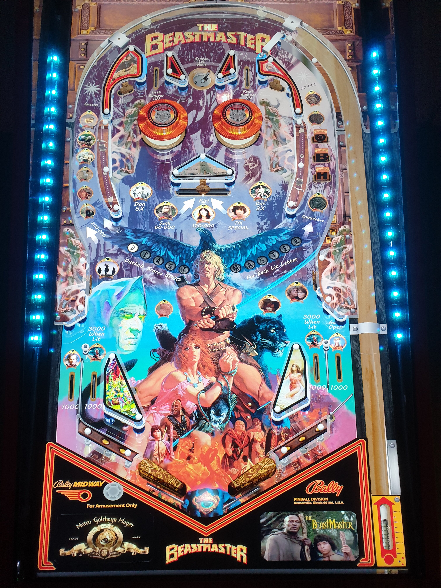

# The BeastMaster V2 SoundFX (Original 2021)

Author(s): [balutito](https://vpuniverse.com/profile/36070-balutito/)  
Table: Version 1.0.2  
Download: 521718423_BeastmastersoundFX.rar  
VPX Version: Beastmaster_v1.1.vpx  
Download: [VPUniverse](https://vpuniverse.com/files/file/7792-the-beastmaster-v2-soundfx/)

DirectB2S is included with Table Zip  
Directb2s: Beastmaster_v1.1.directb2s  
Author(s): [balutito](https://vpuniverse.com/profile/36070-balutito/) 

ROM is included with Table Zip  
Black Pyramid - ROM  
ROM: blakpyra.zip  
Included in 521718423_BeastmastersoundFX.rar ---> ROM

NVRAM is included with Table Zip  
NVRAM: blakpyra.nv  
Included in 521718423_BeastmastersoundFX.rar ---> ROM

Author(s): [balutito](https://vpuniverse.com/profile/36070-balutito/)

MD5: DB8FCAD018206DCB4D5066FFADE50B86
SHA-1: 956EC11B9721003363782B90ECBA1F2EB99C9A91

Tested by:
[TechZombie]

## Status 

Minimum VPX Standalone build: 10.8.0-1983-b84441e
| Playfield | Controls | Backglass | DMD | ROM Required | FPS | 
|-----------|----------|-----------|-----|--------------|-----|
| :white_check_mark: | :white_check_mark: | :white_check_mark: | :x: | :white_check_mark: | 60 |

## Instructions

- Copy the contents of this repo folder to your USB drive
- Add your personalized launcher.elf and rename it to vpx-beastmaster.elf
- Download the table, and directb2s, extract them and copy/place them into vpx-beastmaster
- Make sure (.vpx) (.direct2b2s) and (.ini) are all named the same
- Open (ROM) Folder, (blakpyra.zip) stays in zip folder, place zip file in vpx-beastmaster/pinmame/roms
- Open (ROM) Folder, (blakpyra.nv) place (.nv) file in vpx-beastmaster/pinmame/nvram
- Open (BM_music), Place (Beastmaster.mp3) into ---> vpx-beastmaster/music
- "Life is a circle. I am sure we will meet again, my friend!"  ---Dar

