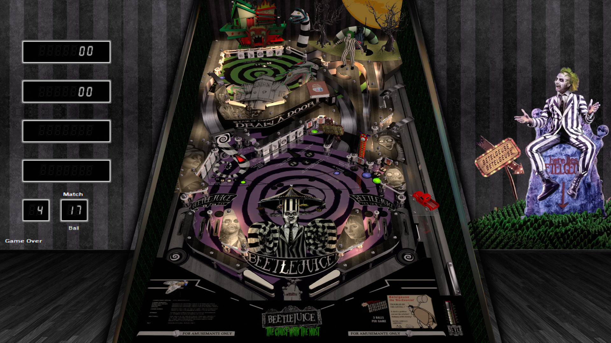

# Beetlejuice (Original 2023)

**Warning!**   **This Table Contains Explicit Language!**   **Warning!**

Author: [doivelspack](https://vpuniverse.com/profile/9648-doivelspack/)  
Version: Beetlejuice (Original 2023) DVL Reskin 1.0.2.rar  
Download: [VP Universe](https://vpuniverse.com/files/file/16562-beetlejuice-original-2023-dvl-reskin/)

DirectB2S
Version: 1.0.2, 2-screen option. 
Included with table zip. 

ROM:  
Included with table zip

Tested by:
[TechZombie]

## Status 

Minimum VPX Standalone build: 10.8.0-1983-b84441e

| Playfield | Controls | Backglass | DMD | ROM Required | FPS | 
|-----------|----------|-----------|-----|--------------|-----|
| :white_check_mark: | :white_check_mark: | :white_check_mark: | :white_check_mark: | :white_check_mark: | 38 |

## Instructions

- Install this table through the Table Manager, using the `Add Table` > `Manual` page
- If you need help, more information found on the wiki: [TM - Add Table - Manual](https://github.com/LegendsUnchained/vpx-standalone-alp4k/wiki/%5B04%5D-%F0%9F%A7%A1-TM-%E2%80%90-Other-Features#add-table---manual)
- If the table requires any additional files/steps, click `GO TO TABLE` after adding, and the TM will open to the relevant table folder.
- "Nice f***ing Vpin Table!" --Beetlejuice

