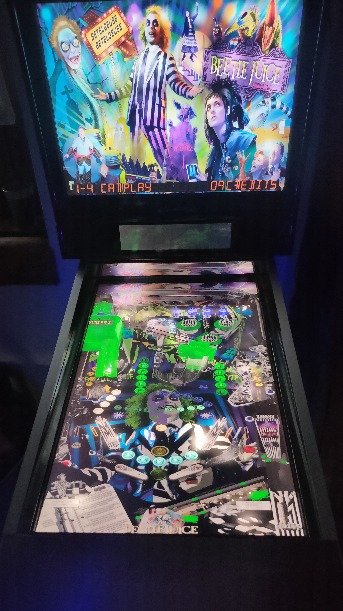

# BeetleJuice Movie (Original 2021)

---

## Files
| File Type | Link | Version | Author | 
|-----------|--------|----------|--------------|
| **VPX** | [VPUniverse](https://vpuniverse.com/files/file/7875-beetlejuice-movie-10-vpx/) | 1.0 | [sebastiendelf](https://vpuniverse.com/profile/42328-sebastiendelf/) |
| **B2S & DMD** | Included in Table Zip | 1.0 | [sebastiendelf](https://vpuniverse.com/profile/42328-sebastiendelf/) |
| **ROM** | [VP Forums](https://www.vpforums.org/index.php?app=downloads&showfile=715)  | strngsci.zip | [destruk](https://www.vpforums.org/index.php?showuser=5)  |
| **NVRAM** | [Pinball Nirvana](https://pinballnirvana.com/forums/resources/bally-6803-gottlieb-gts3-nvram-pack.3346/)  | strngsci.nv | [destruk](https://www.vpforums.org/index.php?showuser=5)  |

*This table requires a Pre-initialized NVRAM file in order for this table to work properly and accept coins.**  
Required NVRAM File: `strngsci.nv` 
It should already be in: (`vpx-beetlejuicemovie/pinmame/nvram`). If not or you have problems, then download the NVRAM Pack from the download link above.

**Tested by:** [TechZombie]

---

## Status 

**Minimum VPX Standalone build:** 10.8.0-1983-b84441e

| Playfield | Controls | Backglass | DMD | ROM Required | FPS | 
|-----------|----------|-----------|-----|--------------|-----|
| :white_check_mark: | :white_check_mark: | :white_check_mark: | :white_check_mark: | :white_check_mark: | 48 |

---

## Instructions

- Install this table through the Table Manager, using the `Add Table` > `Manual` page
- If you need help, more information found on the wiki: [TM - Add Table - Manual](https://github.com/LegendsUnchained/vpx-standalone-alp4k/wiki/%5B04%5D-%F0%9F%A7%A1-TM-%E2%80%90-Other-Features#add-table---manual)
- If the table requires any additional files/steps, click `GO TO TABLE` after adding, and the TM will open to the relevant table folder.
- Open the Music file and copy `BeetleJuice.mp3` into the music folder on your USB drive
- Verify that (strngsci.nv) file is located in (`vpx-beetlejuicemovie/pinmame/nvram`). If not then download the NVRAM pack and extract it from there
> "It's Showtime!"
> ---Beetlejuice

