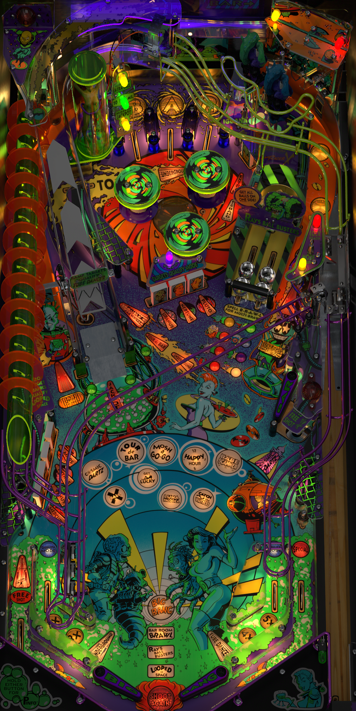

# Big Bang Bar (Capcom 1996)

Authors: [Sheltemke](https://www.vpforums.org/index.php?showuser=727)
Version: 1.0
Download: [VP Forums](https://www.vpforums.org/index.php?app=downloads&showfile=15000)

DirectB2S

Authors: [hauntfreaks](https://vpuniverse.com/profile/5216-hauntfreaks/)
Version: 1.0
Download: [VP Universe](https://vpuniverse.com/files/file/13633-big-bang-bar-capcom-1996-b2s-with-full-dmd/)

ROM

Download: [VP Forums](https://www.vpforums.org/index.php?app=downloads&showfile=418)

## Status 

Minimum VPX Standalone build: 10.8.0-1989-a764013
| Playfield | Controls | Backglass | DMD | ROM Required | FPS | 
|-----------|----------|-----------|-----|--------------|-----|
| :white_check_mark: | :white_check_mark: | :white_check_mark: | :white_check_mark: | :white_check_mark: | 50 |

## Instructions

- Copy the contents of this repo folder to your USB drive
- Add your personalized launcher.elf and rename it to vpx-bigbangbar.elf
- Download the table and directb2s versions listed above and copy them into this folder